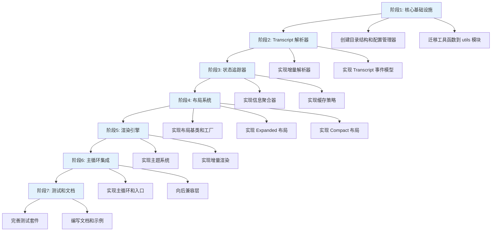

# Statusline 重构计划

## 元数据

```yaml
title: Statusline 重构计划
status: planning
created: 2026-03-27
estimated_duration: 3-4 weeks
priority: high
tags:
  - refactoring
  - statusline
  - architecture
phases: 7
tasks: 16
```

## 概述

本计划旨在重构 statusline 组件，建立模块化、可扩展的架构。重构分为 7 个阶段，涵盖核心基础设施、解析器、状态追踪、布局系统、渲染引擎、主循环集成以及测试文档。

## 执行流程图



## 任务清单

### 阶段 1: 核心基础设施

| ID | 任务名称 | 描述 | 优先级 | 依赖 | 预估时间 | 状态 |
|---|---|---|---|---|---|---|
| 1.1 | 创建目录结构和配置管理器 | 建立模块化的目录结构，实现配置管理器用于集中管理配置 | 高 | 无 | 1-2 天 | todo |
| 1.2 | 迁移工具函数到 utils 模块 | 将现有工具函数整理并迁移到独立的 utils 模块 | 中 | 1.1 | 1 天 | todo |

### 阶段 2: Transcript 解析器

| ID | 任务名称 | 描述 | 优先级 | 依赖 | 预估时间 | 状态 |
|---|---|---|---|---|---|---|
| 2.1 | 实现增量解析器 | 开发增量解析器，支持逐步解析 transcript 数据 | 高 | 1.2 | 2-3 天 | todo |
| 2.2 | 实现 Transcript 事件模型 | 设计并实现 transcript 事件模型，定义事件类型和处理机制 | 高 | 2.1 | 2-3 天 | todo |

### 阶段 3: 状态追踪器

| ID | 任务名称 | 描述 | 优先级 | 依赖 | 预估时间 | 状态 |
|---|---|---|---|---|---|---|
| 3.1 | 实现信息聚合器 | 开发信息聚合器，从多个数据源收集和聚合状态信息 | 高 | 2.2 | 2-3 天 | todo |
| 3.2 | 实现缓存策略 | 设计并实现缓存策略，提高状态查询性能 | 中 | 3.1 | 1-2 天 | todo |

### 阶段 4: 布局系统

| ID | 任务名称 | 描述 | 优先级 | 依赖 | 预估时间 | 状态 |
|---|---|---|---|---|---|---|
| 4.1 | 实现布局基类和工厂 | 创建布局系统的基类和工厂模式，支持多种布局类型 | 高 | 3.2 | 2-3 天 | todo |
| 4.2 | 实现 Expanded 布局 | 实现扩展布局模式，展示完整信息 | 中 | 4.1 | 1-2 天 | todo |
| 4.3 | 实现 Compact 布局 | 实现紧凑布局模式，优化空间利用 | 中 | 4.1 | 1-2 天 | todo |

### 阶段 5: 渲染引擎

| ID | 任务名称 | 描述 | 优先级 | 依赖 | 预估时间 | 状态 |
|---|---|---|---|---|---|---|
| 5.1 | 实现主题系统 | 开发主题系统，支持自定义样式和颜色方案 | 中 | 4.3 | 2-3 天 | todo |
| 5.2 | 实现增量渲染 | 实现增量渲染机制，只更新变化的部分以提高性能 | 高 | 5.1 | 3-4 天 | todo |

### 阶段 6: 主循环集成

| ID | 任务名称 | 描述 | 优先级 | 依赖 | 预估时间 | 状态 |
|---|---|---|---|---|---|---|
| 6.1 | 实现主循环和入口 | 创建主循环逻辑和程序入口，协调各模块工作 | 高 | 5.2 | 2-3 天 | todo |
| 6.2 | 向后兼容层 | 实现向后兼容层，确保现有代码平滑迁移 | 高 | 6.1 | 2-3 天 | todo |

### 阶段 7: 测试和文档

| ID | 任务名称 | 描述 | 优先级 | 依赖 | 预估时间 | 状态 |
|---|---|---|---|---|---|---|
| 7.1 | 完善测试套件 | 编写单元测试和集成测试，覆盖所有核心功能 | 高 | 6.2 | 3-4 天 | todo |
| 7.2 | 编写文档和示例 | 编写使用文档、API 文档和示例代码 | 中 | 7.1 | 2-3 天 | todo |

## 里程碑

1. **基础设施完成** (阶段 1): 配置管理和工具模块就绪
2. **解析器就绪** (阶段 2): Transcript 解析和事件模型可用
3. **状态管理完成** (阶段 3): 信息聚合和缓存策略实现
4. **布局系统可用** (阶段 4): 多种布局模式支持
5. **渲染引擎完成** (阶段 5): 主题和增量渲染实现
6. **主循环集成** (阶段 6): 完整的工作流程打通
7. **生产就绪** (阶段 7): 测试和文档完善

## 风险评估

| 风险 | 影响 | 概率 | 缓解措施 |
|---|---|---|---|
| 架构复杂度增加 | 高 | 中 | 分阶段实现，充分测试 |
| 性能瓶颈 | 中 | 中 | 增量渲染和缓存策略 |
| 向后兼容性 | 高 | 低 | 专门的兼容层，渐进式迁移 |
| 测试覆盖不足 | 中 | 中 | 早期介入测试，持续集成 |

## 资源需求

- 开发人员: 1-2 人
- 预估总时长: 3-4 周
- 依赖工具: 测试框架、文档生成工具

## 注意事项

- 保持模块间的低耦合高内聚
- 优先实现核心功能，后续迭代优化
- 及时更新文档，保持与代码同步
- 每个阶段完成后进行代码审查
