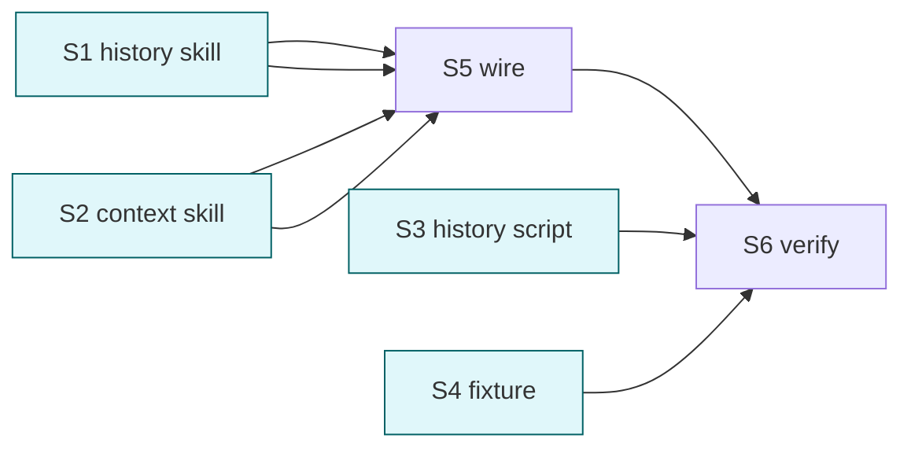

# cortex-history-digest + cortex-context-digest

## 目标

新增两个独立 skill:

1. **cortex-history-digest** — 读 `~/.claude/projects/**/*.jsonl` 全部 Claude Code 历史 transcripts, 整理 → 全局记忆库 `~/.cortex/.wiki/memory/`
2. **cortex-context-digest** — 整理当前会话上下文 → 默认项目级 `<repo>/.wiki/memory/`; 自动判定 "全局适用" 时 (含 L0 关键词 / 跨项目语义) 落全局 `~/.cortex/.wiki/memory/`; 用户可 `--scope global|project` 强制覆盖

两 skill 共用 cortex-schema 路径权威 + cortex-extract 三轴分类 (复用算法不重写).

## 范围分工 vs 既有 skill

| skill | 数据源 | 落点 | 与 cortex-extract 区别 |
| --- | --- | --- | --- |
| cortex-history-digest | `~/.claude/projects/**/*.jsonl` (Claude Code 全部 session 历史) | 仅全局 `~/.cortex/.wiki/memory/` | extract 处理 L4-inbox 内已收件资料; history-digest 直接从 transcripts 抽取 |
| cortex-context-digest | 当前主会话上下文 (Read 当前任务 / 用户最近指令 / 关键决策) | 项目级 默认 + 全局自动判定/手动覆盖 | extract 走 inbox 文件; context-digest 走对话上下文实时整理 |

## Deliverable 矩阵

| ID | 交付物 | 验收 | P |
| --- | --- | --- | --- |
| D1 | `skills/cortex-history-digest/` (SKILL.md + references/ 含 sources/parser/routing) | frontmatter 合规, ≤ 60 行 | P0 |
| D2 | `skills/cortex-context-digest/` (SKILL.md + references/ 含 scope/triggers) | frontmatter 合规, ≤ 60 行 | P0 |
| D3 | `scripts/history-digest.sh` + `_history_digest/` (扫 transcripts → 提取 → dry-run JSON plan) | --help OK; dry-run 对 fixture 产 plan | P0 |
| D4 | scope 自动判定逻辑 (含 L0 kw → global, repo-specific → project, 显式 --scope 覆盖) | 文档化 + python 实现 | P0 |
| D5 | tests/fixtures/history/ 2+ 类样本 transcripts (jsonl) | sample-session.jsonl 含可识别学习增量 | P0 |
| D6 | plugin.json skills 数组 4→6; agent / README / llms 更新引用 | grep "history-digest" / "context-digest" 各 ≥ 1 | P0 |

## Subtask 拆分

| ID | Subtask | Deliverable | 边界 | 详情 |
| --- | --- | --- | --- | --- |
| S1 | 建 cortex-history-digest skill | D1 | skills/cortex-history-digest/** | subtask/S1-history-skill.md |
| S2 | 建 cortex-context-digest skill | D2, D4 (scope 决策文档) | skills/cortex-context-digest/** | subtask/S2-context-skill.md |
| S3 | 写 scripts/history-digest.sh + _history_digest/ python | D3 | scripts/history-digest.sh + scripts/_history_digest/** | subtask/S3-history-script.md |
| S4 | 建 fixture | D5 | tests/fixtures/history/** | subtask/S4-fixture.md |
| S5 | 改 plugin.json + agent + README + llms | D6 | .claude-plugin/plugin.json / agents/cortex.md / README.md / llms.txt | subtask/S5-wire.md |
| S6 | 联合验证 | all | smoke + grep | subtask/S6-verify.md |

## Subtask 调度图

S1//S2//S3//S4 并行 (互不依赖). S5 收 S1+S2. S6 收所有.

## 范围边界

- 在范围: 2 新 skill, 1 新脚本 + python 模块, 1 fixture, 4 处引用更新 (plugin.json/agent/README/llms)
- 不在范围: context-digest 本身**无独立脚本** (它读 main 会话上下文, 由 main 调用 skill 步骤完成, 不需 .sh)
- 不在范围: history-digest 的"实际写入 memory" 步骤可标 "需 main 会话或 cortex-extract --apply 后处理"
- 禁改: cortex-schema/lint/extract/ingest 已稳定内容; templates/ examples/

## 验收

- [ ] 2 skill 完整 (SKILL.md + 2-3 references), 各 ≤ 60 行 SKILL.md
- [ ] frontmatter 合规 (description ≤ 512 / when_to_use ≤ 128 / 无 "用户说" / arguments 字符串 / user-invocable=true)
- [ ] history-digest.sh --help OK; dry-run fixture 产 JSON plan 含 ≥ 1 候选记忆
- [ ] context-digest skill 文档含 scope 自动判定 + 显式 --scope 覆盖
- [ ] plugin.json skills len == 6 (cortex-schema + ingest + lint + extract + history-digest + context-digest)
- [ ] 其他 4 skill smoke 无 regression
- [ ] 自动 git add

## 约束

硬约束:
- SKILL.md ≤ 60 行 + frontmatter 字段全套 (含 user-invocable=true 因这两个都是用户可调)
- references ≤ 220 行 / 文件
- 复用 cortex-schema (路径) + cortex-extract (三轴判定) 算法; 不复写
- history-digest 默认 dry-run + 显式 --apply 才写盘 (本 task 范围只 dry-run plan)
- context-digest 不写脚本 (skill 步骤指导 main; 实际写入走 cortex-save / extract)
- frontmatter description 收紧 ≤ 512, when_to_use ≤ 128

软约束:
- history-digest skill 拆 references: sources.md (transcripts 格式) + parser.md (提取算法) + routing.md (路由到 L0-L4)
- context-digest 拆 references: scope.md (全局/项目级判定) + triggers.md (识别什么值得 digest)

## 风险

| 风险 | 缓解 |
| --- | --- |
| transcripts JSONL 格式不稳, parser 易碎 | parser.md 文档化已知字段 (type=user/assistant/tool_use, content, ...); 不识别字段 skip + warn |
| context-digest 与 cortex-save 边界模糊 | scope.md 显式: cortex-save = 一次性快速存; context-digest = 端任务整理沉淀, 自动判定全局/项目 |
| 全局/项目判定误归 | 默认 project (保守); L0 关键词 (永远/硬性) 才升全局; 用户 --scope 强制覆盖优先 |
| history-digest 读用户机器 transcripts 含敏感数据 | dry-run 输出仅显示前 80 字符摘要; --apply 前必须用户审 |
