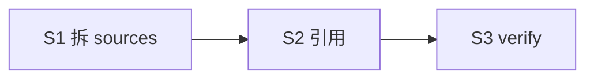

# split cortex-ingest sources per type

## 目标

cortex-ingest `references/sources.md` 单文件描述 4 类抓取拆为 `sources/<type>.md` 4 独立文件 (github / gitlab / website / local). routing + workflow 保留 references/. 对齐 cortex-schema templates 拆分模式.

## 目标形态

```
skills/cortex-ingest/
├── SKILL.md (≤ 60 行, 路由表新增 sources/<type>)
├── sources/
│   ├── github.md       ← GitHub repo 抓取 (gh CLI / WebFetch)
│   ├── gitlab.md       ← GitLab repo 抓取 (glab CLI / WebFetch)
│   ├── website.md      ← 任意 Website (WebFetch)
│   └── local.md        ← local dir (检测 .git remote → 转 github/gitlab; 否则 项目/local/)
└── references/
    ├── routing.md      (识别算法 + 优先序; 不变)
    └── workflow.md     (CLI vs sub-agent 混合; 不变)
```

## Deliverable 矩阵

| ID | 交付物 | 验收 | P |
| --- | --- | --- | --- |
| D1 | sources/ 4 独立文件 (github/gitlab/website/local) | 各 ≤ 100 行, 含识别条件 + 典型示例 + 抓取方法 + frontmatter 提示 + 与 extract 边界 | P0 |
| D2 | 删 references/sources.md (内容迁完) | 文件不存在 | P0 |
| D3 | SKILL.md 路由表更新 (sources/<type>.md 4 行 + references/{routing,workflow} 2 行) | ≤ 60 行, 路由表完整 | P0 |
| D4 | references/{routing,workflow}.md 内 `sources.md` 引用改 `../sources/<type>.md` 对位 | 0 旧引用残留 | P0 |

## Subtask 拆分

| ID | Subtask | Deliverable | 边界 |
| --- | --- | --- | --- |
| S1 | 拆 sources.md 为 4 sources/ 文件 + 删原 | D1, D2 | skills/cortex-ingest/{sources/**, references/sources.md} |
| S2 | 改 SKILL.md + references/{routing,workflow}.md 引用 | D3, D4 | SKILL.md + references/*.md |
| S3 | 验证 + 暂存 | all | smoke + grep |

## Subtask 调度图



## 范围边界

- 在范围: `skills/cortex-ingest/{SKILL.md, sources/**, references/**}`
- 不动: ingest.sh / _ingest/ python / fixture / plugin.json / agent / README / llms
- 禁改: 4 类输入路由逻辑 / 目标路径映射 / arguments 字段

## 验收

- [ ] `skills/cortex-ingest/sources/` 存在, 含 4 .md
- [ ] `skills/cortex-ingest/references/sources.md` 不存在
- [ ] 每个 sources/<type>.md 含识别条件 + 抓取方法 + ≥ 1 处典型示例 + frontmatter 提示
- [ ] SKILL.md 路由表反映新结构, ≤ 60 行
- [ ] grep `references/sources.md` 在 cortex-ingest/ 内 0 命中
- [ ] frontmatter 体检 (desc/wtu/arguments/user-invocable=true)
- [ ] smoke: ingest 6 输入路由仍正确 (脚本未动); validate/lint/extract 同前
- [ ] 自动 git add

## 约束

硬约束:
- 每个 sources/<type>.md ≤ 100 行
- SKILL.md ≤ 60 行
- 内容只迁移 + 微补 (各 source 可补 frontmatter 提示 + 与 extract 边界); 不删
- routing/workflow 不动 (只改 sources.md 引用)

软约束:
- sources/ 文件名与 InputKind 严格对位 (github/gitlab/website/local)
- 头部 1 行注释: `> source — type=<X>; 识别 + 抓取 + frontmatter`
