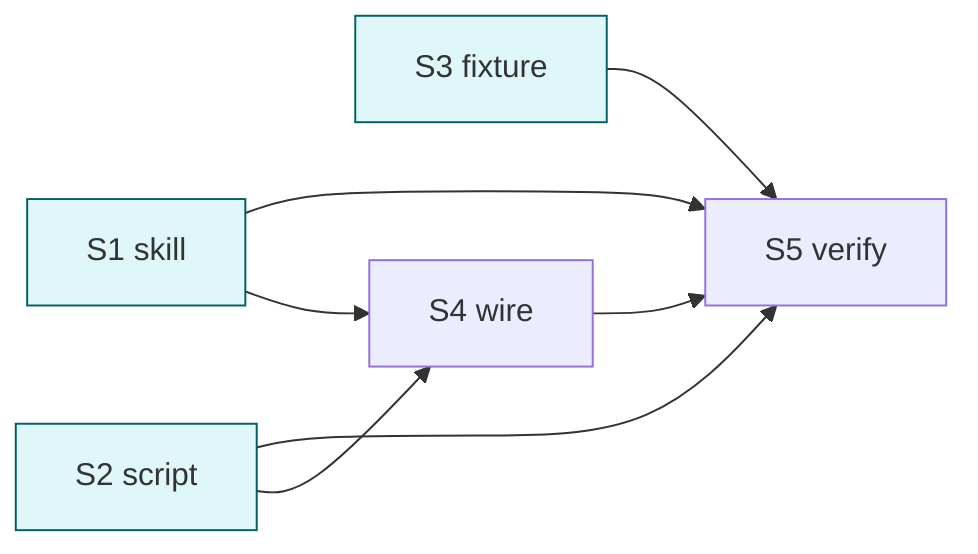

# cortex-ingest skill — 知识库构建

## 目标

新增 `cortex-ingest` skill: 接受 4 类输入 (GitHub URL / GitLab URL / Website URL / local dir), 抓取/分析/摘要 → 落盘到 `项目/<host>/<owner>/<repo>/` (cortex-schema 三模块的"项目"模块). 默认 dry-run, --apply 才落盘.

## 输入识别 + 路由

| 输入 | 识别 | 目标路径 |
| --- | --- | --- |
| `https://github.com/<o>/<r>` | URL host | `项目/github.com/<o>/<r>/` |
| `https://gitlab.com/<o>/<r>` | URL host | `项目/gitlab.com/<o>/<r>/` |
| `https://<domain>/...` (其他) | URL | `项目/<domain>/_/<slug>/` (host=domain, owner=`_`, repo=path slug) |
| local dir + `.git` + remote 是 github/gitlab | 读 `.git/config` | 当 github/gitlab 处理 (按 remote URL 路由) |
| local dir 无 git 或无远端 | dir 存在 | `项目/local/<dir-basename>/` |

## Deliverable 矩阵

| ID | 交付物 | 验收 | P |
| --- | --- | --- | --- |
| D1 | `skills/cortex-ingest/SKILL.md` 薄入口 (≤ 60 行) | frontmatter 合规 (含 user-invocable? 可选; description ≤ 512 / wtu ≤ 128 / arguments 字符串) | P0 |
| D2 | `skills/cortex-ingest/references/{sources,routing,workflow}.md` | 3 文件描述 4 类输入 / 路由表 / 抓取流程 (CLI + sub-agent 混合) | P0 |
| D3 | `scripts/ingest.sh` + `scripts/_ingest/` python 模块 | 实现输入识别 + git remote 检测 + dry-run JSON plan | P0 |
| D4 | local dir 非 git → 项目/local/<name>/ 路由实现 | fixture 测试通过 | P0 |
| D5 | local dir 是 github/gitlab repo (有 remote) → 当 github/gitlab 处理 | fixture 含 .git/config 含 remote, 路由对 | P0 |
| D6 | plugin.json 注册 cortex-ingest (skills 数组 +1) | skills 数组 len == 4 | P0 |
| D7 | tests/fixtures/ingest/ 4+ 类样本 | github / gitlab / website / local-no-git / local-with-git-remote | P0 |
| D8 | agent + README + llms.txt 更新引用 4 skill | 描述含 cortex-ingest | P1 |

## Subtask 拆分

| ID | Subtask | Deliverable | 边界 | 详情 |
| --- | --- | --- | --- | --- |
| S1 | 建 cortex-ingest skill (SKILL.md + 3 references) | D1, D2 | skills/cortex-ingest/** | subtask/S1-skill.md |
| S2 | 写 ingest.sh + _ingest/ python 模块 (识别 + 路由 + dry-run) | D3, D4, D5 | scripts/ingest.sh + scripts/_ingest/** | subtask/S2-script.md |
| S3 | 建 fixture (4+ 类) | D7 | tests/fixtures/ingest/** | subtask/S3-fixture.md |
| S4 | 改 plugin.json + agent + README + llms.txt 引用 | D6, D8 | .claude-plugin/plugin.json / agents/cortex.md / README.md / llms.txt | subtask/S4-wire.md |
| S5 | 联合验证 | all | smoke + fixture 验证 | subtask/S5-verify.md |

## Subtask 调度图

S1+S2+S3 并行 (互不依赖). S4 等 S1+S2. S5 收口.

## 范围边界

- 在范围: `skills/cortex-ingest/**`, `scripts/ingest.sh` + `scripts/_ingest/**`, `tests/fixtures/ingest/**`, plugin.json / agent / README / llms 引用更新
- 不在范围: 真实抓取实现 (gh / git clone / WebFetch 调用) — 本 task 仅骨架 + 路由 + dry-run JSON plan; 实际拉取由 main 会话或后续 task 接 sub-agent
- 不动: cortex-schema / lint / extract 已稳定的内容; fixture e2e

## 验收

- [ ] `skills/cortex-ingest/SKILL.md` 存在, ≤ 60 行, frontmatter 合规
- [ ] 3 references 文件存在, 各 ≤ 220 行
- [ ] `scripts/ingest.sh` 可执行, `--help` 退出 0
- [ ] `ingest.sh --dry-run --target <fixture-dir> --source <URL/path>` 输出 JSON 含 plan
- [ ] github / gitlab / website / local-no-git / local-with-git-remote 5 种输入路由正确
- [ ] plugin.json skills 数组 len == 4 (含 cortex-ingest)
- [ ] grep "cortex-ingest" 在 README/llms/agent 各 ≥ 1 次
- [ ] frontmatter 体检 (desc ≤ 512 / wtu ≤ 128 / 无 "用户说" / arguments 字符串)
- [ ] smoke (validate / lint / extract / ingest) 4 个脚本无 regression
- [ ] 自动 git add

## 约束

硬约束:
- SKILL.md ≤ 60 行
- references ≤ 220 行
- 默认 dry-run; --apply 才落盘 (本 task 范围 dry-run 即可, apply 实际落盘可标 "需 main 会话执行实际抓取")
- 路径权威 cortex-schema (不复制路径硬列)
- 输入识别优先序: URL pattern → local dir + git remote → local dir fallback
- frontmatter arguments 字符串

软约束:
- ingest.sh 入口 ≤ 80 行 (主体在 _ingest/)
- python 模块 stdlib only (+ 可用 pyyaml)
- references 命名: sources.md (4 类输入) / routing.md (识别+目标路由表) / workflow.md (抓取流程, CLI vs sub-agent 混合)

## 风险

| 风险 | 缓解 |
| --- | --- |
| 真实抓取超出 task 范围导致 skill 不可用 | dry-run + plan JSON 已可用; SKILL.md 显式标"实际抓取由 main 会话/sub-agent 完成" |
| local dir 路径冲突 (同名 dir 不同位置) | 路由含完整 abspath sha 短 hash 防同名冲撞 (可选, 后续 task) |
| git remote URL 多 format (ssh / https) | _ingest/git.py 处理 git@github.com:... vs https://github.com/... 双形态 |
| website 落 host=任意 domain, 目录爆炸 | 写在 sources.md, 鼓励用户用稳定 domain (一篇文章不必 ingest) |
| ingest 行为与 extract 重叠 | extract = L4-inbox 内部分类; ingest = 外部资源进 vault; sources.md 边界写清 |
