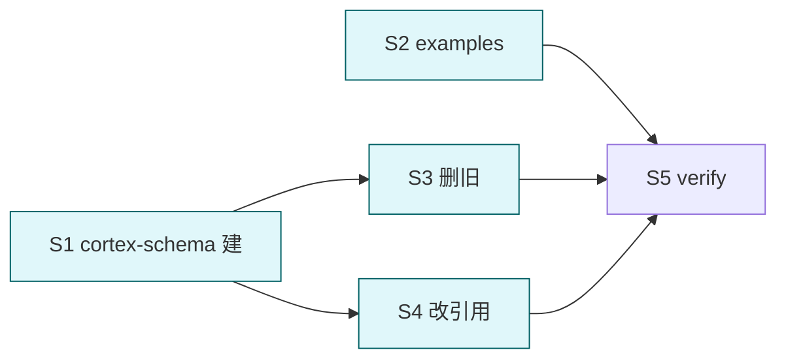

# merge cortex schema skills + enrich examples

## 目标

合并 `cortex-schema-knowledge` + `cortex-schema-memory` 为单一 skill `cortex-schema` (代表项目知识库统一契约), 同时补完整 .md 样例文件 + 更详细 ASCII 目录树.

## 背景

用户视角: 记忆与知识库本质都是项目知识库的组成. 拆两个 skill 维护成本高 + 跨 reference 引用反复. 合并后:
- 1 skill 覆盖目录契约 / 三模块 / 5 级记忆 / frontmatter / 模板
- references 按内容块组织: topology / knowledge-modules / memory-levels / templates / examples
- lint/extract/agent 引用单个 skill 名即可

## Deliverable 矩阵

| ID | 交付物 | 验收 | 优先级 |
| --- | --- | --- | --- |
| D1 | `cortex-schema` 新 skill (合并源 + 重组 references) | SKILL.md + 5 references; frontmatter 合规 | P0 |
| D2 | 完整 .md 样例集 (含正文 + wikilink) | references/examples/ 含 ≥ 5 完整样例 (rule / project / domain / memory L1/L2/L3 / vault-script) | P0 |
| D3 | 详细 ASCII 目录树 (带示例文件名叶子) | topology 树含 README.md / example-rule.md / design.md 等具体文件名 | P0 |
| D4 | 删除 `cortex-schema-knowledge` + `cortex-schema-memory` 旧 skill 目录 | 两目录不存在; plugin.json skills 数组 = 3 (cortex-schema + lint + extract) | P0 |
| D5 | 更新引用: lint/extract/agent/README/llms.txt/_lint 注释/e2e-report 指向 cortex-schema | grep 旧 skill 名 0 命中 | P0 |

## Subtask 拆分

| ID | Subtask | Deliverable | 边界 | 详情 |
| --- | --- | --- | --- | --- |
| S1 | 建 cortex-schema 新 skill (SKILL.md + 重组 references) | D1, D3 | skills/cortex-schema/** (新建) | subtask/S1-skill-build.md |
| S2 | 写 examples/ 5+ 完整样例 .md | D2 | skills/cortex-schema/references/examples/** | subtask/S2-examples.md |
| S3 | 删旧 schema-knowledge / schema-memory + 改 plugin.json | D4 | skills/cortex-schema-knowledge/ (删) / -memory/ (删) / plugin.json | subtask/S3-purge-old.md |
| S4 | 改全库引用指向 cortex-schema | D5 | lint references / extract references / agent / README / llms / _lint/__init__.py / e2e-report.md | subtask/S4-update-refs.md |
| S5 | 联合验证 | all | smoke + grep | subtask/S5-verify.md |

## Subtask 调度图

S1 与 S2 并行 (新 skill 主体 + examples 不互斥). S3+S4 依赖 S1 完成. S5 收口.

## 范围边界

- 在范围: `plugins/tools/cortex/skills/cortex-schema/**` (新), `cortex-schema-{knowledge,memory}/` (删), lint/extract references 引用名, agent / README / llms / 脚本注释 / e2e-report
- 不在范围: lint/extract 规则/算法 / 脚本代码 / fixture / agent 主体逻辑
- 禁改: 三模块中文路径 (项目/领域/脚本) / 5 级路径 (L0-core ... L4-inbox) / lint 7 规则数 / extract 路由顺序 / arguments 字段格式

## 验收

- [ ] D1-D5 全过
- [ ] `skills/cortex-schema-knowledge/` 不存在
- [ ] `skills/cortex-schema-memory/` 不存在
- [ ] `skills/cortex-schema/` 存在, SKILL.md ≤ 60 行, references ≥ 5
- [ ] `references/examples/` 含 ≥ 5 完整 .md 样例 (含正文 + wikilink, 不只 frontmatter)
- [ ] grep `cortex-schema-knowledge\|cortex-schema-memory` 在 plugins/tools/cortex/ 内 0 命中
- [ ] plugin.json skills 数组 len == 3 (cortex-schema, cortex-lint, cortex-extract)
- [ ] frontmatter description ≤ 512, when_to_use ≤ 128, 无 "用户说"; arguments 字符串
- [ ] smoke: validate-layout / lint / extract 行为同改前
- [ ] 自动 git add

## 约束

硬约束:
- SKILL.md ≤ 60 行 (薄入口, 含路由表覆盖 5 references)
- references/*.md ≤ 220 行
- examples/*.md ≤ 80 行/文件 (完整可读样例)
- 合并后**仍是单一真相源**, lint/extract 不复制路径硬列
- arguments 字符串格式 (`[模块|等级]` 或类似)

软约束:
- references 命名: topology.md / knowledge-modules.md / memory-levels.md / templates.md / examples/
- examples/ 子目录组织: rule.md / project.md / domain.md / memory-L1.md / memory-L2.md / memory-L3.md / vault-script.md

## 风险

| 风险 | 缓解 |
| --- | --- |
| 合并后 SKILL.md 路由表过长 (5+ 项) | 用紧凑表; SKILL.md 仍 ≤ 60 行验证 |
| examples 与 templates 重复 | templates = frontmatter 块片段; examples = 完整文件 (含正文 / wikilink). 边界写在两处头部 |
| 旧引用残留导致 sub-agent / 用户找不到 skill | S5 强制 grep 死引检查 |
| plugin.json 改坏 | 跑 python3 json.tool 验证 |
