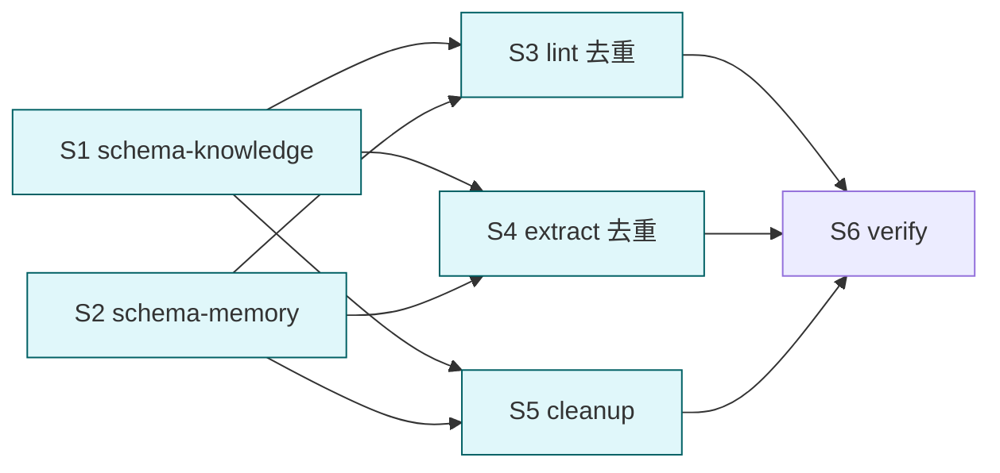

# consolidate cortex schema as single source of truth

## 目标

让 cortex-schema-knowledge 与 cortex-schema-memory 成为目录结构 / 路径规范 / 文件模板的**唯一真相源**. 其他 skill (lint/extract) 与 agent 引用 schema-*, 不再重复定义路径/结构规则. 删除 `docs/layout.md` (内容合并到 schema-*).

## 背景

当前 4 处重复定义目录/路径规则:
- `docs/layout.md` (物理树 + 同构 + 用途分离)
- `cortex-schema-knowledge` (三模块路径)
- `cortex-schema-memory` (5 级路径)
- `cortex-lint/references/rules.md` (R3/R4/R6 路径/同构/level 映射)
- `cortex-extract/references/classifier.md` (路由路径)

修任一处都要四处同步, 高漂移风险.

## Deliverable 矩阵

| ID | 交付物 | 验收 | 优先级 |
| --- | --- | --- | --- |
| D1 | cortex-schema-knowledge 吸收 layout 三模块 + 双层同构 + 脚本用途分离 + 文件模板 | references 含完整三模块物理树 + 同构 + 用途分离 + frontmatter 模板 | P0 |
| D2 | cortex-schema-memory 吸收 layout 5 级目录 + 遗忘曲线 + R6 映射表 (从 lint 迁移) | references 含 5 级物理树 + 速查图 + level↔dir 映射 | P0 |
| D3 | cortex-lint references 去重: 删路径硬列, 仅留 R1-R7 算法 + 引用 schema-* | rules.md 无路径段硬列, 改 "详见 cortex-schema-{knowledge,memory}" | P0 |
| D4 | cortex-extract references 去重: 删路由路径列举, 仅留三轴 + 顺序决策 + 引用 schema-* | classifier.md 无 `领域/<area>` `memory/L<n>-` 硬列 | P0 |
| D5 | 删 docs/layout.md; 全局引用改向 schema-* | grep `docs/layout.md` 在 plugins/tools/cortex/ 内 0 命中 | P0 |
| D6 | cortex agent 引用更新: 用 schema-* 而非 layout.md | agents/cortex.md / README.md / llms.txt / validate-layout.sh 不引 layout.md | P1 |

## Subtask 拆分

| ID | Subtask | Deliverable | 边界 | 详情 |
| --- | --- | --- | --- | --- |
| S1 | schema-knowledge 吸收 | D1, D5 部分 | skills/cortex-schema-knowledge/** | subtask/S1-schema-knowledge.md |
| S2 | schema-memory 吸收 | D2, D5 部分 | skills/cortex-schema-memory/** | subtask/S2-schema-memory.md |
| S3 | lint references 去重 | D3 | skills/cortex-lint/references/** | subtask/S3-lint.md |
| S4 | extract references 去重 | D4 | skills/cortex-extract/references/** | subtask/S4-extract.md |
| S5 | 删 docs/layout.md + 改全库引用 + agent/README/llms/脚本注释 | D5, D6 | docs/layout.md / agents/cortex.md / README.md / llms.txt / scripts/validate-layout.sh | subtask/S5-cleanup.md |
| S6 | 联合验证 | all | 跑 smoke + 死链 grep | subtask/S6-verify.md |

## Subtask 调度图

S1//S2 并行先做 (吸收). 完成后 S3//S4//S5 三者并行 (互不依赖). S6 串行收口.

## 范围边界

- 在范围: `plugins/tools/cortex/skills/cortex-{schema-*,lint,extract}/**`, `docs/layout.md` (删), `agents/cortex.md`, `README.md`, `llms.txt`, `scripts/validate-layout.sh` (仅注释)
- 不在范围: 脚本逻辑 (`_lint/` `_extract/` 行为) / fixture / plugin.json
- 禁改: 三模块中文路径名 / 5 级英文路径名 / lint 7 规则数 / extract 路由顺序 / arguments 字段格式 / 已清理的 "用户说" 不能复现

## 验收标准

- [ ] D1-D6 全过
- [ ] `docs/layout.md` 文件不存在
- [ ] `grep -r "docs/layout.md" plugins/tools/cortex/` 在合并改后 0 命中
- [ ] 4 skill SKILL.md ≤ 60 行
- [ ] lint references/rules.md 不含 `领域/<area>/` `memory/L<n>-<suffix>` 等路径段硬列 (R6 映射表迁移到 schema-memory; R4 必备目录改引用)
- [ ] extract references/classifier.md 不再硬列 `项目/<host>` `领域/<area>` 等模板; 改写为"按 schema-knowledge / schema-memory 决定目标路径"
- [ ] schema-knowledge references 含完整: 项目模块物理树 + 领域 + 脚本 (vault 内部) + 用户操作入口 + 同构原则 + frontmatter 模板
- [ ] schema-memory references 含完整: 5 级物理树 + 遗忘曲线速查 + level↔dir 映射 (从 lint 迁来)
- [ ] 跑 `lint.sh --check` / `extract.sh --dry-run` 对 fixture 行为不变 (脚本逻辑未受影响)
- [ ] frontmatter description ≤ 512, when_to_use ≤ 128, 无 "用户说"
- [ ] 自动 git add

## 约束

硬约束:
- schema-* SKILL.md 仍 ≤ 60 行
- references/*.md ≤ 220 行 (吸收后允许微涨)
- 路径列表只存一处 (schema-*), 其他地方仅速查 + 引用
- lint/extract 引用 schema-* 用 skill 名 (如 `cortex-schema-knowledge`) 或相对路径 (`../cortex-schema-knowledge/references/projects.md`)

软约束:
- schema-* 可新增 references/templates.md 容纳 frontmatter 模板 + 目录初始化 mkdir 清单
- 引用形式统一 (markdown link 或 backtick 路径)

## 风险

| 风险 | 缓解 |
| --- | --- |
| schema-* 文件变厚 (≥ 220 行) | 拆子 reference (templates.md / topology.md) |
| 去重后链接失效 / 悬挂引用 | S6 跑 grep `docs/layout.md` + 跑 markdown link checker (简单 sed) |
| validate-layout.sh 注释引用 layout.md | S5 同步改注释为引 schema-* |
| 旧 commit 历史引 layout.md | 不动 (git 历史不可篡改, 仅 HEAD 干净) |
