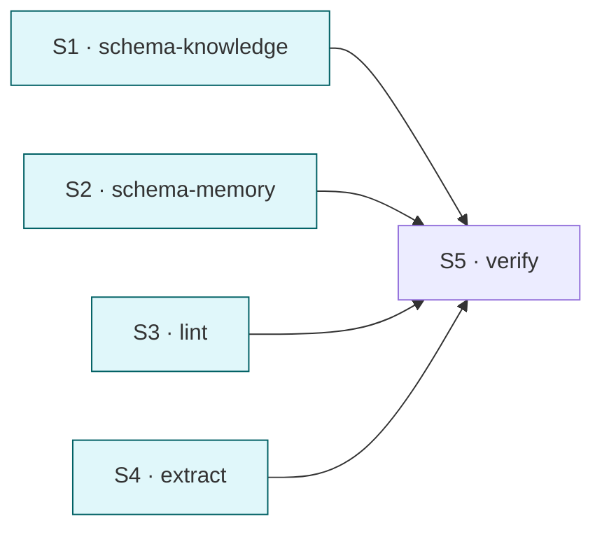

# split cortex skills into multi-file structure

## 目标

把 4 个 cortex skill 从单 SKILL.md 拆成 SKILL.md (薄入口 + 路由表) + references/*.md (按逻辑块 2-3 个/skill), 对齐 trellisx-orchestrate 模式; 同时补齐 frontmatter `arguments` 字段 (有 `argument-hint` 必须配 `arguments`).

## Deliverable 矩阵

| ID | 交付物 | 类型 | 独立验收 | 优先级 |
| --- | --- | --- | --- | --- |
| D1 | cortex-schema-knowledge 多文件改造 | skill 结构 | SKILL.md + 2-3 个 references/*.md, frontmatter 含 arguments | P0 |
| D2 | cortex-schema-memory 多文件改造 | skill 结构 | 同上 | P0 |
| D3 | cortex-lint 多文件改造 | skill 结构 | 同上 | P0 |
| D4 | cortex-extract 多文件改造 | skill 结构 | 同上 | P0 |
| D5 | frontmatter 全量加 `arguments` 字段 (4 skill) | 修字段 | grep 4 个 SKILL.md 都含 arguments | P0 |

## Subtask 拆分

| ID | Subtask | Deliverable | 边界 | 详情 |
| --- | --- | --- | --- | --- |
| S1 | 拆 cortex-schema-knowledge | D1, D5 | skills/cortex-schema-knowledge/** | subtask/S1-schema-knowledge.md |
| S2 | 拆 cortex-schema-memory | D2, D5 | skills/cortex-schema-memory/** | subtask/S2-schema-memory.md |
| S3 | 拆 cortex-lint | D3, D5 | skills/cortex-lint/** | subtask/S3-lint.md |
| S4 | 拆 cortex-extract | D4, D5 | skills/cortex-extract/** | subtask/S4-extract.md |
| S5 | 联合验证 + 暂存 | all | 跑 frontmatter + 路由 smoke | subtask/S5-verify.md |

## Subtask 调度图

4 拆分互不依赖, 完全并行. S5 串行收口.

## 范围边界

- 在范围: `plugins/tools/cortex/skills/cortex-*/**`
- 不在范围: agent / scripts / fixture / plugin.json 内容 (skills 数组路径不变, 仍是目录)
- 禁改: 三模块中文路径 / 5 级记忆等级语义 / lint 规则数 / extract 路由表

## 验收标准

- [ ] 4 skill 每个含 SKILL.md (≤ 60 行, frontmatter + 路由表 + 速查 + 引用)
- [ ] 每个 skill 含 2-3 个 references/*.md, 按逻辑块切分
- [ ] 全部 4 SKILL.md frontmatter 含非空 `arguments` (与 `argument-hint` 配对)
- [ ] 全部 4 SKILL.md frontmatter `description` 长度 ≤ 512 字符
- [ ] 全部 4 SKILL.md frontmatter `when_to_use` 长度 ≤ 128 字符
- [ ] 内容完整性: 拆分前后信息不丢失, 仅重组
- [ ] plugin.json `skills` 数组路径不变 (仍指向目录)
- [ ] 跑 cortex-lint 内嵌的 SKILL frontmatter 校验通过

## 约束

硬约束:
- SKILL.md 薄: ≤ 60 行 (含 frontmatter)
- references 文件每个 ≤ 200 行, 按逻辑块切
- frontmatter 必备字段: name, description, when_to_use, argument-hint, **arguments** (新增)
- **description 长度 ≤ 512 字符** (新)
- **when_to_use 长度 ≤ 128 字符** (新; 单行短句或简洁短语集合, 不写多行列表)
- `arguments` 用列表形式描述参数, 字段语义对齐 `argument-hint`
- 不删除既有内容, 只迁移

软约束:
- references/*.md 命名 kebab-case
- SKILL.md 路由表用表格 (file | 何时读)

## 风险与决策

| 风险 | 影响 | 缓解 |
| --- | --- | --- |
| 拆分粒度选错 (过细 / 过粗) | 维护性反而下降 | 按"完成一项任务需要读的最小集合"切; 不为 LoC 平衡硬拆 |
| arguments 字段语义模糊 | 不同 skill 写法不一致 | PRD 内统一格式: list of {name, description, optional?} |
| 拆完丢失内容 | 信息不对齐 | S5 跑 diff: 旧 SKILL.md 全文 ⊂ 新 (SKILL.md + references) 并集 |
