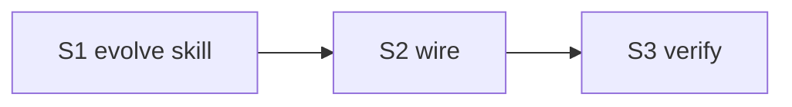

# cortex-evolve — 记忆升降级 skill

## 目标

新增 `cortex-evolve` skill: 按金字塔模型自动维护记忆等级 (L4 庞大 → L0 稠密). 升降级依据 3 类信号 (频率 / 时间 / 重要度) + 2 规则修饰 (用户强调 / L1-L0 不主动降). 仅 skill 文档, 无独立脚本 (调 cortex-extract / cortex-save / lint 执行).

## 升降级规则

### 信号轴

| 轴 | 升级 | 降级 |
| --- | --- | --- |
| 频率 (提及次数) | 最近常提 → ↑ | 渐少 → ↓ |
| 时间 (事件距今) | 越近 → ↑ | 越远 → ↓ |
| 重要度 | 十分重要 → ↑ | 不重要 → 保持现状 (不主动降) |

### 修饰规则

| 规则 | 说明 |
| --- | --- |
| 用户强调 | 反复多次强调 → 逐级升级 (L3→L2→L1→L0) |
| L1/L0 不主动降级 | 若用户未显式提出, 且条目已在 L1/L0, **不主动降** (仅频率/时间触发不够; 需用户显式 forget) |
| L1/L0 自动升级允许 | L2 满足升级条件可自动 → L1; L1 满足可自动 → L0 (无需 ask, 但 lint 标 audit-candidate) |
| L1/L0 写入 ask 例外 | 新写入 L1/L0 (非从下级 promote) 必须 ask 用户确认 |

### 适用范围

- 自动升降: L4 ↔ L3 ↔ L2 (主要工作区)
- 自动升 (单向): L2 → L1, L1 → L0 (允许, 无 ask)
- 自动降 (禁止): L1, L0 (除非用户显式)

### 金字塔结构

```
        L0  ← 稠密、稀少 (尽可能少)
       L1
      L2
     L3
    L4    ← 庞大、信息密集
```

L0 越少越好 — 信息稠密; L4 容量大 — 收件箱+短期.

## Deliverable 矩阵

| ID | 交付物 | 验收 | P |
| --- | --- | --- | --- |
| D1 | `skills/cortex-evolve/SKILL.md` ≤ 60 行 (薄入口) | frontmatter 合规 (含 user-invocable=true) | P0 |
| D2 | `references/signals.md` (频率/时间/重要度 三轴 + 计算方法) | 含 3 轴定义 + 计算公式/启发式 | P0 |
| D3 | `references/rules.md` (升降级规则 + 修饰 + L1/L0 例外) | 含 5 修饰规则 + 适用范围 | P0 |
| D4 | `references/workflow.md` (执行流程: 扫 vault → 评分 → plan → 用户审 → apply) | 含 5 步流程 + dry-run/apply 行为 | P0 |
| D5 | plugin.json + agent + README + llms 更新引用 | skills 6→7 | P0 |

## Subtask 拆分

| ID | Subtask | Deliverable | 边界 |
| --- | --- | --- | --- |
| S1 | 建 cortex-evolve skill (SKILL.md + 3 references) | D1-D4 | skills/cortex-evolve/** (新建) |
| S2 | wire (plugin.json + agent + README + llms) | D5 | .claude-plugin/plugin.json + agents + README + llms.txt |
| S3 | 验证 + 暂存 | all | smoke + grep |

## Subtask 调度图



## 范围边界

- 在范围: skills/cortex-evolve/** (新), plugin.json/agent/README/llms 引用
- 不在范围: 无独立脚本 (skill 步骤指导 main 调 extract/save/lint); 不动其他 skill 内容; 不动 fixture
- 禁改: 6 既有 skill / cortex-schema templates / 5 级路径 / arguments 格式

## 验收

- [ ] `skills/cortex-evolve/SKILL.md` ≤ 60 行, frontmatter 合规 (desc ≤ 512 / wtu ≤ 128 / 无"用户说" / arguments 字符串 / user-invocable=true)
- [ ] 3 references 存在, 各 ≤ 220 行
- [ ] references/rules.md 含 "L1/L0 不主动降级" + "L1/L0 自动升级允许" + "L4-L2 主要工作区" + "金字塔" 关键词
- [ ] references/signals.md 含三轴 (频率/时间/重要度) + 计算方法
- [ ] plugin.json skills len == 7 (含 cortex-evolve)
- [ ] agent / README / llms 各 ≥ 1 处引用 cortex-evolve
- [ ] 6 既有 skill smoke 同前
- [ ] 自动 git add

## 约束

硬约束:
- SKILL.md ≤ 60 行
- 各 reference ≤ 220 行
- 无脚本 / 无 fixture
- 复用 cortex-schema (5 级路径) + cortex-extract (三轴模式)
- L1/L0 写入新条目 (非 promote) 必须 ask, 与 extract/save 一致
- L1/L0 不主动降级硬规
- frontmatter 字段全套 (含 user-invocable=true)

软约束:
- signals.md 给出可量化公式 (如 "频率 = 最近 7d 提及次数 / 历史均值")
- rules.md 给具体阈值 (升级条件: 复用 ≥ 3 → L3→L2; 复用 ≥ 5 + weight ≥ 0.8 → L2→L1; 复用 ≥ 10 + 用户多次强调 → L1→L0)

## 风险

| 风险 | 缓解 |
| --- | --- |
| 自动升 L0 风险 (污染核心规则) | L1→L0 仍标 audit-candidate, 即使"自动允许"也 dry-run + lint 标记 |
| 与 cortex-extract router 重叠 (extract 也有 promote-L1/L2 hint) | rules.md 边界: extract = inbox 入门级路由; evolve = 已入 vault 后跨级再平衡 |
| 频率/时间信号噪声 | signals.md 文档化最小窗口 (≥ 7d) + 最小提及计数 (≥ 3) 防误判 |
| 金字塔失衡 (L0 膨胀) | lint 加 audit: L0 条目数超阈值 (默认 20) → warn |
