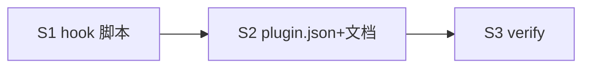

# cortex hooks — 自动构建 .wiki + 主动检索

## 目标

为 cortex 插件加 3 个轻量 hook: 会话开始注入 vault 概览 + 缺结构提示; 每轮用户输入注入主动 recall 提示; 会话结束提示沉淀。**纯注入提示 (additionalContext), 不跑重扫、不自动写盘** — AI 据提示决定是否调对应 skill。

## hook 矩阵

| 事件 | 职责 | 注入内容 (轻量) |
| --- | --- | --- |
| SessionStart | vault 概览 + 构建提示 | `test -d <repo>/.wiki`: 存在→"cortex vault 就绪, 查资料用 cortex-recall"; 缺→"无 .wiki, 需知识库可让 cortex 构建 (validate-layout / lint --fix 建必备目录)" |
| UserPromptSubmit | 主动检索提示 | 静态 reminder: "需查/回忆 → 先 cortex-recall 搜双层 vault (项目+用户级), 未命中再外部" |
| Stop | 沉淀提示 | "本轮有非平凡发现? cortex-context-digest 沉淀到 .wiki (项目级/全局自动判)" |

## 关键约束

- **轻量**: hook 脚本只 `test -d` / echo JSON, 禁 rg/全扫; `async: true` + 短 timeout
- **不写盘**: 构建 .wiki 由 hook 提示 AI 执行 (validate-layout/lint --fix), hook 本身不 mkdir 用户 repo (避免未授权写)
- **不强制**: 注入 additionalContext 提示, AI/用户决定是否调 skill; 非触发轮不增负担
- 输出 JSON: `{"hookSpecificOutput":{"hookEventName":"<E>","additionalContext":"<提示>"}}`

## Deliverable 矩阵

| ID | 交付物 | 验收 | P |
| --- | --- | --- | --- |
| D1 | `hooks/session-start.sh` | test -d .wiki → 注入概览/构建提示 JSON; 退出 0 | P0 |
| D2 | `hooks/user-prompt-submit.sh` | 注入 recall 提示 JSON; 退出 0 | P0 |
| D3 | `hooks/stop.sh` | 注入沉淀提示 JSON; 退出 0 | P0 |
| D4 | plugin.json hooks 声明 (SessionStart/UserPromptSubmit/Stop) | JSON 合法, 3 事件指向 3 脚本 (${CLAUDE_PLUGIN_ROOT}) | P0 |
| D5 | README/llms 提 hooks | 文档列 3 hook 职责 | P1 |

## Subtask 拆分

| ID | Subtask | Deliverable | 边界 |
| --- | --- | --- | --- |
| S1 | 写 3 hook 脚本 (bash, 轻量, 输出 JSON) | D1-D3 | hooks/*.sh (新建) |
| S2 | plugin.json hooks 声明 + README/llms | D4,D5 | .claude-plugin/plugin.json + README + llms |
| S3 | 验证 (脚本可跑出合法 JSON + plugin.json 合法 + smoke) | all | 只读测 + 暂存 |

## Subtask 调度图

## 范围边界

- 在范围: `hooks/{session-start,user-prompt-submit,stop}.sh` (新), plugin.json hooks 字段, README/llms
- 不在范围: hook 内跑搜索/构建逻辑 (轻量原则); 不改 skill/agent/scripts/references
- 禁改: 已定 skill frontmatter / worker agents / 契约

## 验收

- [ ] 3 hook 脚本存在, 可执行, 各 `echo '{}' | bash <hook>` 出合法 JSON (additionalContext)
- [ ] session-start: .wiki 存在/缺失两分支提示正确
- [ ] plugin.json hooks 含 SessionStart/UserPromptSubmit/Stop, 指向 3 脚本, JSON 合法
- [ ] hook command 用 `${CLAUDE_PLUGIN_ROOT}` + async/timeout
- [ ] README/llms 提 hooks
- [ ] 既有脚本 smoke 无 regression
- [ ] 自动 git add

## 约束

硬约束:
- hook 脚本 bash, ≤ 40 行/个, 只 test/echo, 无 rg/find 全扫
- 输出 stdout JSON (hookSpecificOutput.additionalContext)
- plugin.json hooks 范式对齐 notify (type:command, ${CLAUDE_PLUGIN_ROOT}, async:true, timeout ≤ 10)
- hook 不写用户 repo (.wiki 构建靠提示 AI 跑 validate-layout/lint --fix)

软约束:
- 提示文案简短 (≤ 2 行), 引导调 cortex-recall / cortex-context-digest / cortex-lint
- UserPromptSubmit 提示静态 (不读 query 做检索, 纯 reminder)

## 风险

| 风险 | 缓解 |
| --- | --- |
| 每轮 UserPromptSubmit 注入增 token 负担 | 提示 ≤ 2 行静态; async; 可后续加触发词过滤 (本期纯静态) |
| SessionStart test -d 路径 (CWD vs repo root) | 用 $CLAUDE_PROJECT_DIR / $PWD; 取不到回退跳过不报错 |
| hook 阻塞会话 | async:true + timeout; 脚本只 test/echo 秒回 |
| 与 trellisx/外部 cortex hook 叠加冲突 | cortex hook 仅注 additionalContext, 不抢占; 文案标 [cortex] 前缀区分 |
