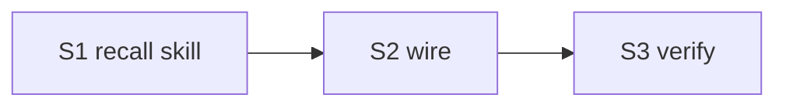

# cortex-recall — 知识库搜索 + 兜底 + 回填 + 归类

## 目标

新增 `cortex-recall` skill: 从项目级 + 用户级 vault 搜索答案; 搜不到走兜底 (互联网 → 拿不准问用户); 把搜索/用户答案自动回填到判定级别的知识库。

## 流程

```
query
 │
 ▼
1. 搜 vault (项目级 <repo>/.wiki + 用户级 ~/.cortex/.wiki, memory + 领域 + 项目)
 │  命中 → 返回 (附引用)
 │  未命中 ↓
2. WebSearch 互联网
 │  拿得准 → 用答案
 │  拿不准 ↓
3. 问用户
 │
 ▼
4. 回填: 互联网/用户答案 → 归类判定 (项目级 vs 全局) → 自动写入对应 vault
```

## 归类判定 (项目级 vs 全局)

复用 cortex-context-digest 的 scope 规则:
- 含当前 repo 名/路径/具体文件 → 项目级 `<repo>/.wiki/`
- 跨项目通用 (通则/方法/外部知识) → 全局 `~/.cortex/.wiki/`
- L0/L1 写入仍按 cortex-schema 硬规 ask (回填默认落 L3-short 或对应模块, 不自动进 L0)

## Deliverable 矩阵

| ID | 交付物 | 验收 | P |
| --- | --- | --- | --- |
| D1 | `skills/cortex-recall/SKILL.md` ≤ 60 行 | frontmatter 合规 (desc ≤ 512 / wtu ≤ 128 / arguments 字符串 / user-invocable=true) | P0 |
| D2 | `references/search.md` (双层搜索策略 + 引用格式) | 含项目级+用户级搜索范围 + 多级回退 (mcp/rg/grep) | P0 |
| D3 | `references/fallback.md` (兜底: WebSearch → 问用户) | 含顺序 + 拿不准判定 | P0 |
| D4 | `references/writeback.md` (回填 + 归类) | 含 scope 判定 + 回填级别 + L0/L1 ask 例外 | P0 |
| D5 | plugin.json + agent + README + llms + marketplace 同步 | skills 7→8; marketplace cortex desc 更新 | P0 |

## Subtask 拆分

| ID | Subtask | Deliverable | 边界 |
| --- | --- | --- | --- |
| S1 | 建 cortex-recall skill (SKILL.md + 3 references) | D1-D4 | skills/cortex-recall/** (新建) |
| S2 | wire (plugin.json skills 7→8 + agent + README + llms + marketplace desc) | D5 | .claude-plugin/* + agents + README + llms + 根 marketplace.json |
| S3 | 验证 + 暂存 | all | frontmatter 体检 + 6 既有脚本 smoke + grep |

## Subtask 调度图



## 范围边界

- 在范围: skills/cortex-recall/** (新), 引用更新 (plugin.json/agent/README/llms/marketplace)
- 不在范围: 无独立脚本 (skill 步骤指导 main 调 vault 搜索工具 / WebSearch / cortex-extract 回填); 实际搜索/写入由 main 会话执行
- 不动: cortex-schema/lint/extract/ingest/digest/evolve 内容; 5 级路径; 项目级仅 memory+领域 契约

## 验收

- [ ] `skills/cortex-recall/SKILL.md` ≤ 60 行, frontmatter 合规
- [ ] 3 references 存在 (search/fallback/writeback)
- [ ] search.md 含项目级 + 用户级双层搜索范围
- [ ] fallback.md 含 "WebSearch → 拿不准问用户" 顺序
- [ ] writeback.md 含 scope 判定 (项目 vs 全局) + L0/L1 ask 例外
- [ ] plugin.json skills len == 8 (含 cortex-recall)
- [ ] marketplace.json cortex desc 更新 (8 skill)
- [ ] agent/README/llms 各 ≥ 1 处引用 cortex-recall
- [ ] 6 既有脚本 smoke 无 regression
- [ ] 自动 git add

## 约束

硬约束:
- SKILL.md ≤ 60 行; references ≤ 220 行
- 无独立脚本 (复用既有: vault 搜索走 mcp-obsidian/rg, 回填走 cortex-extract/cortex-save)
- 归类复用 cortex-context-digest scope 规则 (不重写)
- 回填 L0/L1 仍 ask (cortex-schema 硬规); 默认落 L3-short / 对应模块
- frontmatter 字段全套 (含 user-invocable=true)

软约束:
- references 命名: search.md / fallback.md / writeback.md
- 引用 cortex-schema (路径) / cortex-extract (回填) / cortex-context-digest (scope) / cortex-search 边界

## 风险

| 风险 | 缓解 |
| --- | --- |
| 与 cortex-extract / context-digest 边界重叠 | writeback.md 明定: recall = 搜+答+回填闭环; extract = inbox 路由; context-digest = 整理会话上下文 |
| 自动回填污染 vault | 回填默认 L3-short (易遗忘, 后续 evolve 升降); L0/L1 ask; 互联网答案标 source |
| WebSearch 答案不可靠 | fallback.md 要求标 source URL + "拿不准问用户" 闸 |
