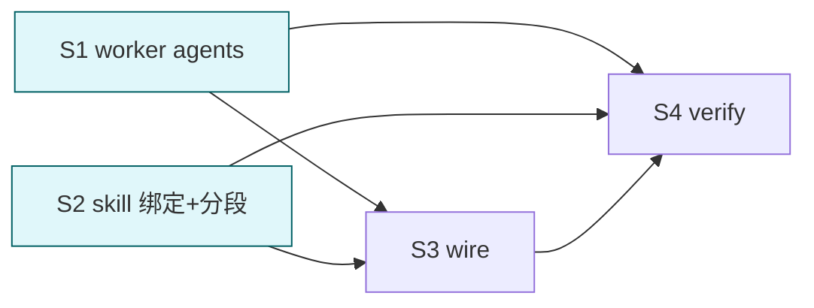

# cortex 后台 worker agents (5 skill)

## 目标

为 5 个 "扫描→plan" 型 skill (lint / history-digest / evolve / extract / ingest) 各建专属后台 subagent (`background: true`), 并用 skill frontmatter `context: fork` + `agent: <worker>` 强绑定 — skill 触发即在后台 worker 内执行重读/分析,产出结构化 plan;ask + 落盘留主会话。

## 关键约束 (官方文档硬限)

- subagent **不能用 AskUserQuestion / 不能 spawn subagent**。
- 因此 forked worker 只做 **scan + 算 + 出 plan (dry-run/check)**;**所有 ask (L0/L1 确认) + --apply/--fix 落盘必须回主会话**。
- 每个 skill 正文必须拆成两段: ①worker 后台段 (读+plan) ②主会话段 (审 plan→ask→apply)。`context: fork` 只 fork ①;②由 worker 返回 plan 后主会话续做。
- worker tools 裁剪为只读+脚本 (Read/Glob/Grep/Bash);extract/evolve/ingest 的 apply 不在 worker。

## Deliverable 矩阵

| ID | 交付物 | 验收 | P |
| --- | --- | --- | --- |
| D1 | 5 worker agent (`agents/cortex-{lint,history,evolve,extract,ingest}-worker.md`) | frontmatter 含 name/description/tools/model/background:true; 正文=scan→plan 职责 + 边界 (不 ask/不 apply) | P0 |
| D2 | 5 skill frontmatter 绑定 (`context: fork` + `agent: cortex-<x>-worker`) | 对应 5 SKILL.md 加两字段 | P0 |
| D3 | 5 skill 正文分段 (worker 段 vs 主会话 ask/apply 段) | 正文明示 fork 段只 plan, apply/ask 回主 | P0 |
| D4 | plugin.json agents 数组 + README/llms 同步 | agents 列 6 个 (cortex + 5 worker); 文档提 worker | P1 |
| D5 | 验证: frontmatter 合法 + 既有脚本 smoke 无 regression | 全过 | P0 |

## Subtask 拆分

| ID | Subtask | Deliverable | 边界 | 并行 |
| --- | --- | --- | --- | --- |
| S1 | 建 5 worker agent 文件 | D1 | agents/cortex-*-worker.md (新建) | 与 S2 不互斥 |
| S2 | 5 skill frontmatter 绑定 + 正文分段 | D2,D3 | skills/cortex-{lint,history-digest,evolve,extract,ingest}/SKILL.md | 与 S1 不互斥 |
| S3 | wire plugin.json agents + README/llms | D4 | .claude-plugin/plugin.json + README + llms.txt | 依赖 S1 |
| S4 | 验证 + 暂存 | D5 | 只读 smoke + frontmatter 体检 | 收口 |

## Subtask 调度图

S1 // S2 并行 (不同文件); S3 依赖 S1 (需 agent 名); S4 收口。

## 范围边界

- 在范围: `agents/cortex-*-worker.md` (新), 5 skill SKILL.md frontmatter+正文, plugin.json/README/llms
- 不在范围: recall/context-digest/schema (不建 worker — recall 兜底需 ask; context-digest 需主会话上下文; schema 不执行); 不改 scripts 逻辑; 不改 references
- 禁改: 5 级路径 / 项目级 memory+领域 契约 / arguments / user-invocable / disable-model-invocation (已定)

## 验收

- [ ] 5 worker agent 存在, frontmatter 含 `background: true` + `tools` 裁剪 + `model`
- [ ] 5 skill frontmatter 含 `context: fork` + `agent: cortex-<x>-worker`
- [ ] 5 skill 正文明示: fork 段只 scan→plan; ask/apply 回主会话
- [ ] worker 正文声明边界: 禁 AskUserQuestion / 禁 apply 落盘 / 只读+脚本
- [ ] plugin.json agents 数组 6 项 (cortex + 5 worker), JSON 合法
- [ ] README/llms 提及 worker agents
- [ ] 既有脚本 smoke (validate/lint/extract/ingest/history-digest) 无 regression
- [ ] frontmatter 全合规 (worker description 非空; skill 既有字段不破)
- [ ] 自动 git add

## 约束

硬约束:
- worker agent frontmatter: name (cortex-<x>-worker), description (何时委托), tools (Read/Glob/Grep/Bash, 按需), model (inherit 或 haiku 省成本), background: true, 不含 Agent/AskUserQuestion
- skill 绑定: context: fork + agent: <worker>; 不破坏既有 frontmatter (name/desc/wtu/argument-hint/arguments/user-invocable/disable-model-invocation)
- worker 不 apply/不 ask — plan 返回主会话
- model 选型: 扫描类 worker 可用 haiku (省); 含语义判断 (evolve/extract 三轴) 用 inherit/sonnet

软约束:
- worker description 前置 "何时委托" (Claude 据此决定派发)
- worker 正文 ≤ 80 行 (职责 + 输入契约 + plan 输出格式 + 边界)

## 风险

| 风险 | 缓解 |
| --- | --- |
| forked skill 正文含 ask 步骤 → subagent 崩 | S2 正文分段, fork 段严格只 plan; ask 移到"返回主会话后"段 |
| context:fork 后 worker 无主会话上下文 | worker 输入靠 skill argument + vault 文件 (自包含); 不依赖主会话历史 |
| background worker 用户看不到进度 | worker 完成回传 plan; skill 正文提示用户 plan 在后台生成 |
| worker 与现有 cortex.md 主 agent 职责重叠 | cortex.md = 前台协调/分类; worker = 单 skill 后台重活; 边界写 README |
| haiku 判断力不足 (evolve/extract 三轴) | 这两个 worker 用 inherit/sonnet, 不用 haiku |
