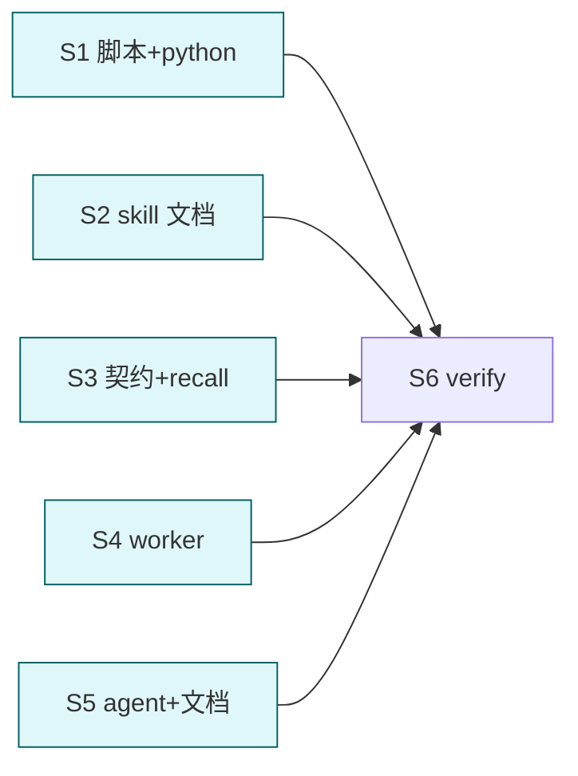

# cortex 默认 apply (去 dry-run 默认 + L0 自动)

## 目标

cortex 所有脚本/skill 默认行为从 dry-run/check 翻转为 **apply/fix 直接落盘**; `--dry-run`/`--check` 保留作 opt-in 预览。**L0 核心记忆写入不再 ask** (彻底自动)。文档/契约/worker 全部对齐"默认 apply"。

## 决策 (用户已定)

1. 默认 apply (脚本 MODE 默认翻转)
2. L0 写入不再 ask (取消 L0-永远-ask 硬规 + needs_ask 机制)
3. 保留 `--dry-run`/`--check` flag 作 opt-in

## Deliverable 矩阵

| ID | 交付物 | 验收 | P |
| --- | --- | --- | --- |
| D1 | 4 脚本默认 MODE 翻转 (lint→fix, extract/ingest/history-digest→apply) + 头注释改 | 无参跑 = apply 行为; --dry-run/--check 仍预览 | P0 |
| D2 | python L0 自动 (_extract/router.py L0 mode ask→auto; __init__/writer L0_AUTO 默认 accept; _history_digest L0 自动) | extract --apply L0 项直接落盘, 不阻断 | P0 |
| D3 | 5 skill SKILL.md + references 文档改 "默认 apply" + 删 ask/needs_ask 分段 | lint/extract/ingest/history-digest/evolve 文档默认 apply | P0 |
| D4 | cortex-schema 契约删 "L0 写入永远 ask" + recall/context-digest/evolve L0 ask 表述 | memory-levels/recall/writeback 等无 L0-ask 硬规 | P0 |
| D5 | 5 worker agent 删 "禁 apply / needs_ask 留主会话" 边界 → worker 可直接 apply | worker 正文反映默认 apply (仍只读+脚本, 脚本默认 apply 写盘) | P0 |
| D6 | agent cortex.md + README + llms + e2e-report 改默认 apply | 文档一致 | P1 |

## Subtask 拆分

| ID | Subtask | Deliverable | 边界 |
| --- | --- | --- | --- |
| S1 | 脚本默认 + python L0 自动 | D1,D2 | scripts/*.sh + scripts/_extract/** + scripts/_history_digest/** |
| S2 | 5 skill 文档默认 apply + 删 ask 分段 | D3 | skills/cortex-{lint,extract,ingest,history-digest,evolve}/** |
| S3 | 契约 + recall/context-digest L0-ask 表述清理 | D4 | skills/cortex-schema/** + cortex-recall/** + cortex-context-digest/** |
| S4 | 5 worker agent 边界改 | D5 | agents/cortex-*-worker.md |
| S5 | agent + README + llms + e2e-report | D6 | agents/cortex.md + README + llms + tests/e2e-report.md |
| S6 | 验证 + 暂存 | all | 脚本默认 apply smoke (fixture, 跑后还原) + grep 残留 |

## Subtask 调度图

S1-S5 改不同文件组, 完全并行。S6 收口。

## 范围边界

- 在范围: 4 脚本默认 + python L0 逻辑 + 全 skill 文档 + 5 worker + agent + README/llms/e2e-report + 契约 L0-ask 清理
- 不在范围: 路由逻辑/三轴算法/5 级路径/双层契约 (不变, 只改默认模式 + L0 闸)
- 禁改: arguments/user-invocable/disable-model-invocation/context:fork+agent 绑定 (已定); fixture 数据 (S6 跑后还原)

## 验收

- [ ] 4 脚本无参跑 = apply (lint 落盘 fix / extract 落盘 / ingest apply / history apply)
- [ ] `--dry-run`/`--check` 仍可预览
- [ ] extract --apply 对 L0-core 项直接落盘 (无 ask 阻断; CORTEX_EXTRACT_L0_AUTO 默认 accept 或移除门)
- [ ] grep "永远 ask" / "needs_ask" / "默认 dry-run" / "默认 (--check)" 在 cortex 内清零 (除 --dry-run flag 说明)
- [ ] worker agent 不再写 "禁 apply / needs_ask 留主会话"
- [ ] 既有脚本结构 smoke 不崩 (validate/lint/extract/ingest/history 可跑)
- [ ] fixture 跑后还原 (git status 干净)
- [ ] 自动 git add

## 约束

硬约束:
- 翻转默认 MODE, 不删 --dry-run/--check flag
- L0 自动: 取消 ask 门, 不是删 L0 级别 (L0-core 目录/语义不变, 只是写入不再确认)
- python 改最小: router L0 mode "ask"→"auto"; writer/__init__ L0_AUTO 默认 accept
- 文档全改 "默认 dry-run/--check" → "默认 apply/--fix; --dry-run/--check opt-in 预览"
- fixture 跑后用 git checkout 还原, 不留脏

软约束:
- worker 仍声明 "只读+脚本" (脚本默认 apply 即写盘, 这是预期)
- 保留 "破坏性提示" 一句 (默认 apply 会改 vault, 提醒用户)

## 风险

| 风险 | 缓解 |
| --- | --- |
| 默认 apply 误改用户真实 vault | 文档显著提示; --dry-run 仍可预览; 本 task 只改默认值不动算法 |
| L0 自动写污染核心规则 | 用户明确要彻底自动; 保留 lint R6/审计兜底 |
| python L0 逻辑改坏 extract | S6 跑 fixture extract --apply 验证 L0 项落盘 + 还原 |
| 30 文件并行漏改 | S6 grep 残留 (永远 ask/needs_ask/默认 dry-run) 清零检查 |
