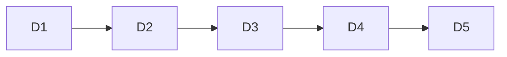

# PRD — trellisx exec 调度自动化: 禁 exec 阶段问用户顺序

## Goal

trellisx exec 阶段排队的 subtask 应按 planning 阶段已定的 DAG 自动调度 (完成即派下一个 / 并发上限 2), 禁在 subtask 之间停下来问用户"先做哪个"。顺序决策归 planning (brainstorm 交互 + mermaid 调度图 + depends-on), exec 阶段只执行不问序。

## What I already know

- 现状: scheduling.md §4 / flow SKILL step4 / orchestrate SKILL 都讲了"动态 DAG 调度 / 完成即派 / 不空等", 算法正确
- 缺口: 无一条**显式禁令**说"exec 阶段禁问用户顺序", 也无对应反例黑名单条目 / 自检项
- 后果: 模型保守时 subagent 之间停顿, 回退到"问用户确认顺序", 违反"顺序归 planning"语义
- 正解已在规程中: 顺序 = planning mermaid 调度图 + depends-on + write-files/exec-scope 静态算冲突 DAG; exec 只跑循环

## 范围边界

- 改: trellisx-flow SKILL.md (step4 exec) + trellisx-orchestrate SKILL.md (反例表 + 自检) + scheduling.md (§4 显式禁令 + §7 自检) + progress-communication.md (若缺补"完成即派禁问序")
- 不改: trellis-implement / trellis-check / planning 阶段规程 (顺序决策归 planning, 不动)
- 不引入新文件 / 新脚本 (纯文档规程强化)

## Deliverable 矩阵

| ID | 交付 | 验收 |
|---|---|---|
| D1 | flow SKILL.md step4 exec 加"自动派发硬规"段: 顺序归 planning, exec 阶段 subtask 间禁问用户, 按 DAG 自动派 | grep 命中"exec 阶段禁问顺序"语义条; step4 含硬规标 🔴 |
| D2 | scheduling.md §4 显式禁令 + §7 自检加项 | §4 含禁令; §7 自检含"subtask 间未问用户顺序" |
| D3 | orchestrate SKILL.md 反例黑名单加一条 | 反例表新增"exec 问用户顺序"行 |
| D4 | progress-communication.md 补"完成即派禁问序"(若缺) | 该 reference 含显式禁令 |
| D5 | 质检: claude -p 验模型识别"exec 阶段该不该问顺序" | 返回"不该问, 自动派"语义 |

## Open Questions

无 (范围已锁)。

## 调度图

单 deliverable 链, 无并行 (文档规程强化, 全 main 同步改):

## 验收标准

- 4 个文档均含"exec 阶段禁问用户顺序"显式禁令 (grep 可验)
- 自检清单含对应自检项
- 反例黑名单含对应反例
- `claude -p` 质检: 模型读改后规程, 对"subtask 完成后下一个该问用户还是自动派"返回"自动派, 不问"语义
- token 不爆 (每文件增量 < 15 行)
