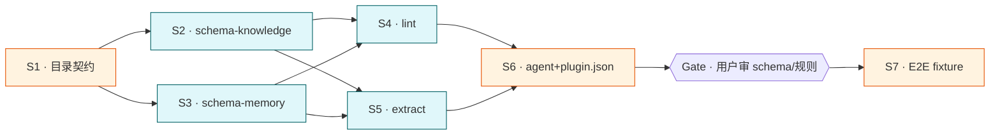

# cortex plugin: knowledge base + memory management system

## 目标

为 cortex 插件落地"知识库 + 记忆"双系统的目录契约、4 个 skill 和 1 个 agent, 使得任意会话结束后, 资料经 L4 inbox → L1/L2/L3 promote → L0 沉淀, 知识库按 项目/领域/脚本 三模块归档, 全链路可用 lint 脚本机器校验。

## 背景与动机

用户当前依赖外部 obsidian vault (`/Users/luoxin/persons/knowledge/obsidian`) 维护知识 + 记忆, 路径与契约绑死单个 vault。cortex 插件需提供**与具体 vault 解耦**的双层 (用户级 ~/.cortex/.wiki + 项目级 <repo>/.wiki) 同构契约, 且可被任何项目复用。

## Deliverable 矩阵

| ID | 交付物 | 类型 | 独立验收 | 优先级 |
| --- | --- | --- | --- | --- |
| D1 | 目录契约文档 (含 .wiki 内部 + ~/.cortex/ 顶层布局规范) | 文档 | `bash plugins/tools/cortex/scripts/validate-layout.sh` 跑通 | P0 |
| D2 | `cortex-schema-knowledge` skill — 知识库目录结构契约 (项目/领域/脚本 三模块) | skill 文件 | 文件存在 + frontmatter 合法 + 含 3 模块定义 + 含路径规则 | P0 |
| D3 | `cortex-schema-memory` skill — 记忆等级契约 (L0/L1/L2/L3/L4) | skill 文件 | 文件存在 + frontmatter 合法 + 含 5 级语义 + 含 promote/demote 规则 | P0 |
| D4 | `cortex-lint` skill — link 校验 + 不合规自动规范化 | skill 文件 + 脚本 | 给定 fixture vault 跑 lint, 不合规项被检出并 autofix | P0 |
| D5 | `cortex-extract` skill — 从 L4 inbox 提取记忆/知识库内容并 promote | skill 文件 + 脚本 | 给定 fixture inbox 跑 extract, 产出落到正确目录 | P0 |
| D6 | `cortex` agent — 主代理, 协调 4 skill, 提供 vault 写边界 | agent 文件 | frontmatter 合法 + 工具集声明完整 + 边界条款齐全 | P1 |

## Subtask 拆分

每个 subtask 详情见 `.trellis/tasks/06-09-cortex-kb-memory/subtask/<id>-<slug>.md`。

| ID | Subtask | 所属 Deliverable | 边界 (改动 / 读取范围) | 简要说明 | 详情文件 |
| --- | --- | --- | --- | --- | --- |
| S1 | 落地目录契约文档 + validate-layout.sh | D1 | `plugins/tools/cortex/docs/layout.md` `plugins/tools/cortex/scripts/validate-layout.sh` | 定义 ~/.cortex/ 顶层 (.wiki/config/state/scripts/logs/+开放扩展) 与 .wiki 内部 (memory/L0-L4 + 三模块) 布局, 写校验脚本 | `subtask/S1-layout-contract.md` |
| S2 | 写 cortex-schema-knowledge skill | D2 | `plugins/tools/cortex/skills/cortex-schema-knowledge/SKILL.md` | 三模块 (项目/领域/脚本) 路径规则 + frontmatter schema + 命名约定 | `subtask/S2-schema-knowledge.md` |
| S3 | 写 cortex-schema-memory skill | D3 | `plugins/tools/cortex/skills/cortex-schema-memory/SKILL.md` | L0-L4 五级语义 + 各级目录 + promote/demote/forget 规则 | `subtask/S3-schema-memory.md` |
| S4 | 写 cortex-lint skill + lint.sh | D4 | `plugins/tools/cortex/skills/cortex-lint/SKILL.md` `plugins/tools/cortex/scripts/lint.sh` `tests/fixtures/lint/` | link 校验 + frontmatter 校验 + 命名校验 + autofix 循环 | `subtask/S4-lint.md` |
| S5 | 写 cortex-extract skill + extract.sh | D5 | `plugins/tools/cortex/skills/cortex-extract/SKILL.md` `plugins/tools/cortex/scripts/extract.sh` `tests/fixtures/extract/` | 扫 L4 inbox, 分类入库, 增量游标, dry-run 默认 | `subtask/S5-extract.md` |
| S6 | 改写 cortex agent + plugin.json 注册 | D6 | `plugins/tools/cortex/agents/cortex.md` `plugins/tools/cortex/.claude-plugin/plugin.json` | agent 协调 4 skill, plugin.json 声明全部 4 skill | `subtask/S6-agent-plugin.md` |
| S7 | 端到端 fixture 验收 | all | `tests/fixtures/e2e/` 只读 + 跑全部脚本 | 跑 validate-layout + lint + extract 全流程, 验证 6 个 deliverable 协作 | `subtask/S7-e2e.md` |

## Subtask 调度图

- 串行: S1 (目录契约是基础) → ... → S6 (写 plugin.json 必须独占) → G1 → S7
- 并行: S2/S3 (两份 schema 互不依赖, 都依赖 S1); S4/S5 (lint 与 extract 互不依赖, 都依赖 S2+S3)
- Gate: S6 完成后必须经用户审 schema 命名 / lint 规则 / extract 路由表

## 范围边界

- 在范围内:
  - `plugins/tools/cortex/**` (插件骨架已存在, 本 task 填充)
  - 新建 `plugins/tools/cortex/scripts/` (脚本目录) 与 `plugins/tools/cortex/docs/` (契约文档)
  - 新建 `plugins/tools/cortex/tests/fixtures/**` (验收用 fixture)
  - 目录契约**仅定义文档**, 不在用户机器上创建 `~/.cortex/`(运行时自创)
- 不在范围内:
  - 不动 `~/.cortex/`(用户机器) 与 `<repo>/.wiki/`(其他项目) 真实数据
  - 不实现 hook (插件骨架已留 hooks/ 占位, 后续 task 再做)
  - 不实现 slash commands (commands/ 占位)
  - 不迁移现有 obsidian vault 内容 (单开 task)
  - 不动 `plugin-marketplace.json`
- 禁改: `**/dist/**` `**/build/**` `**/*.generated.*` `.trellis/spec/**` (走 trellisx-spec)

## 验收标准 (整体)

- [ ] D1-D6 全部 P0 deliverable 通过各自独立验收
- [ ] `python3 -c "import json; json.load(open('plugins/tools/cortex/.claude-plugin/plugin.json'))"` 通过, `skills` 数组含 4 个 skill, `agents` 数组含 cortex agent
- [ ] 4 个 SKILL.md 的 frontmatter 都含非空 `name` / `description` / `when_to_use`
- [ ] `bash plugins/tools/cortex/scripts/validate-layout.sh` 对内置 fixture vault 通过
- [ ] `bash plugins/tools/cortex/scripts/lint.sh --check tests/fixtures/lint/` 检出预期违规并能 `--fix` 修复
- [ ] `bash plugins/tools/cortex/scripts/extract.sh --dry-run tests/fixtures/extract/` 产出预期归档计划
- [ ] 全部 SKILL.md 跑 `claude -p "<SKILL 内容>" --output-format stream-json` 返回非空成功结果 (项目 CLAUDE.md 要求)
- [ ] cortex agent 边界条款明确"只读 .trellis/, 写仅限 ~/.cortex/ 与 <repo>/.wiki/"

## 约束

硬约束:
- ~/.cortex/.wiki/ 与 <repo>/.wiki/ 内部结构**完全同构** (memory/L0-L4 + 三模块 + scripts/)
- ~/.cortex/ 顶层除 .wiki/config/state/scripts/logs/ 外**保留开放扩展位** (后续可加 cache/credentials/templates 等, 契约文档须显式声明"非穷举")
- 所有写盘走 mcp-obsidian 优先, fallback 走本地 fs (与现有 cortex 行为一致, 但本 task 不实现 hook 注入)
- skill description 必须前置关键词 (与全局 LARGE_REPO.md 一致, skill 描述会被截断)
- 全部脚本默认 dry-run, 破坏性操作必须 `--fix` / `--apply` 才落盘

软约束:
- 脚本优先 bash + python3 (与既有 .trellis/scripts/ 对齐), 避免引入 node 依赖
- frontmatter 字段命名对齐既有 vault 习惯 (type/title/created/updated/tags/aliases)

## 风险与决策

| 风险 | 影响 | 缓解 |
| --- | --- | --- |
| 双层同构导致用户级与项目级数据漂移 | 同一笔知识两边写, 后续 promote 路由混乱 | 契约文档明定"项目级是项目专属事实, 用户级是跨项目沉淀"; lint 检测同 title 跨层重复 |
| L1-L3 三级语义 (按遗忘曲线: L1 长期 / L2 中期 / L3 短期) 与直觉"数字越小越基础"冲突 | 实现期路径名/路由表写反 | 全部文档、skill、路径名 (L1-long / L2-mid / L3-short) 显式标注语义; lint R6 检测路径名与级别一致性; extract 路由表硬编码默认入口 L3 |
| 与既有外部 cortex (vault=/Users/luoxin/persons/knowledge/obsidian) 命名冲突 | 用户混淆"插件 cortex" vs "外部 vault cortex" | README 与 SKILL.md 显式标注"本插件 ~/.cortex 与外部 obsidian vault 无关, 独立体系" |
| 4 skill 同时落地工作量大 | 单 task 周期长 | S2-S5 按调度图并行, S6 串行收口, fixture 早期定义降低 E2E 风险 |
| skill description 截断导致触发失效 | 用户输入未命中关键词 | 每个 skill 前置触发词清单 (when_to_use 同步), 跑项目 CLAUDE.md 的 claude --settings 测试验证识别 |

## 开放项 (planning 阶段需补)

- ~/.cortex/ 顶层"其它配置内容"的具体清单 (用户说"还需要存储一些别的配置等内容"); 当前以"开放扩展位"占位, S1 写契约时如有更明确清单再追加。
