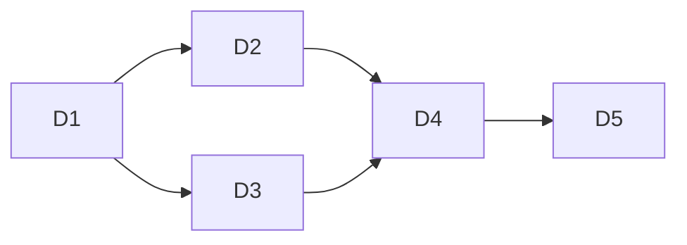

# PRD — novelist-pipeline 多场景 mode 路由

## Goal

novelist-pipeline 当前只支持 write (批量写章)。扩展为多场景: 默认 write, 加 mode 入参支持 review/humanize/proofread/polish/rewrite/outline。**载体策略**: 默认仅 write 用 Workflow (workflow.js 两流水线并行), 其余 mode 走 **trellisx subagent 编排** (main 调度派 novelist 系列 skill, DAG 并发上限 2); 入参 `--workflow`/`--no-workflow` 覆盖。

## What I already know

- 现状: `workflow.js` 硬编码 write 全流程 (路线图→世界观→预检→write→三环→fix→定稿→统一check), 511 行
- SKILL.md 入参契约: `$target` (写到第N章/写N章/缺省单章), `user-invocable: true`, `disable-model-invocation: true`
- novelist skill 全集 (14): write/check/humanize/proofread/rewrite/polish(组合)/outline/character/worldview/craft/design/init/trending/lint
- 各 skill 子 mode: rewrite `detect|fix`(默认fix, 三模式A/B/C); proofread `detect|fix`(默认fix); check `detect|fix`; humanize 检测+改
- 载体约束 (用户裁定): 默认 write→Workflow, 其它→trellisx subagent; `--workflow`/`--no-workflow` 覆盖
- trellisx subagent 编排: main 调度, 派 Agent 各执行 1 章/1 subtask, DAG 并发上限 2, 共享 task worktree (见 trellisx-orchestrate scheduling.md)

## mode 清单 + pipeline 行为

| mode | 级 | 前置跳过? | pipeline 行为 (逐章) | 子 mode 默认 | 统一 check | 载体默认 |
|---|---|---|---|---|---|---|
| `write` (默认) | 章 | 否 (路线图/世界观/预检) | write→三环→fix→定稿 | — | ✓ | **Workflow** |
| `review` | 章 | 是 | check (detect 只查一致) | detect | ✓ | subagent |
| `humanize` | 章 | 是 | humanize (去AI味+改) | fix | ✗ | subagent |
| `proofread` | 章 | 是 | proofread (校对+改) | fix | ✗ | subagent |
| `polish` | 章 | 是 | 三环(check+humanize+proofread)→fix→定稿 | — | ✓ | subagent |
| `rewrite` | 章 | 是 | rewrite (fix 模式A/B/C 按入参) | fix | ✓ | subagent |
| `outline` | 批 | 部分 (仅路线图, 无世界观/预检) | outliner 生成路线图 (无 write/收尾) | — | ✗ | subagent |

**排除** (非章节级, 不进 pipeline): character/worldview/craft/design/init/trending/lint — 这些是一次性或被引用型, pipeline 调度无意义。用户说"大纲设定等都需要" → outline 进 pipeline (批级路线图); character/worldview 是 write 前置内调, 非独立 mode。

## 入参契约

```
/novelist-pipeline [mode] [target] [--workflow|--no-workflow]
```

- **mode**: 缺省 `write`; 值 = write/review/humanize/proofread/polish/rewrite/outline
- **target**: 复用 $target (写到第N章/写N章/缺省=下一章); 对 outline=批范围
- **--workflow**: 强制该 mode 走 Workflow (即便非 write)
- **--no-workflow**: 强制走 subagent (即便 write)
- 中文别名: 评审=review, 去AI味/去AI化=humanize, 校对=proofread, 润色=polish, 重写=rewrite, 大纲/路线图=outline

## 范围边界

- **改**:
  - `SKILL.md`: 入参契约加 mode + --workflow/--no-workflow; mode 路由表; 各 mode 行为说明
  - `workflow.js`: 加 mode 分支 (仅 write 全流程; review/humanize/proofread/polish 走精简流程; rewrite/outline 单独)。**默认 write 行为不变**
  - 新增 mode 路由逻辑 (SKILL.md 激活时执行: 解析 mode → 选载体)
- **不改**:
  - novelist 系列 skill 本身 (pipeline 调度它们, 不改其逻辑)
  - 评分契约 (各 mode 用各自 skill 的评分, write 沿用现有综合分)
- 载体: write 默认 Workflow 不变; 非 write 默认 subagent 编排

## Deliverable 矩阵

| ID | 交付 | 验收 |
|---|---|---|
| D1 | SKILL.md 入参契约 + mode 路由表 + 各 mode 行为 + 载体选择规则 | grep mode 清单全; 缺省=write 明确; --workflow/--no-workflow 覆盖语义 |
| D2 | workflow.js 加 mode 分支: write(现状)/review/humanize/proofread/polish/rewrite/outline 各走对应精简流程 | write 行为不变; 非 write 跳前置 + 跑对应 skill |
| D3 | subagent 编排路径: SKILL.md 描述非 write + --no-workflow 时 main 怎么 DAG 调度 (派 Agent 各章, 并发2) | 路由逻辑清晰; 引用 trellisx scheduling 语义 |
| D4 | 质检: claude -p 验 mode 路由识别 + 载体选择 | 返回正确 mode→载体映射 |
| D5 | 自检: 模拟 mode 解析 (write/review/humanize 各一) | 路由正确 |

## 调度图

write 链 (workflow.js 改动重) ‖ 非 write 链 (SKILL.md + 路由), 有交叉 (SKILL.md 入参契约两链共用):



## 验收标准

- SKILL.md mode 路由表覆盖 7 mode + 载体默认 + --workflow/--no-workflow 覆盖
- workflow.js: write 行为零回归 (现有两流水线并行不变); 非 write mode 跳前置 + 跑对应 skill
- subagent 编排路径描述完整 (main 解析 mode → DAG 派 Agent)
- claude -p 质检: 模型读 SKILL.md 对 "review 第30-35章" / "humanize 5章" / 默认 返回正确 mode+载体
- 不破坏现有 write pipeline 行为

## Open Questions

- rewrite 在 pipeline 默认走 fix 哪个模式 (A报告修复/B从N章起/C连续)? → 默认 A (报告修复, 最安全), 入参可指 B/C
- outline 批级如何定范围? → 复用 target (写到第N章 = 路线图到第N章)
