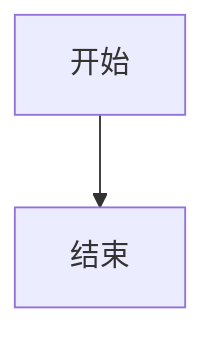

# Markdown 参考文档

## Markdown 语法参考

### 基础语法

#### 标题

```markdown
# 一级标题
## 二级标题
### 三级标题
#### 四级标题
##### 五级标题
###### 六级标题
```

#### 段落和换行

```markdown
段落之间空一行。

这是新段落。
行末加两个空格可换行。  
这是新行。
```

#### 强调

```markdown
*斜体* 或 _斜体_
**粗体** 或 __粗体__
***粗斜体*** 或 ___粗斜体~~
~~删除线~~
```

#### 列表

```markdown
无序列表：
- 项目
* 项目
+ 项目

有序列表：
1. 项目
2. 项目

任务列表：
- [ ] 未完成
- [x] 已完成
```

#### 链接

```markdown
[行内链接](https://example.com)

[引用链接][ref]

[ref]: https://example.com

<https://example.com>
```

#### 图片

```markdown


[](https://example.com)
```

#### 代码

```markdown
行内代码：`code`

代码块：
```language
code block
```
```

#### 引用

```markdown
> 引用内容
> 
> 多行引用
>
> > 嵌套引用
```

#### 表格

```markdown
| 列1 | 列2 | 列3 |
| --- | --- | --- |
| 内容 | 内容 | 内容 |

| 左对齐 | 居中 | 右对齐 |
| :--- | :---: | ---: |
| 内容 | 内容 | 内容 |
```

#### 分隔线

```markdown
---

***

___
```

### GFM 扩展语法

#### 任务列表

```markdown
- [x] 已完成
- [ ] 未完成
```

#### 删除线

```markdown
~~删除线~~
```

#### 自动链接

```markdown
https://example.com

user@example.com
```

#### 脚注

```markdown
这是脚注[^1]。

[^1]: 脚注内容。
```

#### 定义列表

```markdown
术语
: 定义

术语2
: 定义2
```

#### 数学公式

```markdown
行内公式：$E=mc^2$

块级公式：
$$
E=mc^2
$$
```

#### Mermaid 图表

```markdown

```

## 工具推荐

### 编辑器

| 工具 | 特点 | 适用场景 |
| --- | --- | --- |
| VS Code | 插件丰富，功能强大 | 日常编辑 |
| Typora | 所见即所得 | 快速编写 |
| Obsidian | 知识管理 | 笔记整理 |
| Mark Text | 开源免费 | 轻量编辑 |

### VS Code 插件

| 插件 | 功能 |
| --- | --- |
| Markdown All in One | 快捷键、预览 |
| markdownlint | 格式检查 |
| Markdown Preview Enhanced | 增强预览 |
| Code Spell Checker | 拼写检查 |

### Lint 工具

| 工具 | 说明 |
| --- | --- |
| markdownlint | JavaScript 实现 |
| mdl | Ruby 实现 |
| remark-lint | Node.js 实现 |

### 转换工具

| 工具 | 说明 |
| --- | --- |
| pandoc | 通用文档转换 |
| markdown-pdf | Markdown 转 PDF |
| md-to-pdf | Markdown 转 PDF |

## 常见问题解答

### 格式问题

**Q: 为什么标题不显示？**

A: 检查标题格式，# 后必须有空格。

**Q: 为什么代码块不高亮？**

A: 确保指定了语言标记。

**Q: 为什么表格不对齐？**

A: 检查分隔符格式和列数。

### 渲染问题

**Q: 不同平台渲染结果不同？**

A: 使用通用语法，避免平台特定扩展。

**Q: 特殊字符显示异常？**

A: 使用反斜杠转义特殊字符。

**Q: HTML 标签不生效？**

A: 检查渲染器是否支持 HTML。

### 最佳实践

**Q: 如何组织大型文档？**

A: 拆分为多个文件，使用目录导航。

**Q: 如何管理图片资源？**

A: 使用相对路径，统一存放在 images 目录。

**Q: 如何保持格式一致？**

A: 使用 markdownlint 自动检查。

## Markdown 变体

### CommonMark

- 标准化的 Markdown 规范
- 明确的语法定义
- 广泛的解析器支持

### GFM (GitHub Flavored Markdown)

- 基于 CommonMark
- 添加表格、任务列表等
- GitHub 平台使用

### 其他变体

| 变体 | 特点 |
| --- | --- |
| MultiMarkdown | 添加脚注、表格等 |
| Markdown Extra | PHP 实现，扩展丰富 |
| RMarkdown | R 语言集成 |
| MDX | 支持 JSX 组件 |

## 资源链接

### 官方文档

- [CommonMark Spec](https://spec.commonmark.org/)
- [GitHub Flavored Markdown](https://github.github.com/gfm/)
- [Markdown Guide](https://www.markdownguide.org/)

### 学习资源

- [Markdown 教程](https://www.markdowntutorial.com/)
- [Mastering Markdown](https://guides.github.com/features/mastering-markdown/)
- [Markdown Cheatsheet](https://github.com/adam-p/markdown-here/wiki/Markdown-Cheatsheet)

### 工具文档

- [markdownlint 规则](https://github.com/DavidAnson/markdownlint/blob/main/doc/Rules.md)
- [Pandoc 手册](https://pandoc.org/MANUAL.html)
- [Mermaid 文档](https://mermaid-js.github.io/mermaid/)
