# Mermaid 类图 (Class Diagram)

类图用于面向对象设计中展示类的结构、属性、方法以及类之间的关系。

## 基本语法

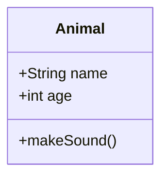

## 类定义

### 基本定义

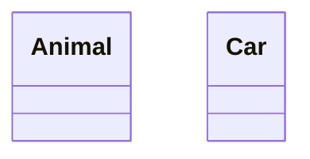

### 带标签的类

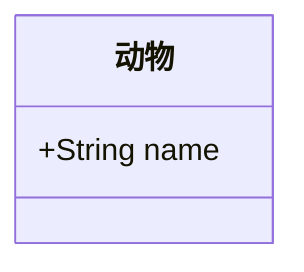

### 类成员

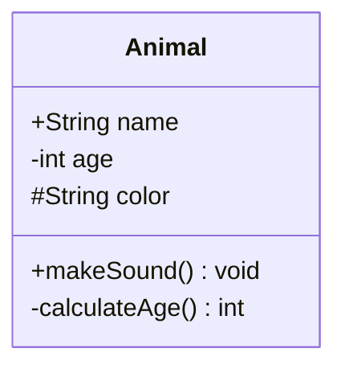

### 成员可见性

| 符号 | 可见性 | 说明 |
| --- | --- | --- |
| `+` | Public | 公有 |
| `-` | Private | 私有 |
| `#` | Protected | 保护 |
| `~` | Package/Internal | 包内 |

### 成员类型

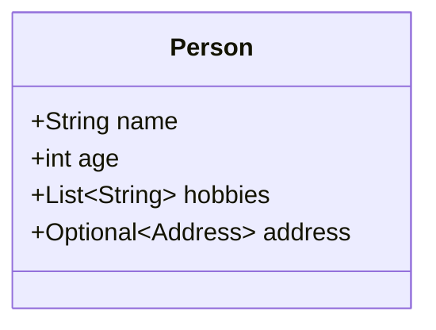

### 抽象方法

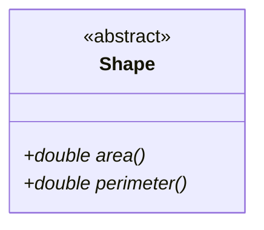

### 静态方法

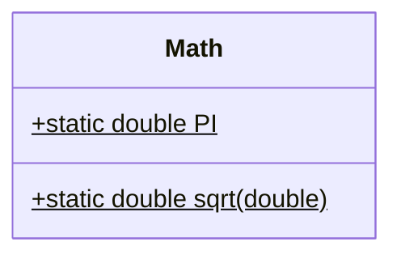

## 类关系

### 关系类型

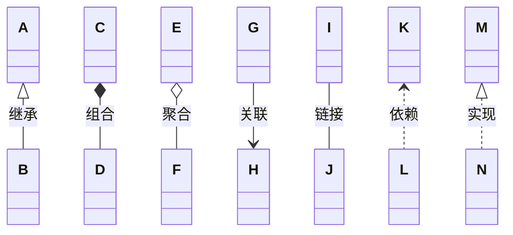

| 关系 | 语法 | 说明 |
| --- | --- | --- |
| 继承 | `<|--` | 子类继承父类 |
| 组合 | `*--` | 强拥有关系 |
| 聚合 | `o--` | 弱拥有关系 |
| 关联 | `-->` | 一般关联 |
| 链接 | `--` | 简单链接 |
| 依赖 | `<..` | 依赖关系 |
| 实现 | `<|..` | 接口实现 |

### 关系标签

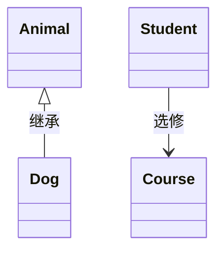

### 多重性

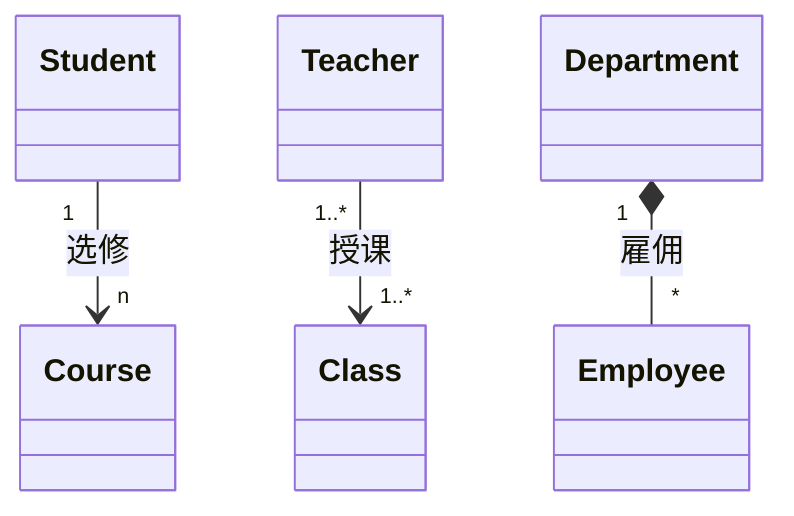

多重性符号：

| 符号 | 含义 |
| --- | --- |
| `1` | 有且仅有一个 |
| `0..1` | 零或一个 |
| `0..*` | 零或多个 |
| `1..*` | 一个或多个 |
| `n` | 多个 |
| `*` | 任意数量 |

## 泛型

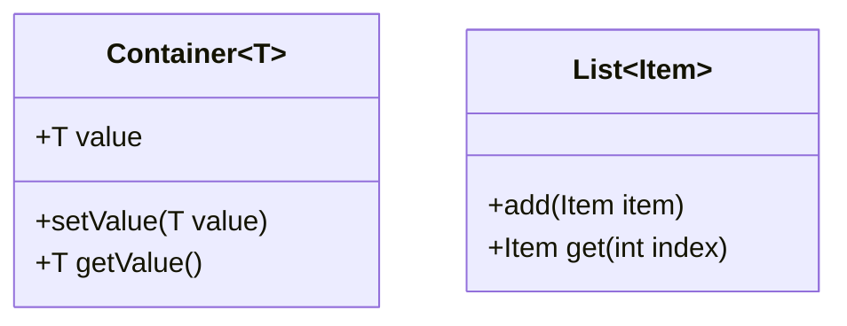

## 注解

### 类注解

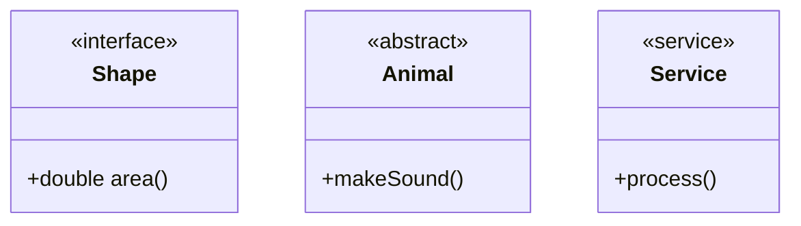

### 自定义注解

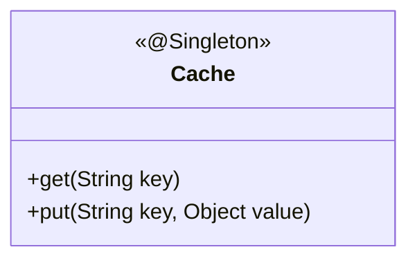

## 命名空间

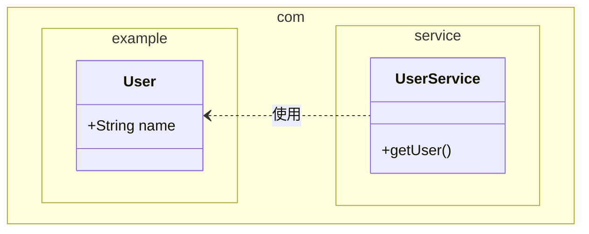

## 方向

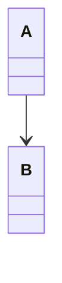

方向选项：
- `TB` - 从上到下
- `BT` - 从下到上
- `LR` - 从左到右
- `RL` - 从右到左

## 注释

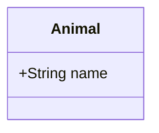

## 最佳实践

### 命名规范

- 类名使用 PascalCase
- 属性和方法使用 camelCase
- 关系标签使用动词短语

### 设计建议

- 控制类的复杂度
- 合理使用可见性
- 明确关系类型

### 示例：完整类图

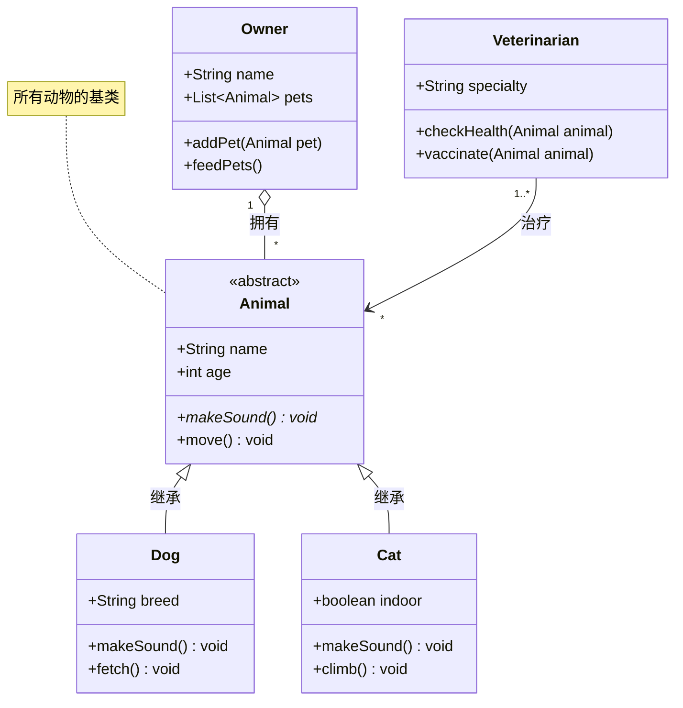

## 参考链接

- [Mermaid 官方文档 - Class Diagram](https://mermaid.js.org/syntax/classDiagram.html)
