# Mermaid 实体关系图 (ER Diagram)

实体关系图用于数据库设计，展示实体、属性和实体之间的关系。

## 基本语法

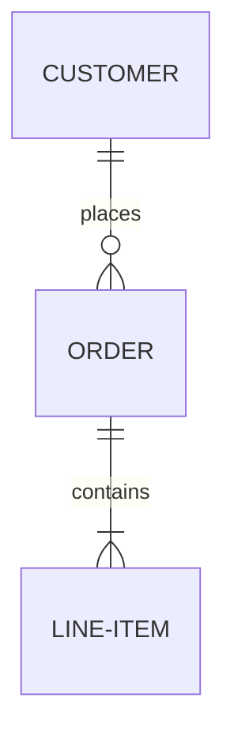

## 实体定义

### 基本实体

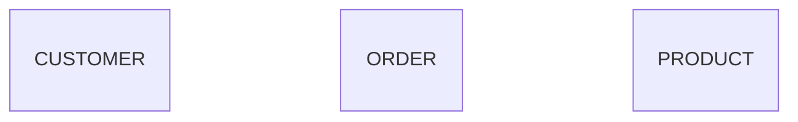

### 带属性的实体

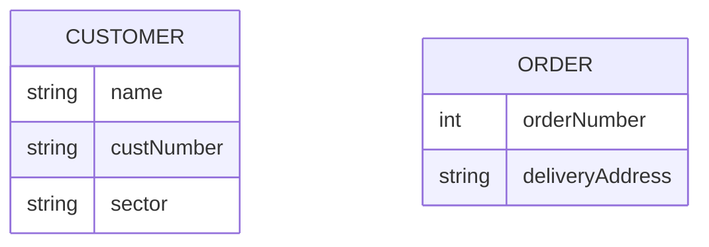

### 属性类型

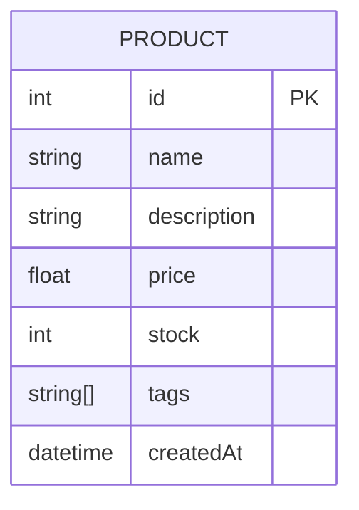

### 属性键约束

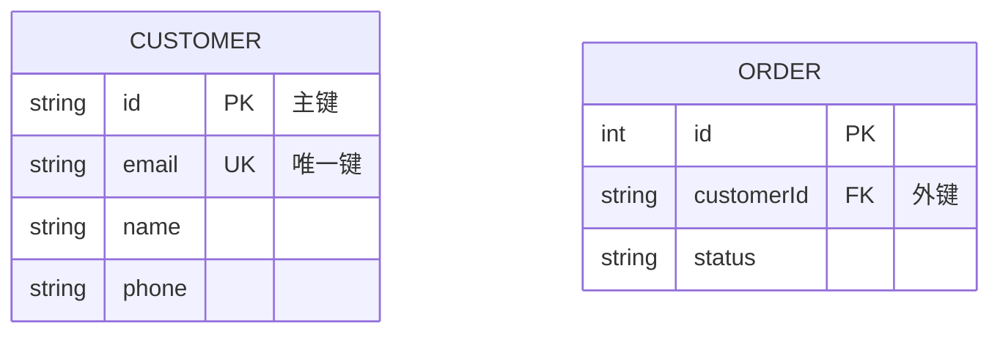

| 键类型 | 标记 | 说明 |
| --- | --- | --- |
| `PK` | 主键 | Primary Key |
| `FK` | 外键 | Foreign Key |
| `UK` | 唯一键 | Unique Key |
| `PK, FK` | 组合 | 同时是主键和外键 |

### 属性注释

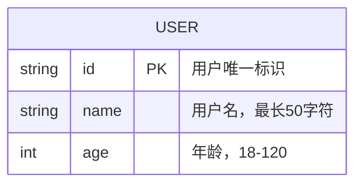

## 关系定义

### 关系语法

```
<实体A> <关系> <实体B> : <关系标签>
```

### 关系类型

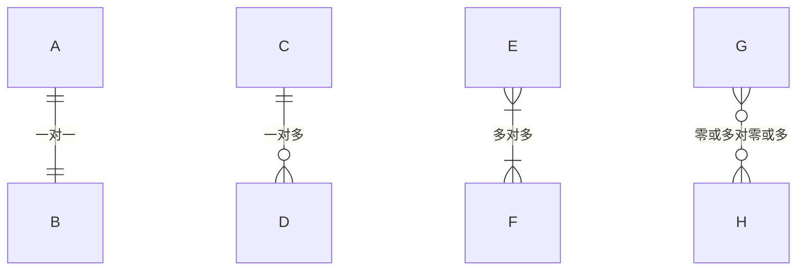

### 关系符号说明

| 符号 | 含义 |
| --- | --- |
| `||` | 恰好一个 |
| `o|` | 零或一个 |
| `}|` | 一个或多个 |
| `o{` | 零或多个 |
| `--` | 标识关系（实线） |
| `..` | 非标识关系（虚线） |

### 完整关系表

| 左侧 | 右侧 | 含义 |
| --- | --- | --- |
| `\|\|` | `\|\|` | 恰好一个对恰好一个 |
| `\|\|` | `o\|` | 恰好一个对零或一个 |
| `\|\|` | `\}\|` | 恰好一个对一个或多个 |
| `\|\|` | `o{` | 恰好一个对零或多个 |
| `}\|` | `}\|` | 一个或多个对一个或多个 |
| `o{` | `o{` | 零或多个对零或多个 |

### 关系别名

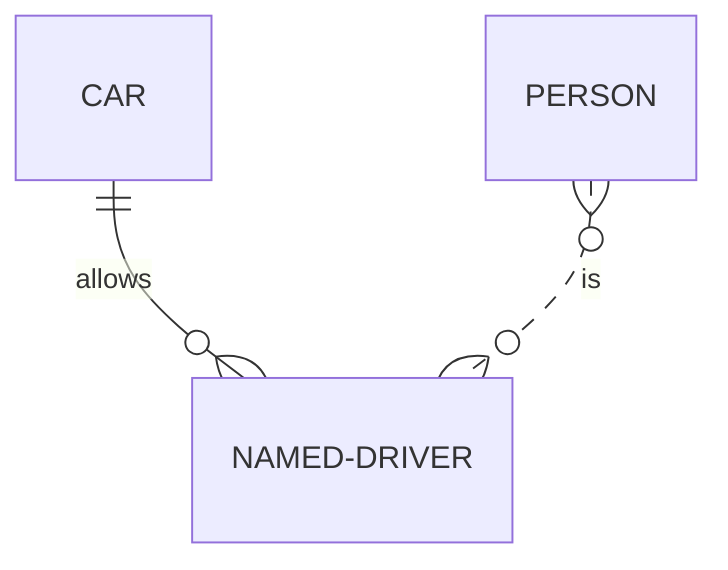

可用别名：
- `one or zero` / `zero or one`
- `one or more` / `one or many`
- `zero or more` / `zero or many`
- `only one` / `1`
- `many(0)` / `many(1)` / `0+` / `1+`

## 标识关系

### 标识关系（实线）

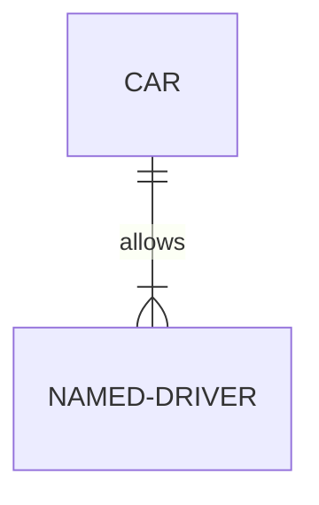

### 非标识关系（虚线）

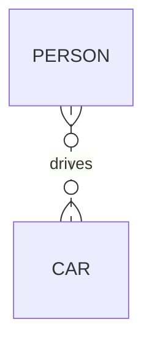

## 实体别名

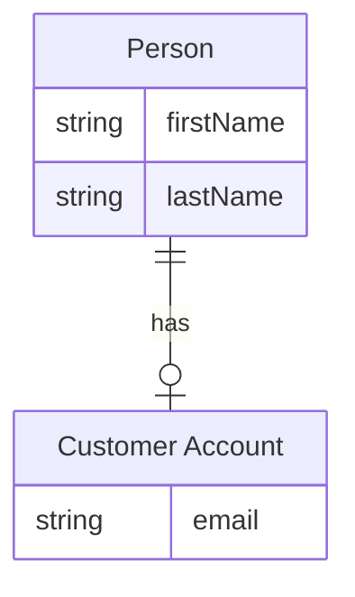

## 方向设置

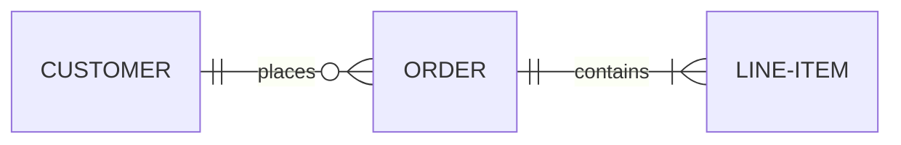

方向选项：
- `TB` - 从上到下
- `BT` - 从下到上
- `LR` - 从左到右
- `RL` - 从右到左

## 样式

### 直接样式

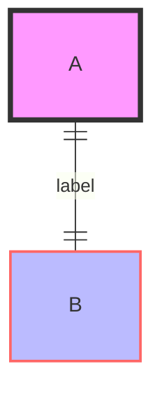

### 类定义

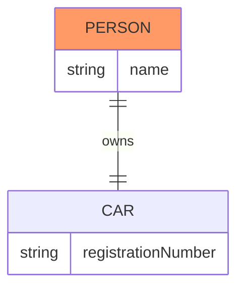

## 布局配置

### ELK 布局

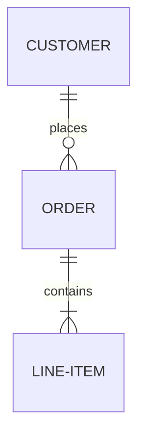

## 最佳实践

### 命名规范

- 实体名称使用大写
- 属性使用 camelCase
- 关系标签使用动词短语

### 设计建议

- 明确主键和外键
- 使用注释说明复杂属性
- 控制实体数量（建议 ≤ 15）

### 示例：完整 ER 图

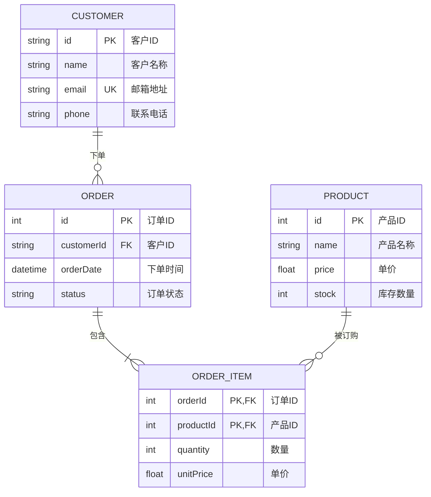

## 参考链接

- [Mermaid 官方文档 - ER Diagram](https://mermaid.js.org/syntax/entityRelationshipDiagram.html)
