# Mermaid 流程图 (Flowchart)

流程图是 Mermaid 中最常用的图表类型，用于展示流程、决策和系统架构。

## 基本语法

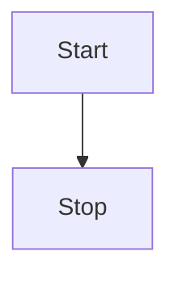

### 图表方向

| 方向 | 关键字 | 说明 |
| --- | --- | --- |
| 从上到下 | `TB` 或 `TD` | Top-Bottom / Top-Down |
| 从下到上 | `BT` | Bottom-Top |
| 从左到右 | `LR` | Left-Right |
| 从右到左 | `RL` | Right-Left |

## 节点形状

### 基本形状

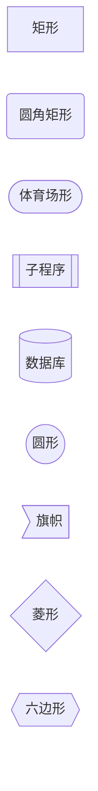

| 语法 | 形状 | 用途 |
| --- | --- | --- |
| `id[文字]` | 矩形 | 普通节点 |
| `id(文字)` | 圆角矩形 | 开始/结束 |
| `id([文字])` | 体育场形 | 起点/终点 |
| `id[[文字]]` | 子程序 | 子程序调用 |
| `id[(文字)]` | 圆柱形 | 数据库 |
| `id((文字))` | 圆形 | 连接点 |
| `id>文字]` | 旗帜 | 事件 |
| `id{文字}` | 菱形 | 判断条件 |
| `id{{文字}}` | 六边形 | 准备步骤 |

### 特殊形状

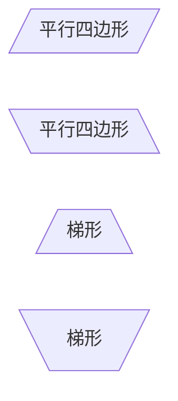

## 连接线

### 连接线类型

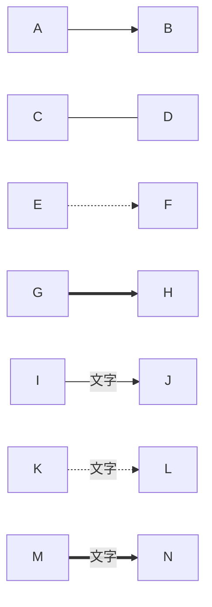

| 语法 | 类型 | 说明 |
| --- | --- | --- |
| `-->` | 实线箭头 | 标准流程方向 |
| `---` | 实线无箭头 | 关联关系 |
| `-.->` | 虚线箭头 | 可选/临时流程 |
| `==>` | 粗线箭头 | 重要流程 |
| `--文字-->` | 带标签 | 流程说明 |

### 连接长度

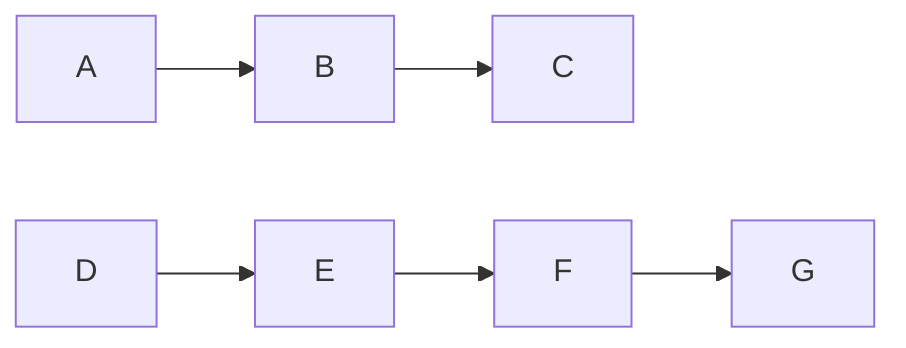

### 多重连接

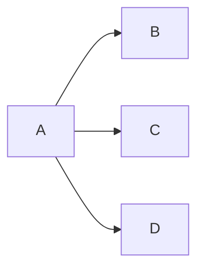

简写：

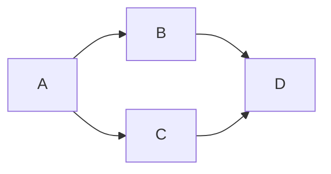

## 子图

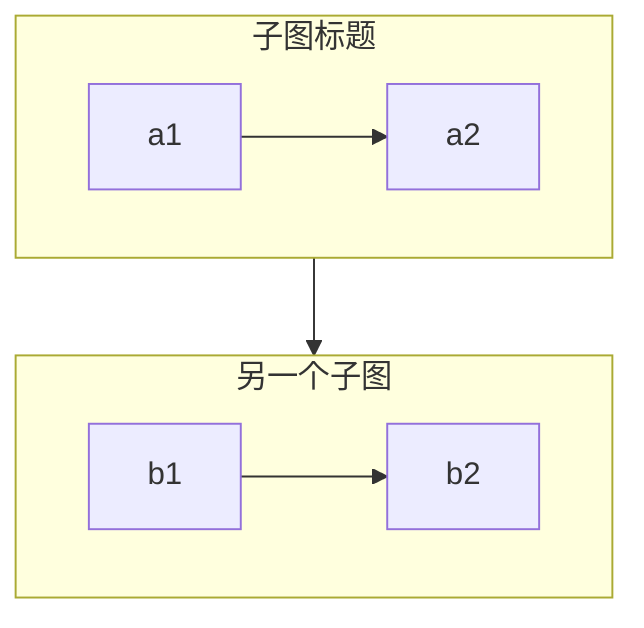

### 子图方向

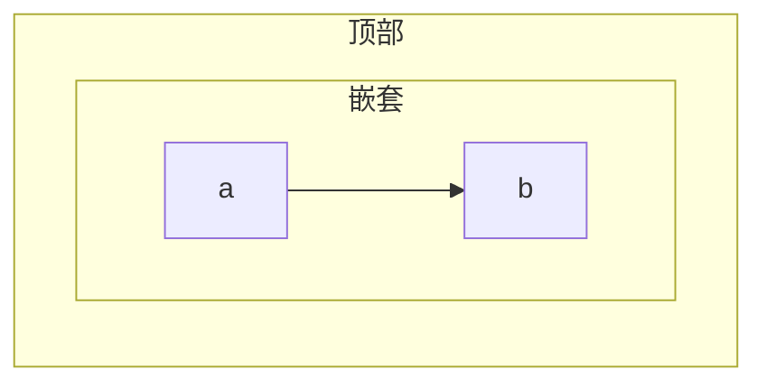

## 交互

### 点击事件

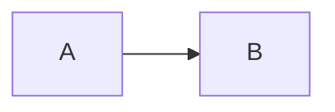

### 工具提示

## 样式

### classDef 定义样式

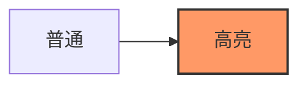

### 行内样式

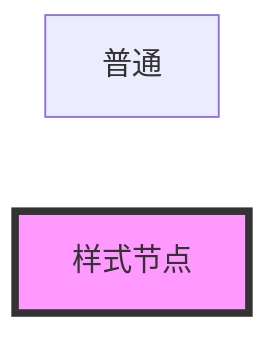

### 样式属性

| 属性 | 说明 |
| --- | --- |
| `fill` | 填充颜色 |
| `stroke` | 边框颜色 |
| `stroke-width` | 边框宽度 |
| `stroke-dasharray` | 虚线样式 |
| `color` | 文字颜色 |
| `font-weight` | 字体粗细 |

## 注释

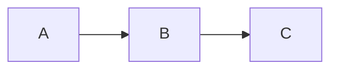

## 最佳实践

### 命名规范

- 节点 ID 使用简洁的标识符
- 节点文字清晰描述含义
- 连接标签简洁明了

### 布局建议

- 复杂流程使用子图分组
- 控制图表宽度，避免过宽
- 使用方向参数优化布局

### 示例：完整流程图

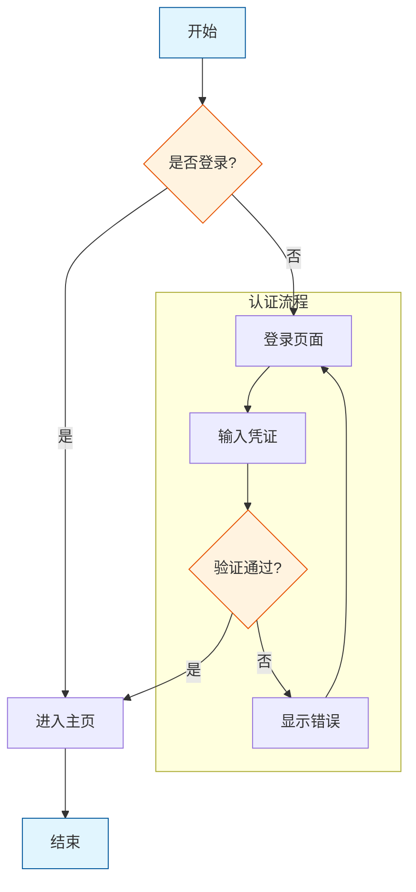

## 参考链接

- [Mermaid 官方文档 - Flowchart](https://mermaid.js.org/syntax/flowchart.html)
