# Mermaid 甘特图 (Gantt Diagram)

甘特图用于项目进度管理，展示任务的时间安排和依赖关系。

## 基本语法

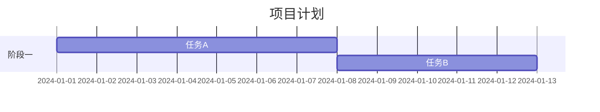

## 日期格式

### dateFormat 设置

```mermaid
gantt
    dateFormat YYYY-MM-DD
```

### 支持的格式

| 格式 | 示例 | 说明 |
| --- | --- | --- |
| `YYYY-MM-DD` | 2024-01-15 | 标准日期 |
| `YYYY-MM-DD HH:mm` | 2024-01-15 14:30 | 带时间 |
| `YYYY/MM/DD` | 2024/01/15 | 斜杠分隔 |
| `DD-MM-YYYY` | 15-01-2024 | 日在前 |

### axisFormat 设置

```mermaid
gantt
    dateFormat YYYY-MM-DD
    axisFormat %m-%d
```

常用格式符：

| 格式符 | 说明 |
| --- | --- |
| `%Y` | 四位年份 |
| `%m` | 两位月份 |
| `%d` | 两位日期 |
| `%H` | 小时（24小时制） |
| `%M` | 分钟 |
| `%W` | 周数 |

## 任务定义

### 基本语法

```
任务名称 :任务ID, 开始日期, 持续时间
```

### 任务状态

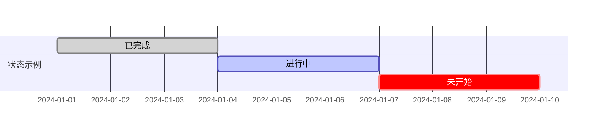

| 状态 | 关键字 | 说明 |
| --- | --- | --- |
| 已完成 | `done` | 任务完成 |
| 进行中 | `active` | 正在进行 |
| 关键任务 | `crit` | 关键路径 |
| 未开始 | 默认 | 普通状态 |

### 状态组合

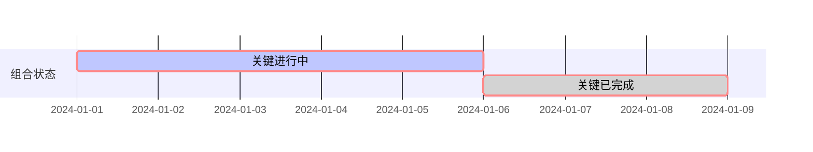

## 任务时间设置

### 固定日期

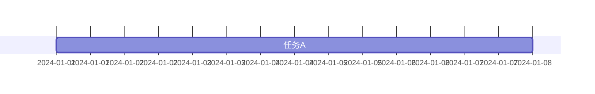

### 相对于其他任务

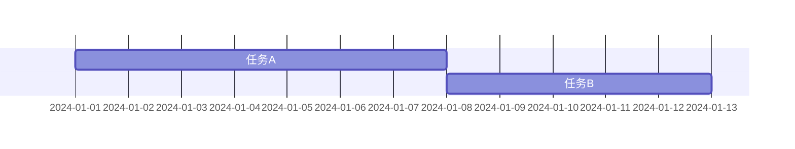

### 指定结束日期

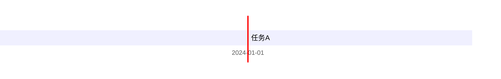

### 排除日期

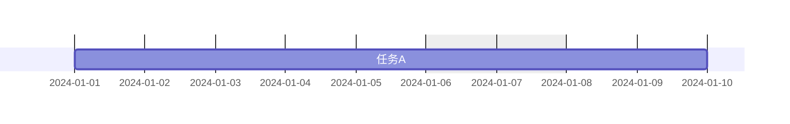

## 分组

### section 分组

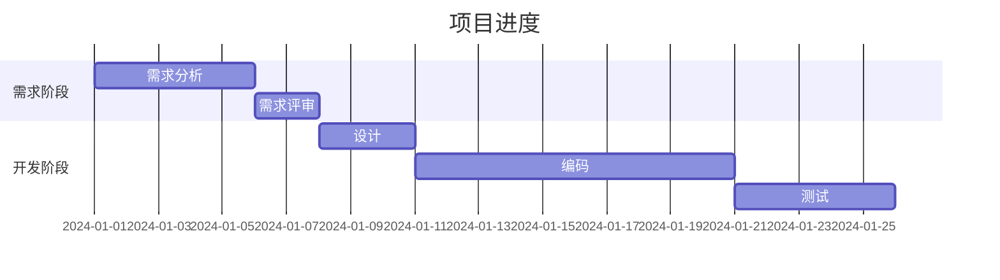

## 里程碑

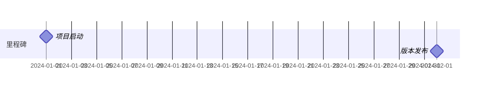

里程碑特点：
- 持续时间为 0
- 显示为菱形标记
- 用于标记重要节点

## 依赖关系

### 顺序依赖

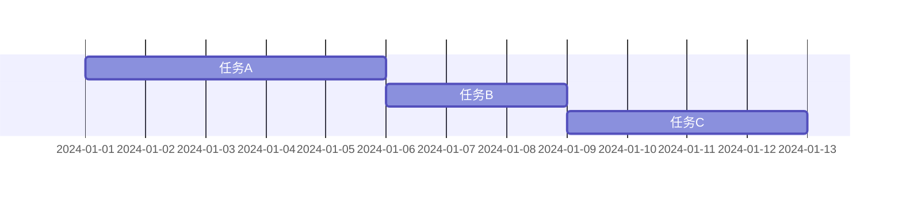

### 多任务依赖

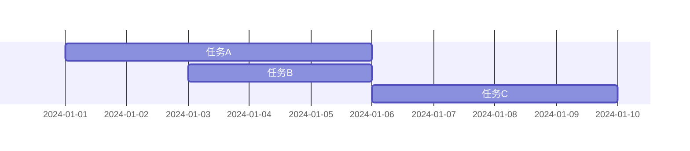

## 样式配置

### 全局配置

```mermaid
gantt
    title 样式配置示例
    dateFormat YYYY-MM-DD

    section 配置
    标题 :title, 2024-01-01, 30d
    包含今天 :todayMarker, 2024-01-15
```

### todayMarker 设置


或自定义样式：


## 高级配置

### excludes 排除日期

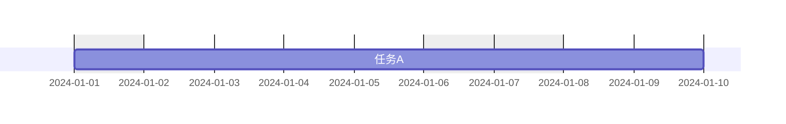

排除类型：
- `weekends` - 周末
- `friday` - 特定星期
- 具体日期 - `2024-01-01`

### includes 包含日期

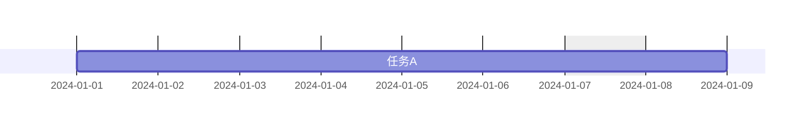

## 最佳实践

### 命名规范

- 任务名称简洁明了
- 任务 ID 使用有意义的标识
- 分组名称概括性强

### 布局建议

- 合理设置时间粒度
- 使用里程碑标记关键节点
- 控制任务数量（建议 ≤ 30）

### 示例：完整甘特图

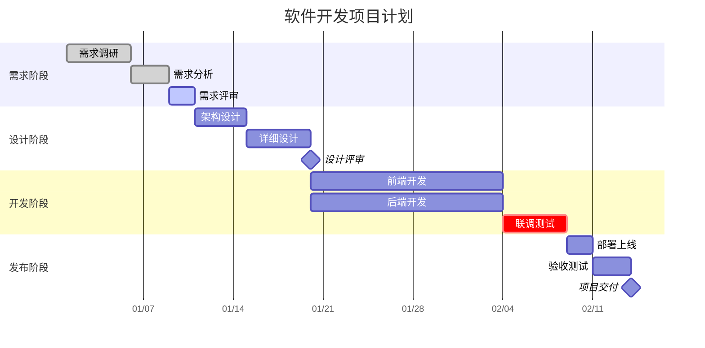

## 参考链接

- [Mermaid 官方文档 - Gantt Diagram](https://mermaid.js.org/syntax/gantt.html)
