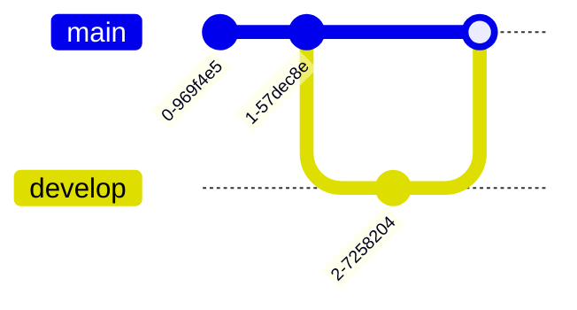
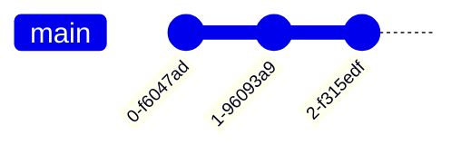
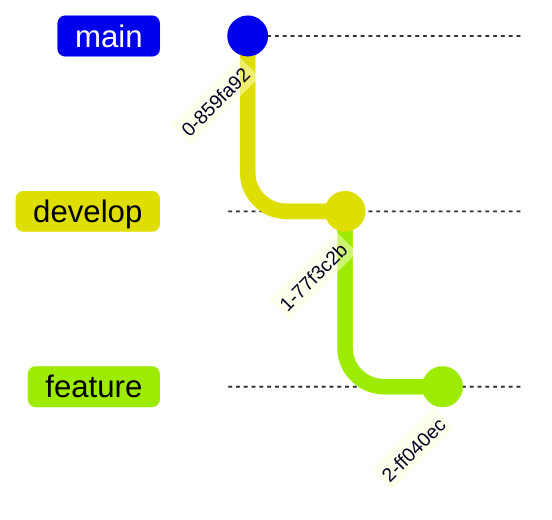
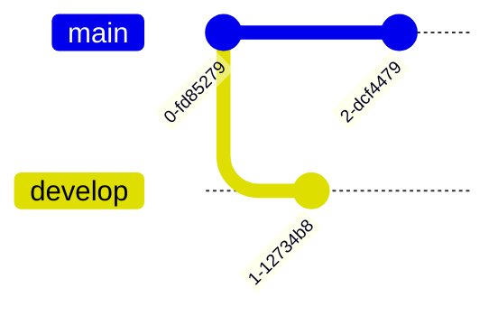
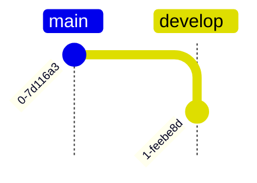
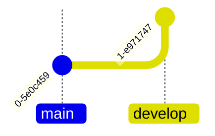

# Mermaid Git 图 (Git Graph)

Git 图用于可视化 Git 分支策略和提交历史，特别适合展示 Git Flow 等工作流程。

## 基本语法



## 提交操作

### 基本提交



### 自定义提交 ID


### 提交类型


| 类型 | 说明 | 显示样式 |
| --- | --- | --- |
| `NORMAL` | 普通提交 | 实心圆 |
| `HIGHLIGHT` | 高亮提交 | 填充矩形 |
| `REVERSE` | 回退提交 | 叉号圆 |

### 提交标签


### 组合属性


## 分支操作

### 创建分支



### 切换分支



`checkout` 和 `switch` 可互换使用：


### 分支顺序


## 合并操作

### 基本合并


### 合并属性


## Cherry-pick 操作


### Cherry-pick 合并提交


## 方向设置

### 从左到右（默认）


### 从上到下



### 从下到上



## 配置选项

### 隐藏分支名称


### 隐藏提交标签


### 自定义主分支名称


### 并行提交

```mermaid
---
config:
  gitGraph:
    parallelCommits: true
---
gitGraph
    commit
    branch develop
    commit
    checkout main
    commit
```

### 提交标签旋转

```mermaid
---
config:
  gitGraph:
    rotateCommitLabel: false
---
gitGraph
    commit id: "feat(api): add new endpoint"
    commit id: "fix(client): resolve issue"
```

## 主题样式

### 内置主题

```mermaid
---
config:
  theme: dark
---
gitGraph
    commit
    branch develop
    commit
```

可用主题：`base`、`forest`、`dark`、`default`、`neutral`

### 自定义分支颜色

```mermaid
---
config:
  themeVariables:
    git0: "#ff0000"
    git1: "#00ff00"
    git2: "#0000ff"
---
gitGraph
    commit
    branch develop
    commit
    branch feature
    commit
```

## 最佳实践

### 命名规范

- 分支名称使用小写和连字符
- 提交 ID 简洁有意义
- 标签使用语义化版本

### 布局建议

- 控制分支数量（建议 ≤ 8）
- 使用方向参数优化布局
- 合理使用高亮类型

### 示例：Git Flow

```mermaid
---
config:
  gitGraph:
    mainBranchOrder: 0
---
gitGraph
    commit id: "init"
    branch develop order: 1
    checkout develop
    commit id: "setup"

    branch feature order: 2
    checkout feature
    commit id: "feat-1"
    commit id: "feat-2"

    checkout develop
    merge feature id: "merge-feature"

    branch release order: 3
    checkout release
    commit id: "release-prep"

    checkout main
    merge release id: "v1.0.0" tag: "v1.0.0" type: HIGHLIGHT

    checkout develop
    merge release id: "back-merge"

    branch hotfix order: 4
    checkout hotfix
    commit id: "fix-bug" type: HIGHLIGHT

    checkout main
    merge hotfix id: "v1.0.1" tag: "v1.0.1"
```

## 参考链接

- [Mermaid 官方文档 - Git Graph](https://mermaid.js.org/syntax/gitgraph.html)
