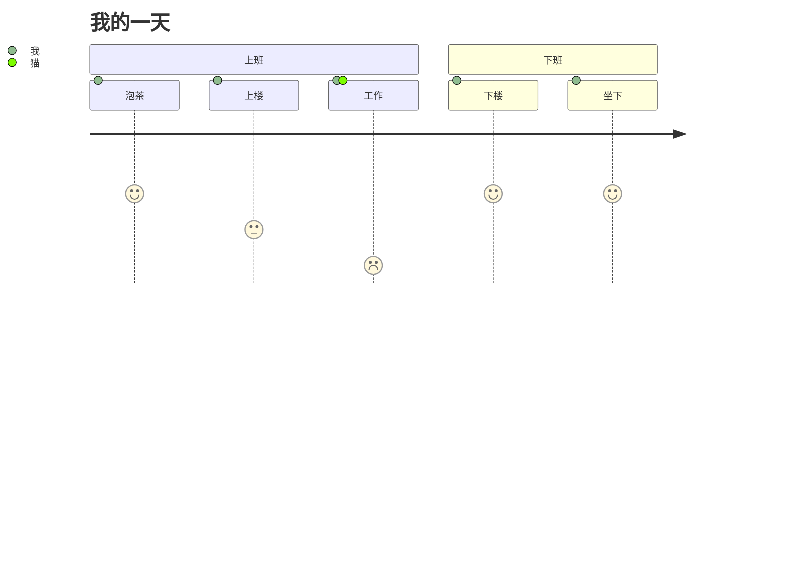
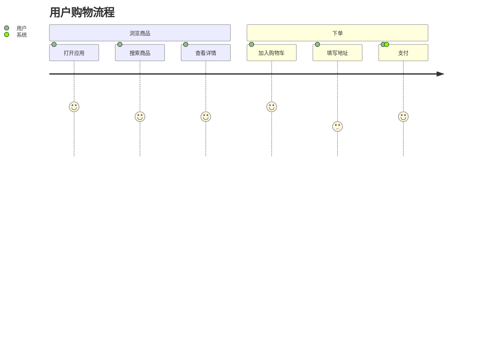
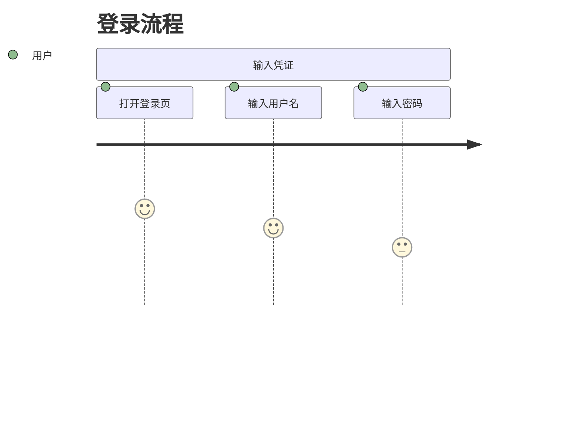
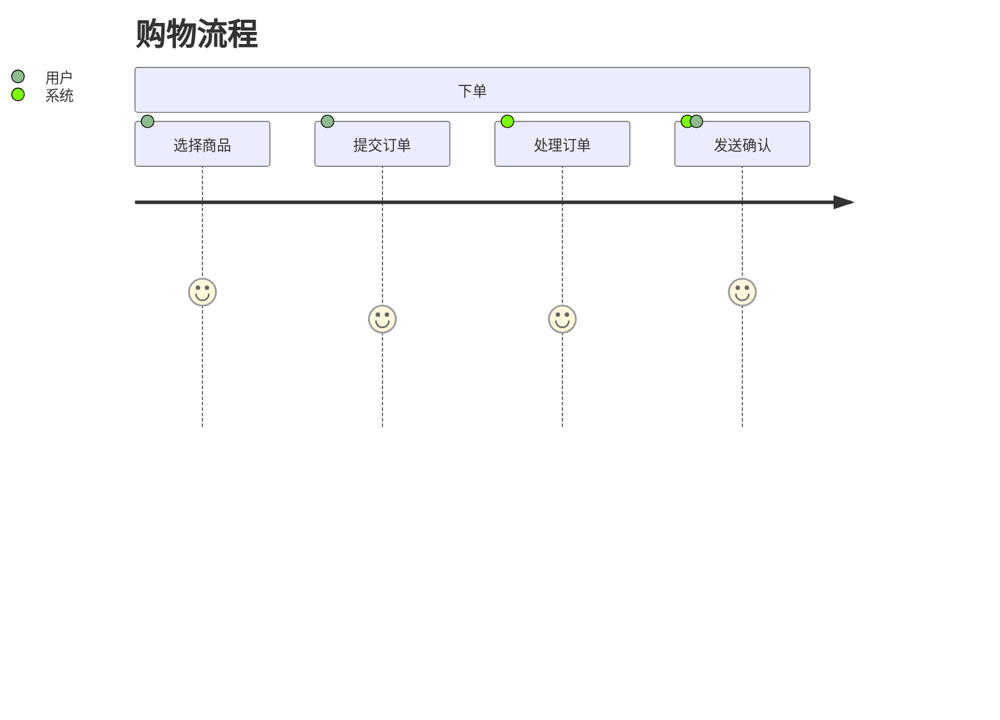
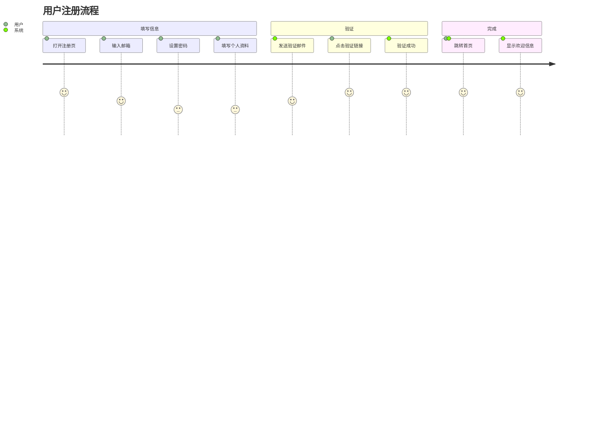
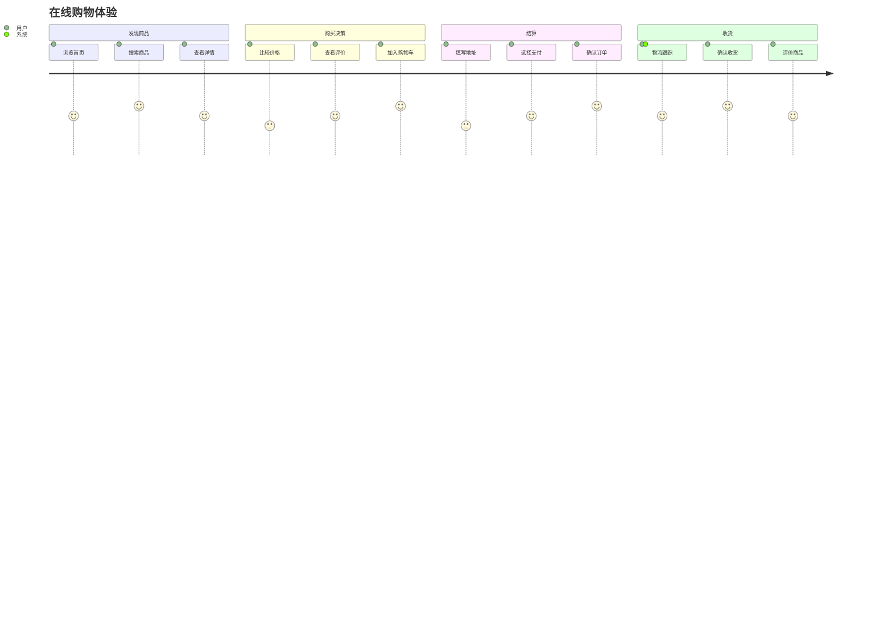
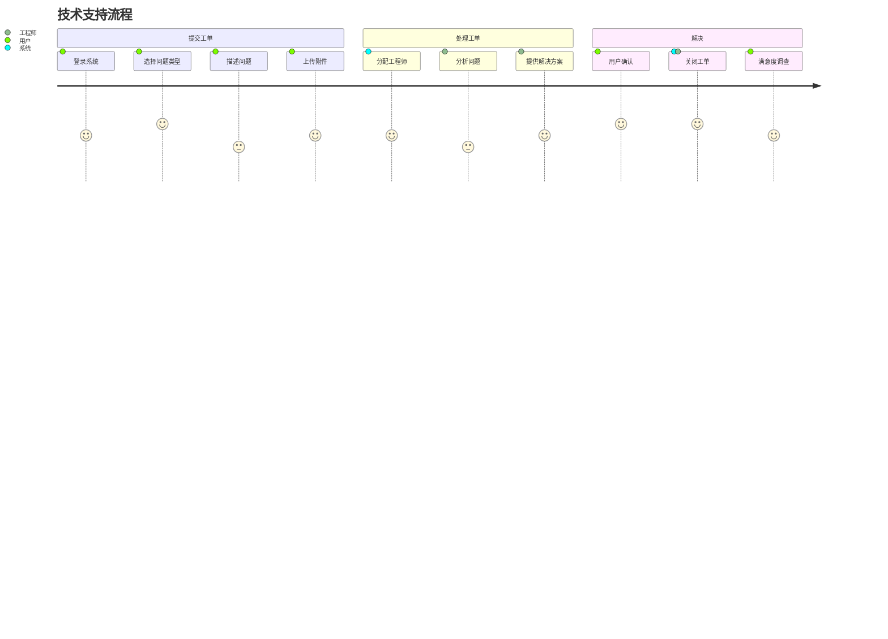

# Mermaid 用户旅程图 (User Journey)

用户旅程图用于描述用户完成特定任务的步骤和体验，展示用户与系统的交互过程。

## 基本语法



## 结构说明

### 标题


### 章节



### 任务

```
任务名称: 评分: 参与者1, 参与者2
```

## 任务评分

评分范围为 1-5，表示用户满意度：

| 分数 | 含义 |
| --- | --- |
| 1 | 非常不满意 |
| 2 | 不满意 |
| 3 | 一般 |
| 4 | 满意 |
| 5 | 非常满意 |

## 参与者

### 单一参与者



### 多参与者



参与者用逗号分隔，表示多个参与者共同参与该步骤。

## 完整示例

### 示例一：用户注册流程



### 示例二：在线购物体验



### 示例三：技术支持流程



## 最佳实践

### 章节划分

- 按时间顺序组织
- 每个章节代表一个阶段
- 章节名称简洁明了

### 任务描述

- 使用动词开头
- 描述具体行为
- 保持简洁

### 评分原则

- 基于用户体验客观评分
- 痛点步骤给予低分
- 愉悦步骤给予高分

### 参与者定义

- 明确区分用户和系统
- 多角色协作时都列出
- 名称保持一致

## 参考链接

- [Mermaid 官方文档 - User Journey](https://mermaid.js.org/syntax/userJourney.html)
