# Mermaid 思维导图 (Mindmap)

思维导图用于可视化组织信息，展示层级关系和概念结构。

## 基本语法

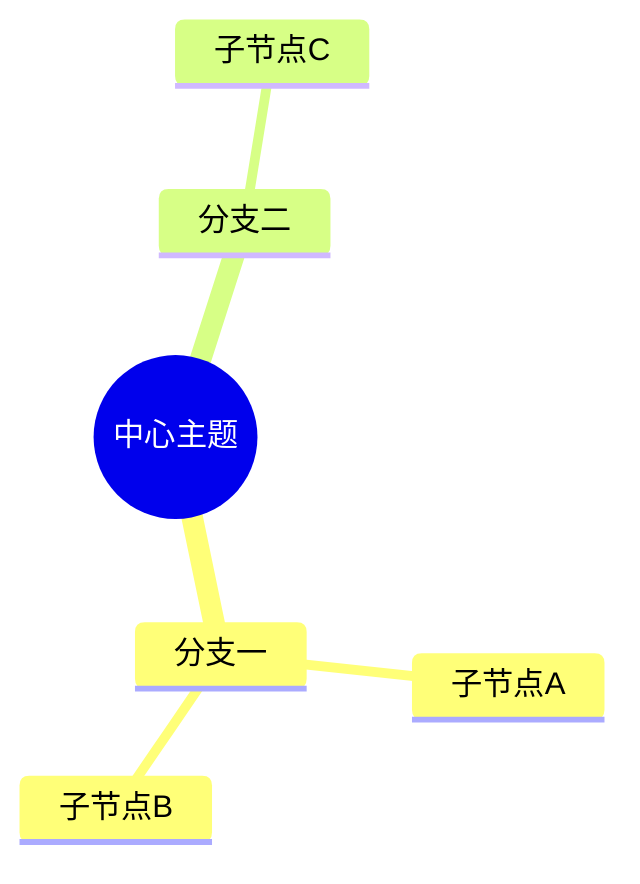

## 节点定义

### 缩进规则

使用缩进定义层级关系：

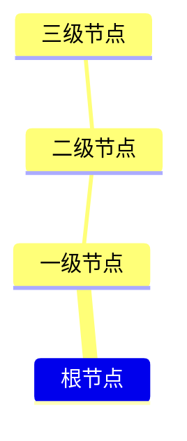

### 根节点

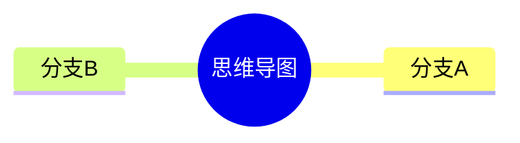

## 节点形状

### 矩形


### 圆角矩形

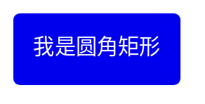

### 圆形

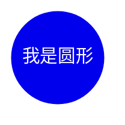

### 旗帜

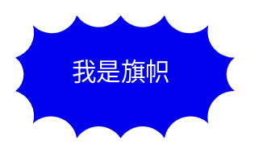

### 云形


### 六边形


### 默认形状


## 形状语法总结

| 语法 | 形状 |
| --- | --- |
| `id[文字]` | 矩形 |
| `id(文字)` | 圆角矩形 |
| `id((文字))` | 圆形 |
| `id))文字((` | 旗帜 |
| `id)文字(` | 云形 |
| `id{{文字}}` | 六边形 |
| `文字` | 默认 |

## 图标

### 添加图标

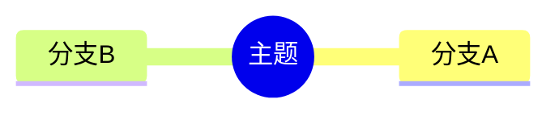

### 图标语法

```
::icon(图标类名)
```

常用图标库：
- Font Awesome: `fa fa-*`
- Material Design Icons: `mdi mdi-*`

## 样式类

### 定义样式类

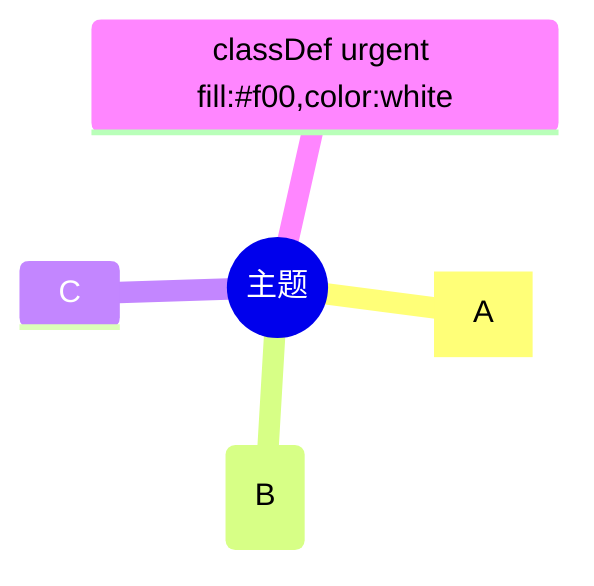

### 多类样式

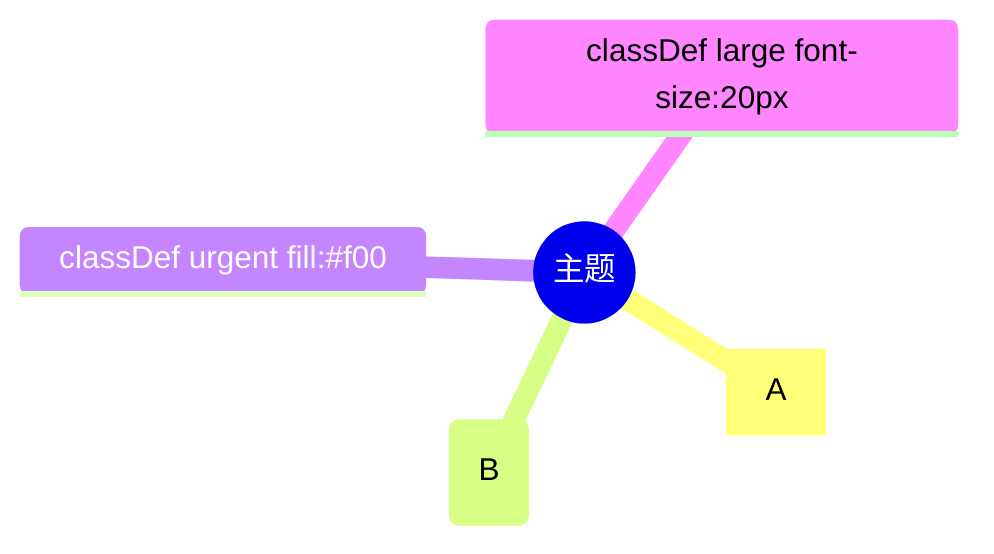

### 样式语法

```
节点:::类名1 类名2
```

## Markdown 格式

### 格式化文本

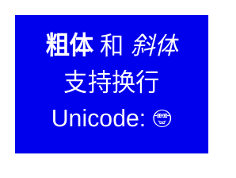

### 格式语法

| 格式 | 语法 |
| --- | --- |
| 粗体 | `**文字**` |
| 斜体 | `*文字*` |
| 换行 | 直接换行 |

## 完整示例

### 示例一：项目规划

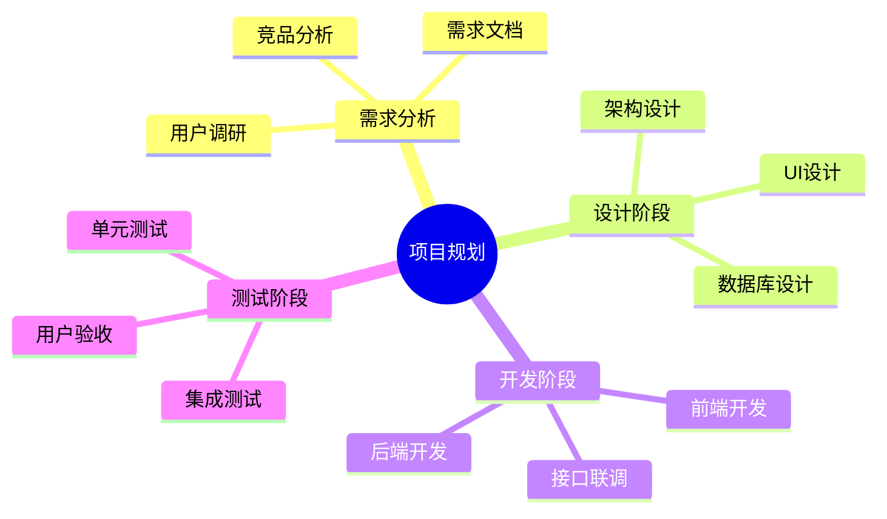

### 示例二：知识体系

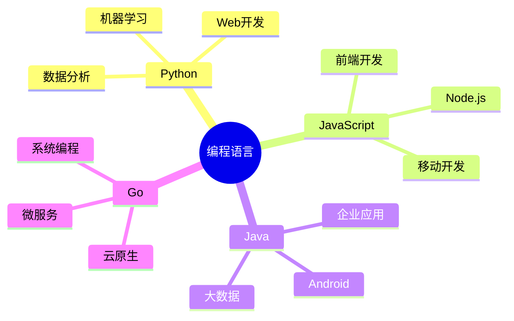

### 示例三：带图标和样式

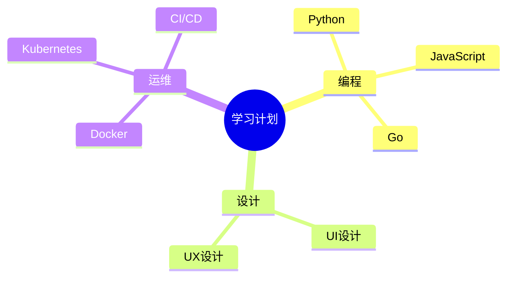

## 布局配置

### Tidy Tree 布局

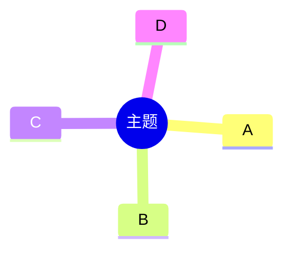

## 注意事项

### 缩进一致性

- 使用空格缩进
- 保持缩进一致
- 避免混用 Tab 和空格

### 实验性功能

思维导图是实验性功能：
- 语法可能变化
- 图标集成是实验部分
- 建议关注版本更新

## 最佳实践

### 结构设计

- 根节点主题明确
- 层级不宜过深（建议 ≤ 4 层）
- 同级节点数量适中

### 内容组织

- 节点文字简洁
- 合理使用形状区分类型
- 使用图标增强可读性

### 样式应用

- 统一使用样式类
- 避免过度装饰
- 保持视觉一致性

## 参考链接

- [Mermaid 官方文档 - Mindmap](https://mermaid.js.org/syntax/mindmap.html)
