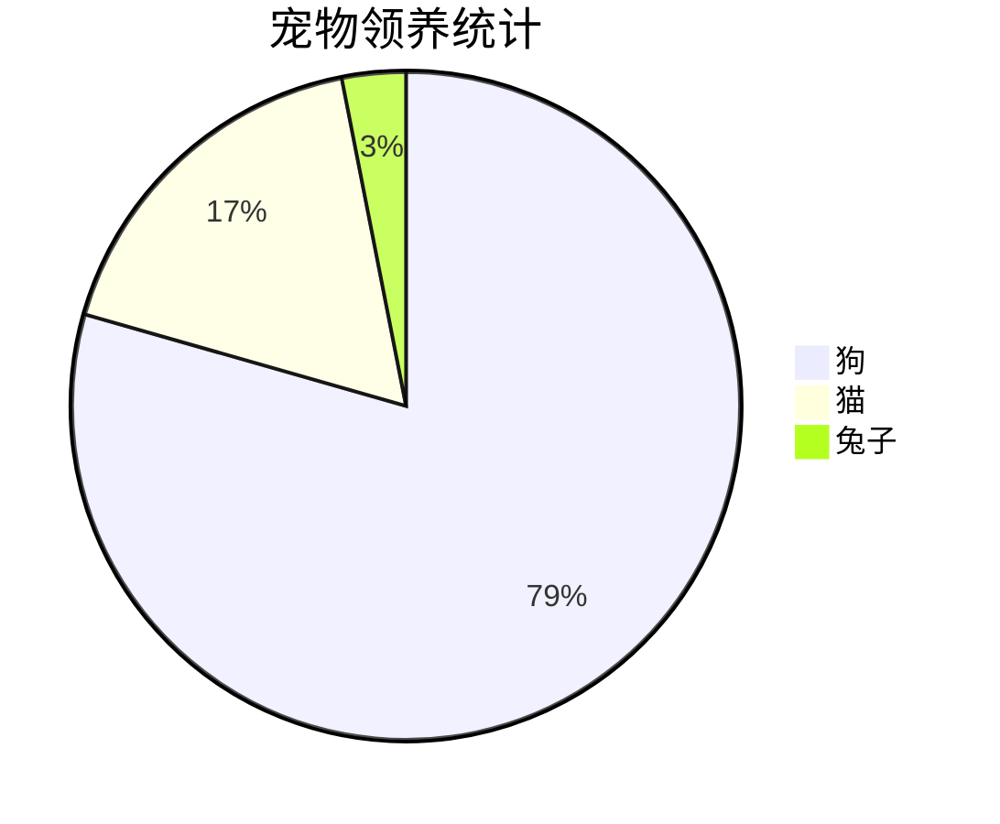
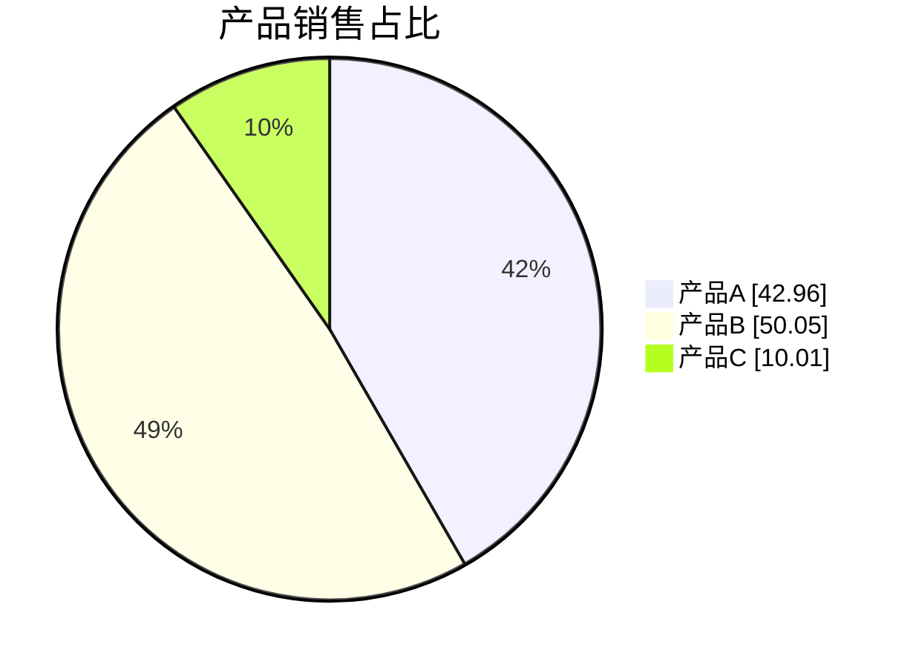
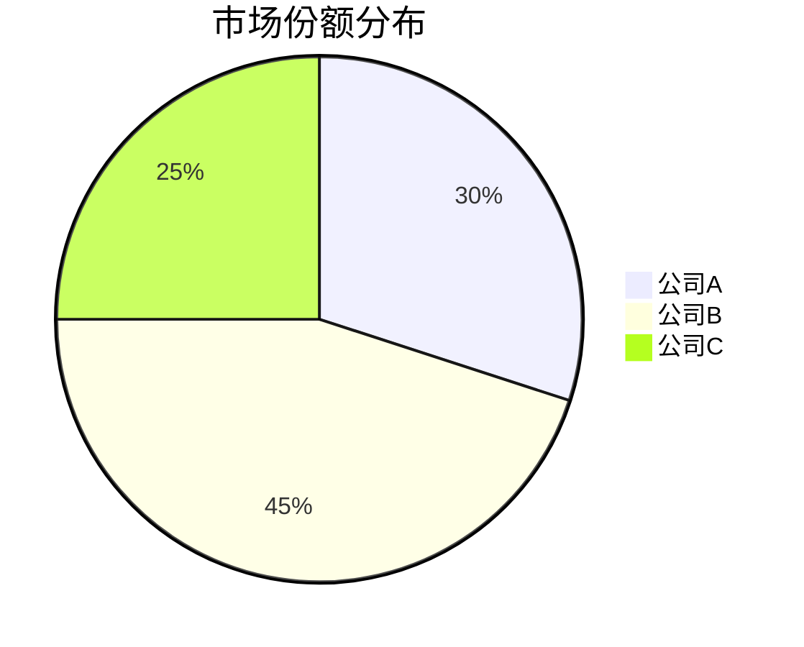
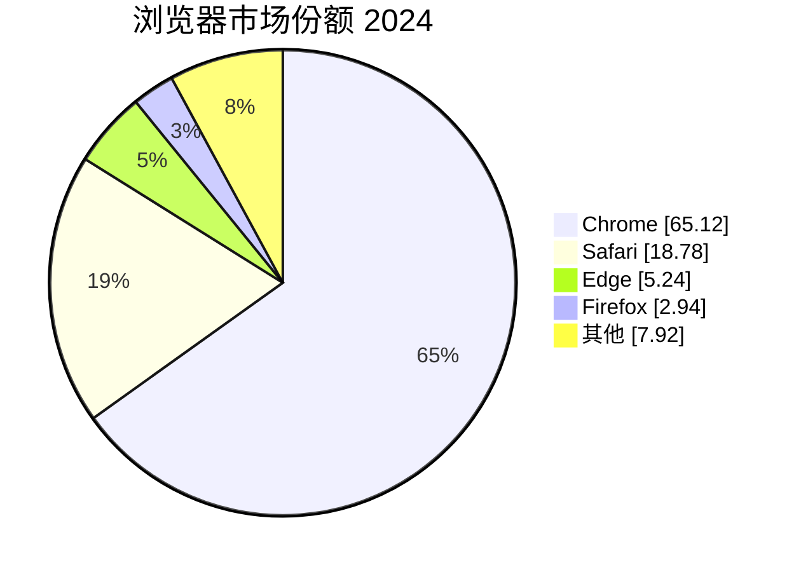
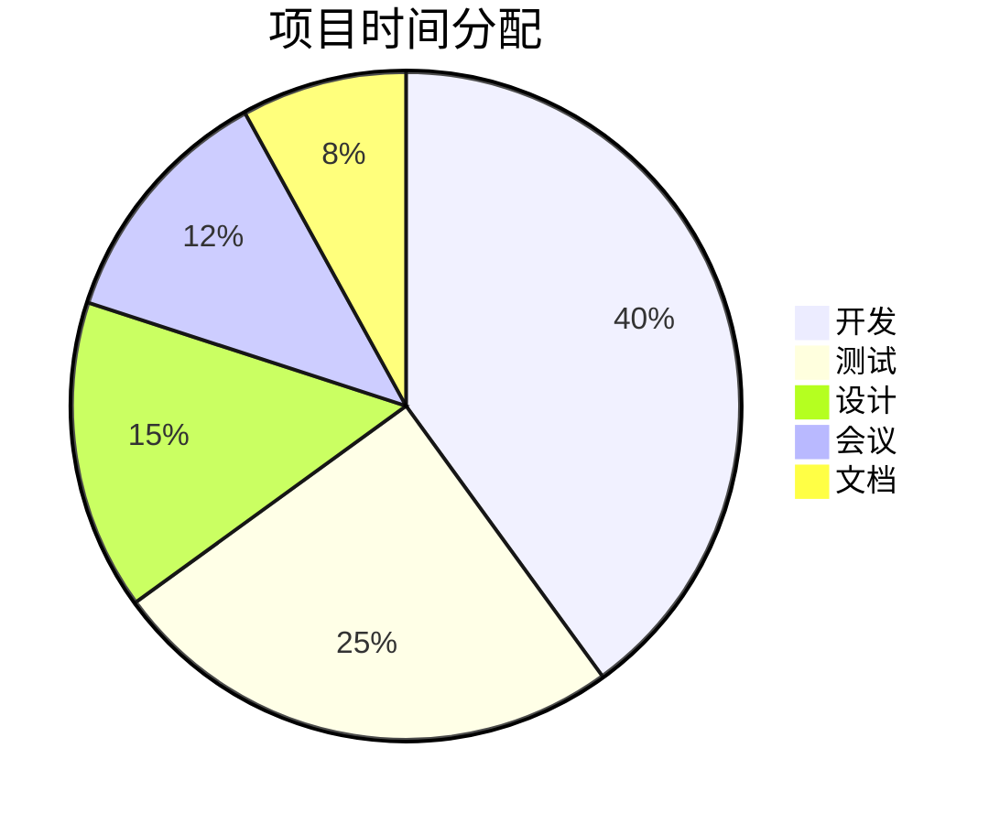
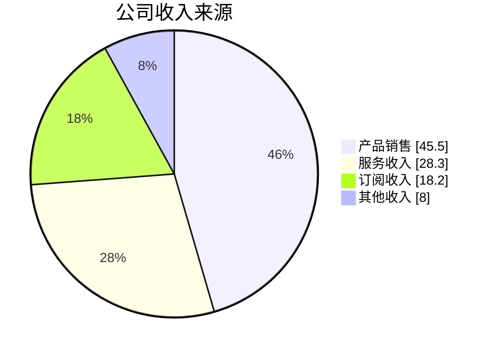
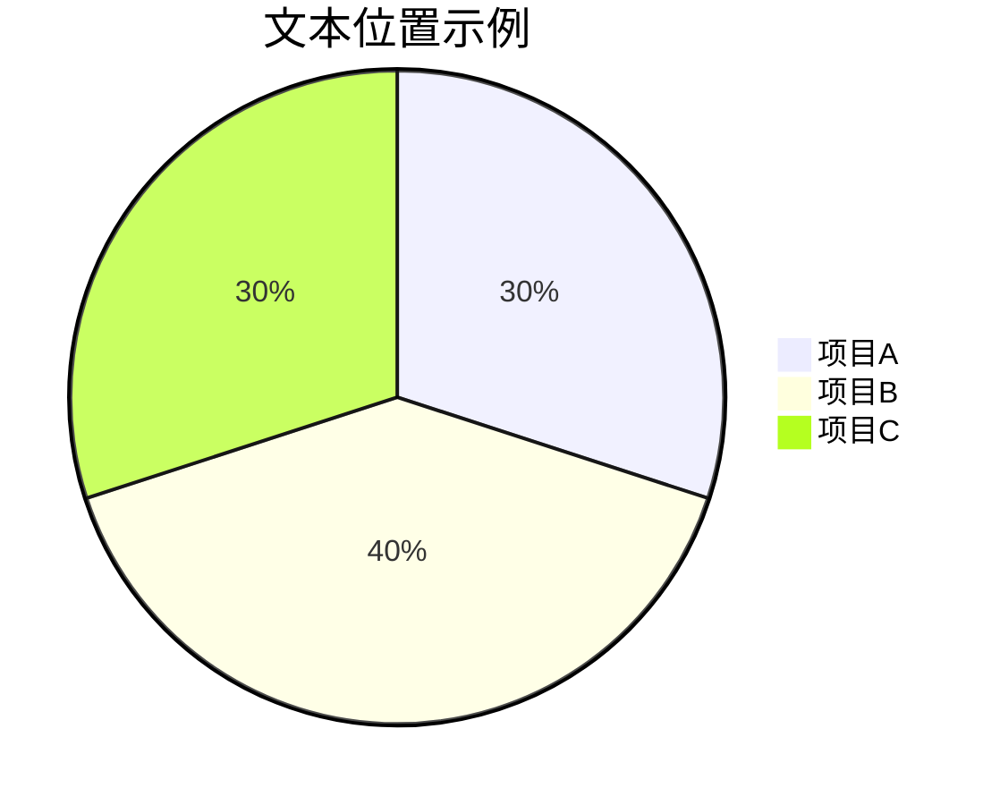
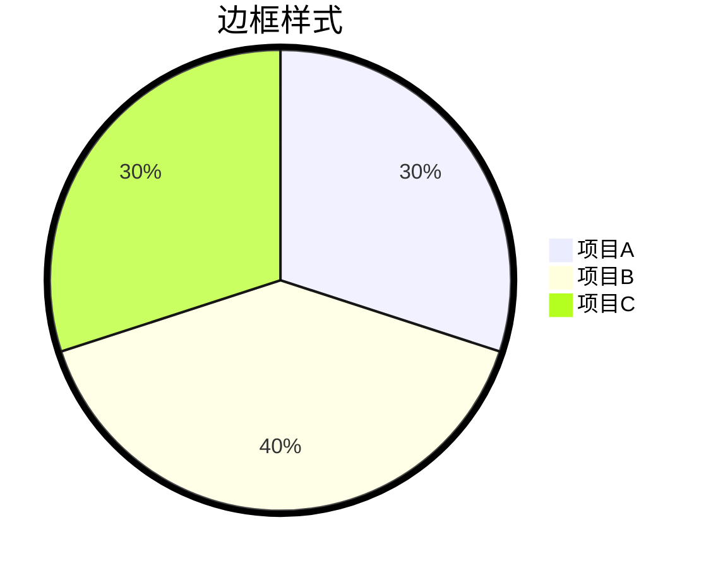
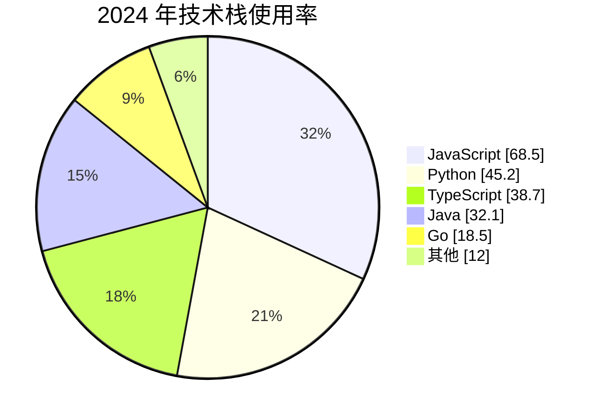

# Mermaid 饼图 (Pie Chart)

饼图用于展示数据的比例分布，直观显示各部分占整体的比例。

## 基本语法



## 语法结构

```
pie [showData] [title 标题]
    "数据项名称": 数值
    "数据项名称": 数值
```

## 参数说明

### showData

显示实际数值：



### title

设置图表标题：



## 数据格式

### 数值要求

- 必须为正数
- 支持小数（最多两位）
- 不支持负数

### 数据项格式

```
"数据项名称": 数值
```

## 完整示例

### 示例一：浏览器市场份额



### 示例二：项目时间分配



### 示例三：收入来源



## 配置选项

### 文本位置



`textPosition` 取值范围：0.0（中心）到 1.0（边缘）

### 边框样式



### 配置参数

| 参数 | 说明 | 默认值 |
| --- | --- | --- |
| `textPosition` | 标签位置（0-1） | 0.75 |

### 主题变量

| 变量 | 说明 |
| --- | --- |
| `pieOuterStrokeWidth` | 外边框宽度 |
| `pie1` - `pie12` | 各扇区颜色 |

## 注意事项

### 数据要求

- 数值必须大于零
- 负数会导致错误
- 小数支持最多两位

### 显示顺序

- 数据按声明顺序顺时针排列
- 第一个数据项从 12 点方向开始

### 标签处理

- 标签名称用双引号包裹
- 支持中文字符
- 避免过长的标签名称

## 最佳实践

### 数据选择

- 数据项不宜过多（建议 ≤ 8）
- 小比例数据可合并为"其他"
- 确保数据总和有意义

### 标签设计

- 标签简洁明了
- 使用 showData 显示数值
- 合理使用标题

### 示例：优化后的饼图



## 参考链接

- [Mermaid 官方文档 - Pie Chart](https://mermaid.js.org/syntax/pie.html)
