# Mermaid 象限图 (Quadrant Chart)

象限图用于数据分类和优先级分析，通过两个维度将数据点分布到四个象限中。

## 基本语法

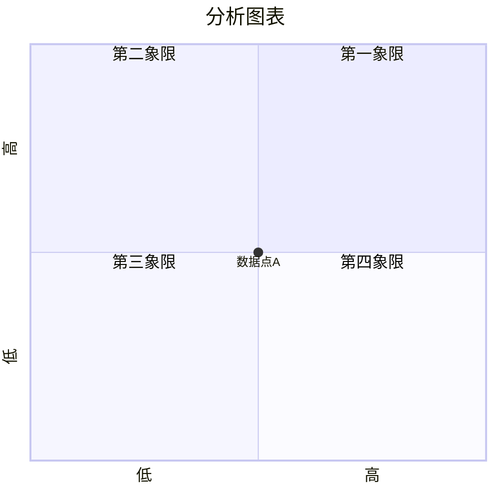
```mermaid
quadrantChart
    title 分析图表
    x-axis 低 --> 高
    y-axis 低 --> 高
    quadrant-1 第一象限
    quadrant-2 第二象限
    quadrant-3 第三象限
    quadrant-4 第四象限
    数据点A: [0.5, 0.5]
```

## 结构说明

### 标题

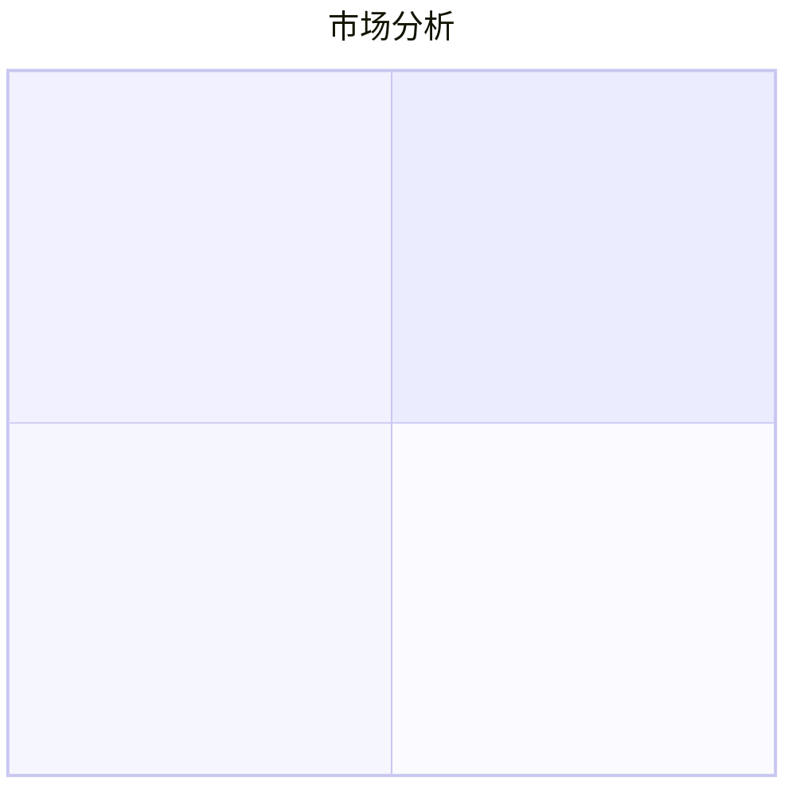
```mermaid
quadrantChart
    title 市场分析
```

### X 轴

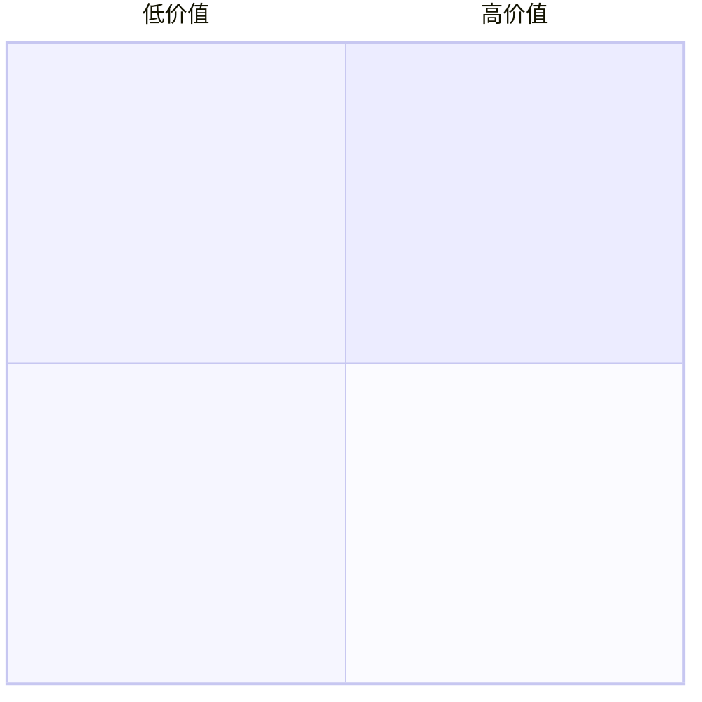
```mermaid
quadrantChart
    x-axis 低价值 --> 高价值
```

或只定义一侧：

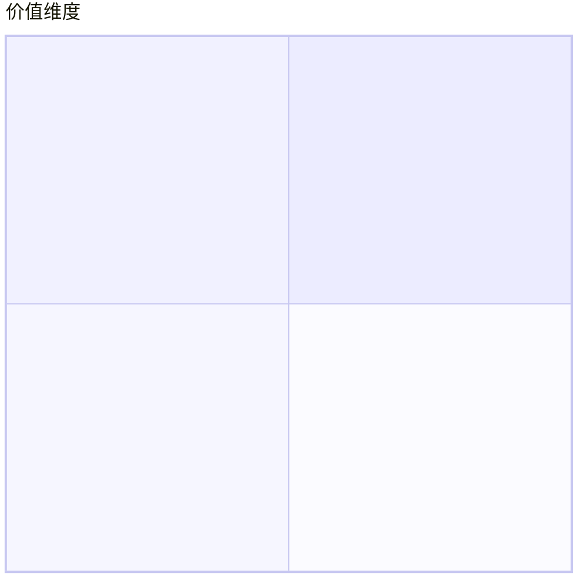
```mermaid
quadrantChart
    x-axis 价值维度
```

### Y 轴

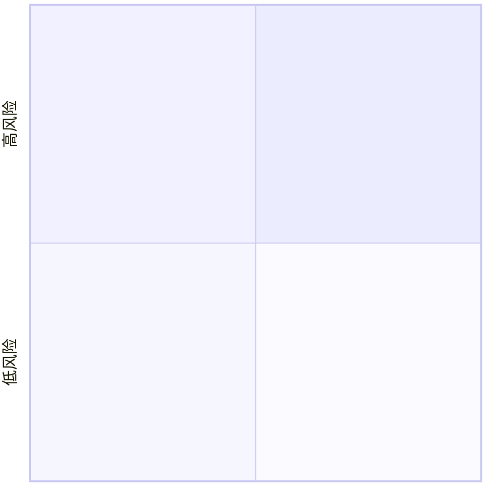
```mermaid
quadrantChart
    y-axis 低风险 --> 高风险
```

或只定义一侧：

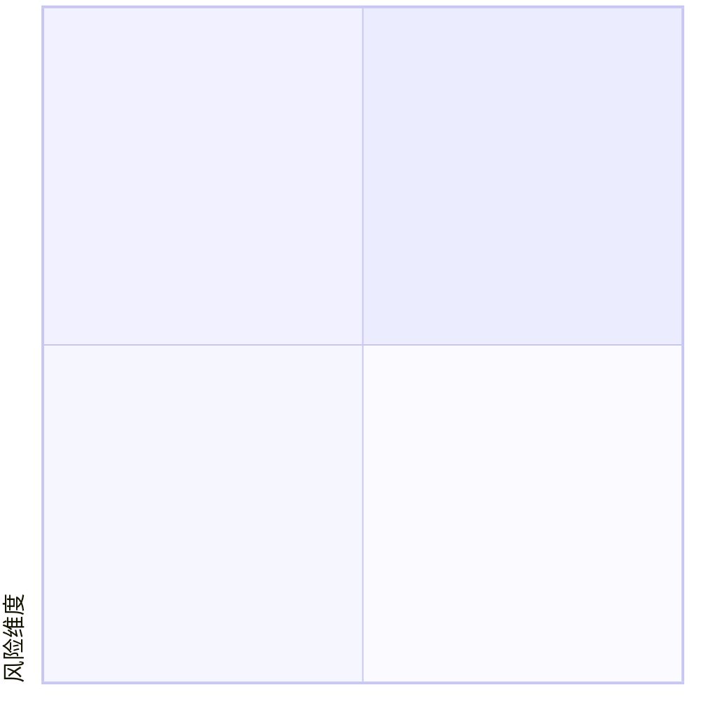
```mermaid
quadrantChart
    y-axis 风险维度
```

### 象限定义

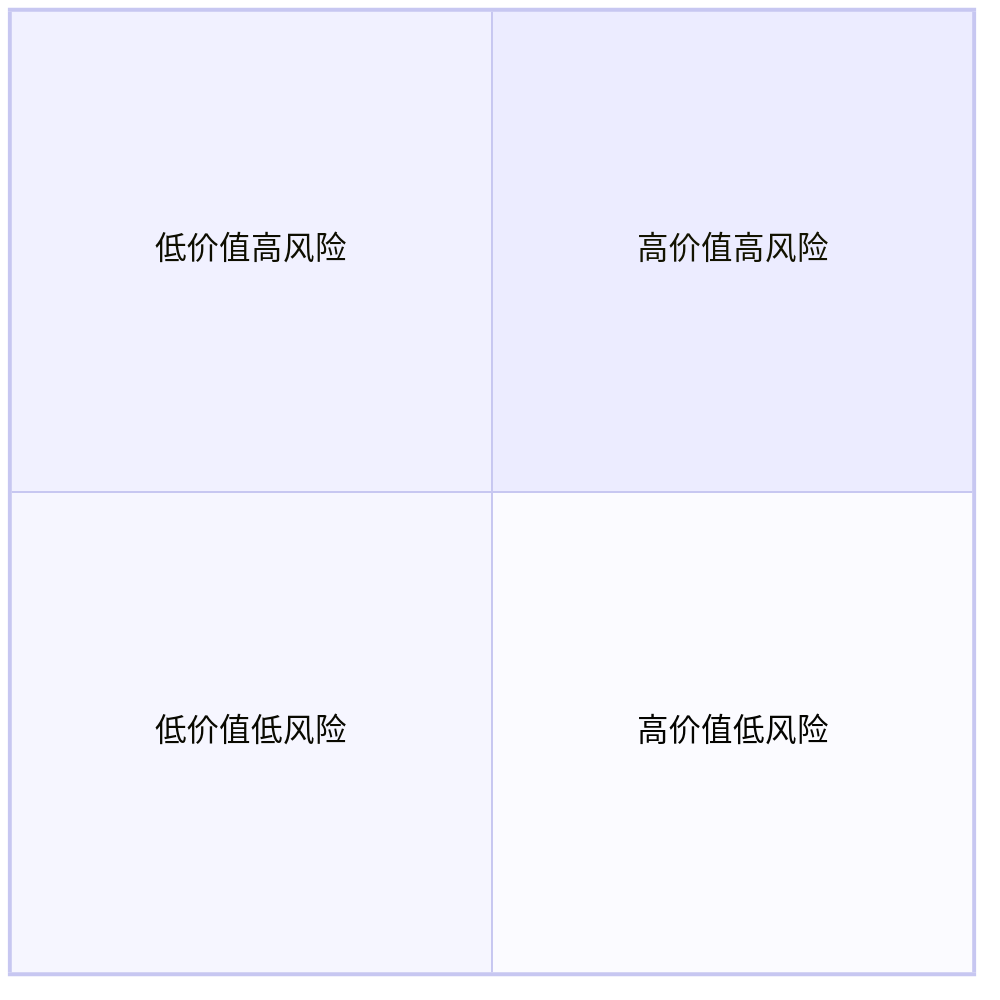
```mermaid
quadrantChart
    quadrant-1 高价值高风险
    quadrant-2 低价值高风险
    quadrant-3 低价值低风险
    quadrant-4 高价值低风险
```

象限位置：
- `quadrant-1` - 右上（高 X，高 Y）
- `quadrant-2` - 左上（低 X，高 Y）
- `quadrant-3` - 左下（低 X，低 Y）
- `quadrant-4` - 右下（高 X，低 Y）

### 数据点

```mermaid
quadrantChart
    数据点名称: [x坐标, y坐标]
```

坐标值范围：0-1

## 完整示例

### 示例一：营销活动分析

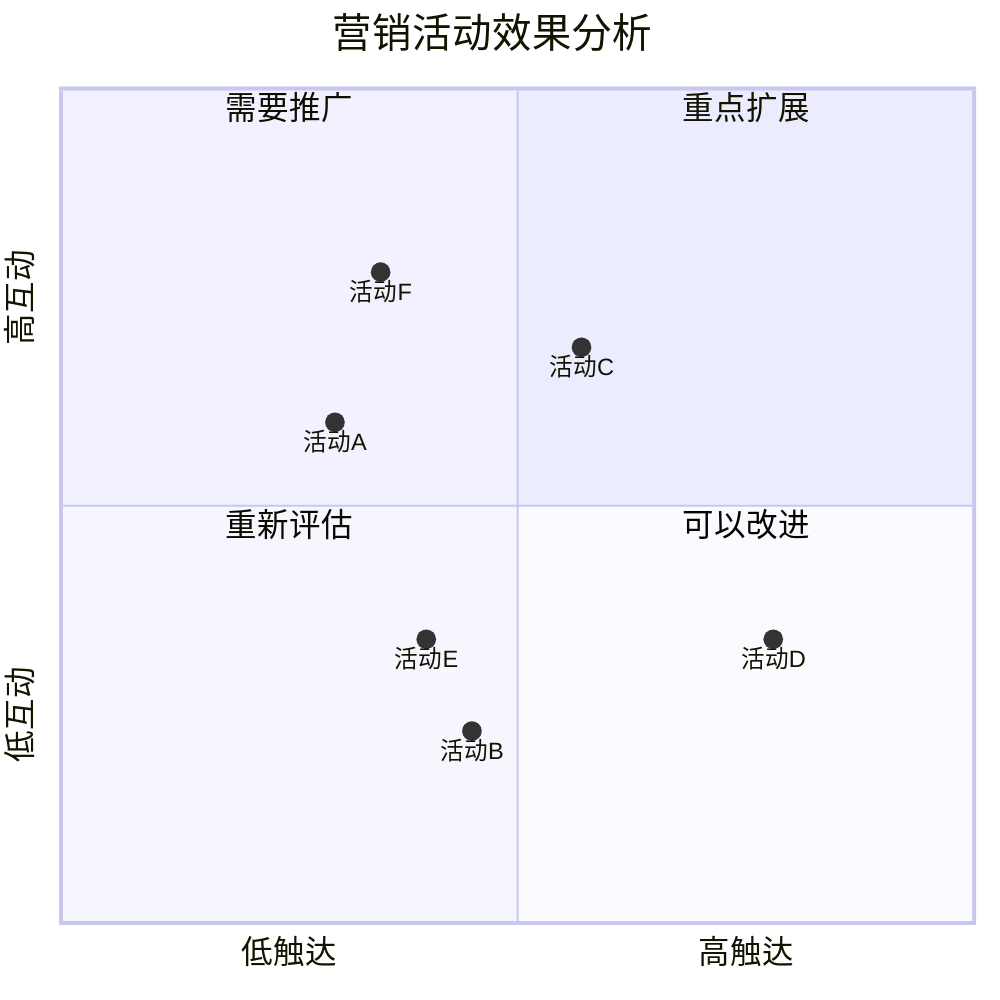
```mermaid
quadrantChart
    title 营销活动效果分析
    x-axis 低触达 --> 高触达
    y-axis 低互动 --> 高互动
    quadrant-1 重点扩展
    quadrant-2 需要推广
    quadrant-3 重新评估
    quadrant-4 可以改进
    活动A: [0.3, 0.6]
    活动B: [0.45, 0.23]
    活动C: [0.57, 0.69]
    活动D: [0.78, 0.34]
    活动E: [0.40, 0.34]
    活动F: [0.35, 0.78]
```

### 示例二：任务优先级矩阵

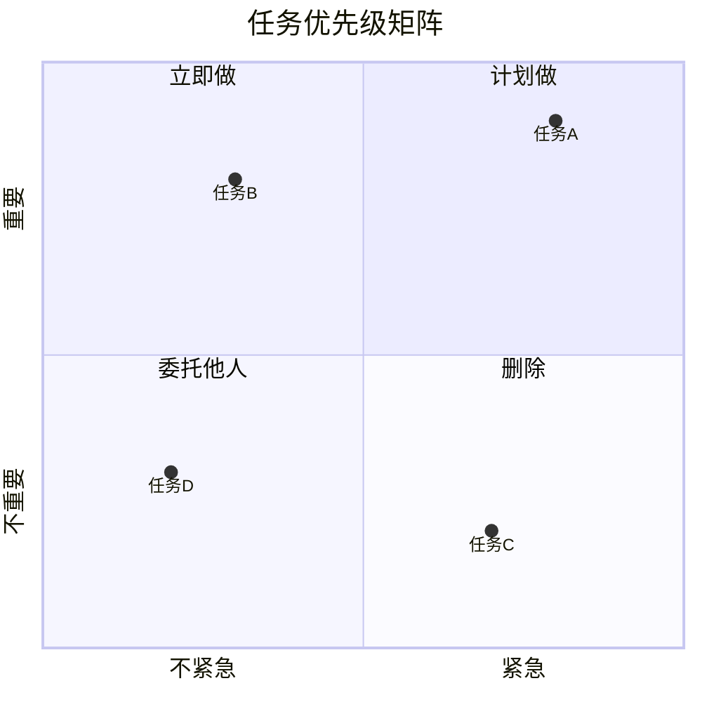
```mermaid
quadrantChart
    title 任务优先级矩阵
    x-axis 不紧急 --> 紧急
    y-axis 不重要 --> 重要
    quadrant-1 计划做
    quadrant-2 立即做
    quadrant-3 委托他人
    quadrant-4 删除
    任务A: [0.8, 0.9]
    任务B: [0.3, 0.8]
    任务C: [0.7, 0.2]
    任务D: [0.2, 0.3]
```

### 示例三：产品分析

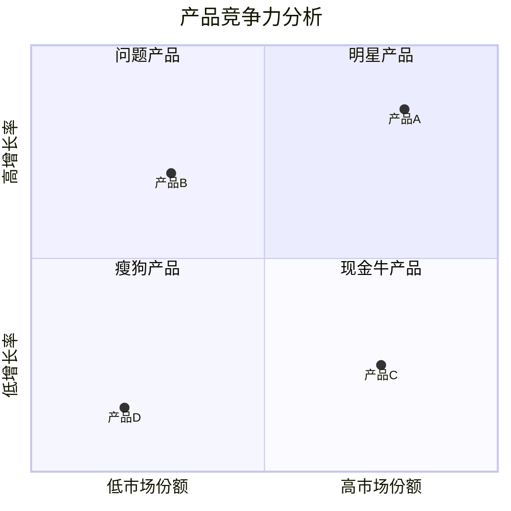
```mermaid
quadrantChart
    title 产品竞争力分析
    x-axis 低市场份额 --> 高市场份额
    y-axis 低增长率 --> 高增长率
    quadrant-1 明星产品
    quadrant-2 问题产品
    quadrant-3 瘦狗产品
    quadrant-4 现金牛产品
    产品A: [0.8, 0.85]
    产品B: [0.3, 0.7]
    产品C: [0.75, 0.25]
    产品D: [0.2, 0.15]
```

## 样式配置

### 图表配置

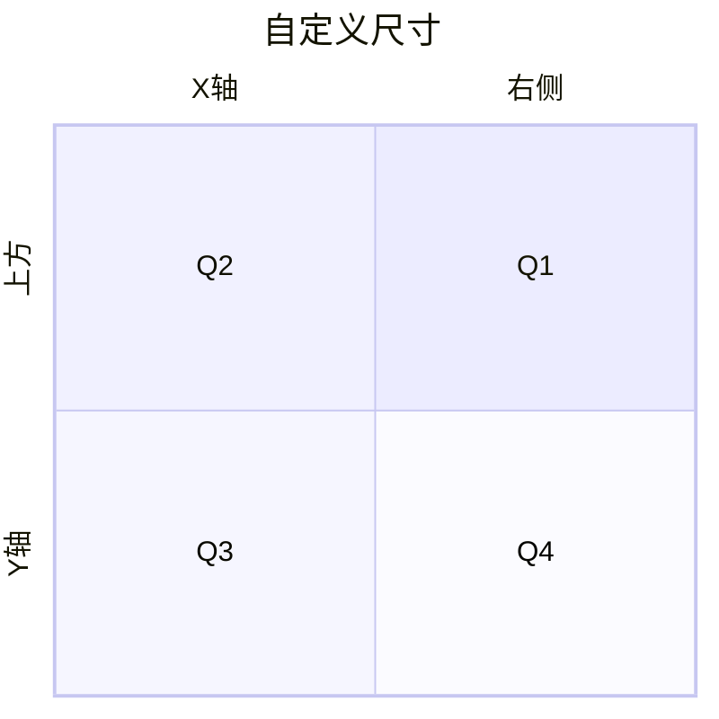
```mermaid
---
config:
  quadrantChart:
    chartWidth: 400
    chartHeight: 400
---
quadrantChart
    title 自定义尺寸
    x-axis X轴 --> 右侧
    y-axis Y轴 --> 上方
    quadrant-1 Q1
    quadrant-2 Q2
    quadrant-3 Q3
    quadrant-4 Q4
```

### 配置参数

| 参数 | 说明 | 默认值 |
| --- | --- | --- |
| `chartWidth` | 图表宽度 | 500 |
| `chartHeight` | 图表高度 | 500 |
| `titlePadding` | 标题内边距 | 10 |
| `titleFontSize` | 标题字体大小 | 20 |
| `quadrantPadding` | 象限内边距 | 5 |
| `quadrantLabelFontSize` | 象限标签字体 | 16 |
| `xAxisLabelFontSize` | X轴标签字体 | 16 |
| `yAxisLabelFontSize` | Y轴标签字体 | 16 |
| `pointLabelFontSize` | 数据点标签字体 | 12 |
| `pointRadius` | 数据点半径 | 5 |

### 主题变量

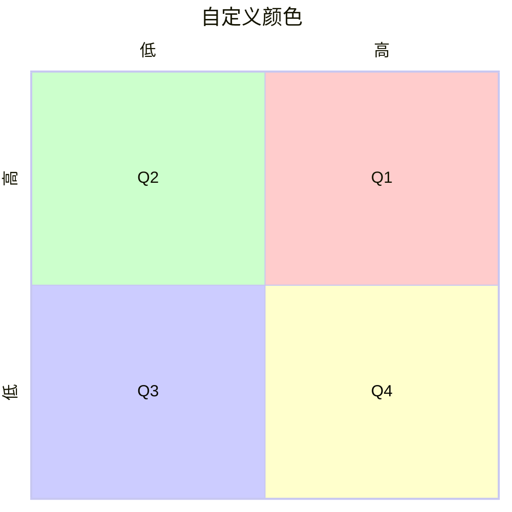
```mermaid
---
config:
  themeVariables:
    quadrant1Fill: "#ffcccc"
    quadrant2Fill: "#ccffcc"
    quadrant3Fill: "#ccccff"
    quadrant4Fill: "#ffffcc"
---
quadrantChart
    title 自定义颜色
    x-axis 低 --> 高
    y-axis 低 --> 高
    quadrant-1 Q1
    quadrant-2 Q2
    quadrant-3 Q3
    quadrant-4 Q4
```

## 数据点样式

### 直接样式

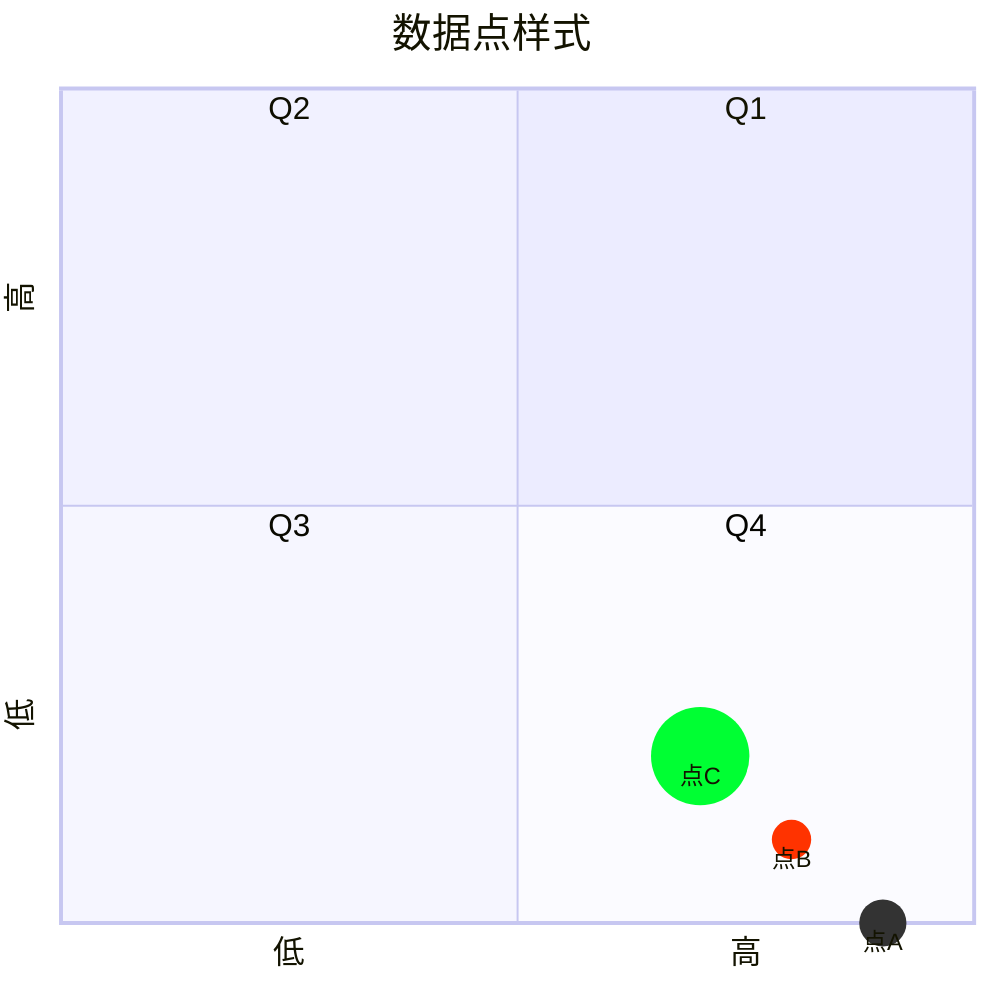
```mermaid
quadrantChart
    title 数据点样式
    x-axis 低 --> 高
    y-axis 低 --> 高
    quadrant-1 Q1
    quadrant-2 Q2
    quadrant-3 Q3
    quadrant-4 Q4
    点A: [0.9, 0.0] radius: 12
    点B: [0.8, 0.1] color: #ff3300, radius: 10
    点C: [0.7, 0.2] radius: 25, color: #00ff33
```

### 类样式

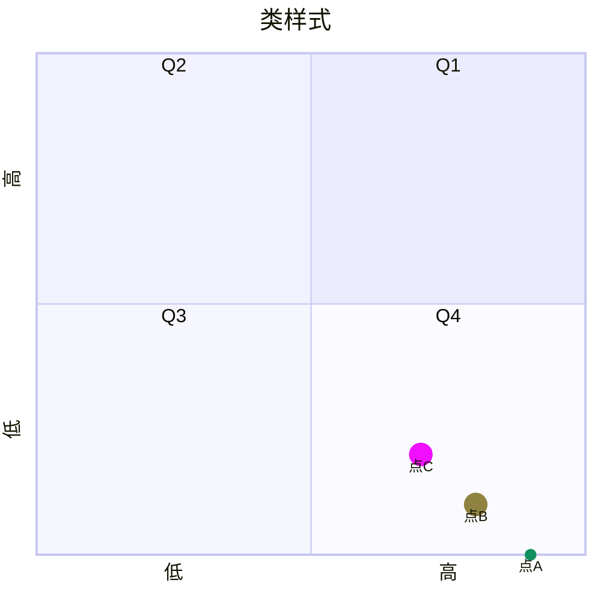
```mermaid
quadrantChart
    title 类样式
    x-axis 低 --> 高
    y-axis 低 --> 高
    quadrant-1 Q1
    quadrant-2 Q2
    quadrant-3 Q3
    quadrant-4 Q4
    点A:::class1: [0.9, 0.0]
    点B:::class2: [0.8, 0.1]
    点C:::class3: [0.7, 0.2]

    classDef class1 color: #109060
    classDef class2 color: #908342, radius: 10
    classDef class3 color: #f00fff, radius: 10
```

### 样式属性

| 属性 | 说明 |
| --- | --- |
| `color` | 填充颜色 |
| `radius` | 点半径 |
| `stroke-width` | 边框宽度 |
| `stroke-color` | 边框颜色 |

## 最佳实践

### 维度选择

- 选择有意义的相关维度
- 维度标签清晰明确
- 确保数据可比较

### 象限命名

- 名称反映象限特征
- 提供行动建议
- 保持简洁

### 数据点分布

- 确保数据点分散
- 避免过度集中
- 合理使用样式区分

## 参考链接

- [Mermaid 官方文档 - Quadrant Chart](https://mermaid.js.org/syntax/quadrantChart.html)
