# Mermaid 时序图 (Sequence Diagram)

时序图用于展示对象之间的交互顺序，特别适合描述系统间的消息传递流程。

## 基本语法

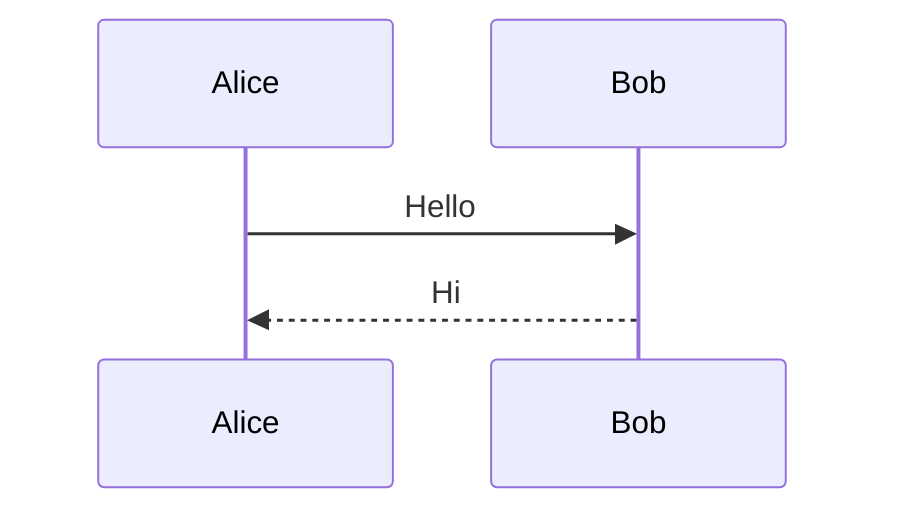

### 消息类型

| 语法 | 类型 | 说明 |
| --- | --- | --- |
| `->` | 实线无箭头 | 同步消息 |
| `->>` | 实线箭头 | 同步请求 |
| `-->>` | 虚线箭头 | 返回消息 |
| `--x` | 虚线叉号 | 失败消息 |
| `-)` | 实线开放箭头 | 异步消息 |

## 参与者

### 定义参与者

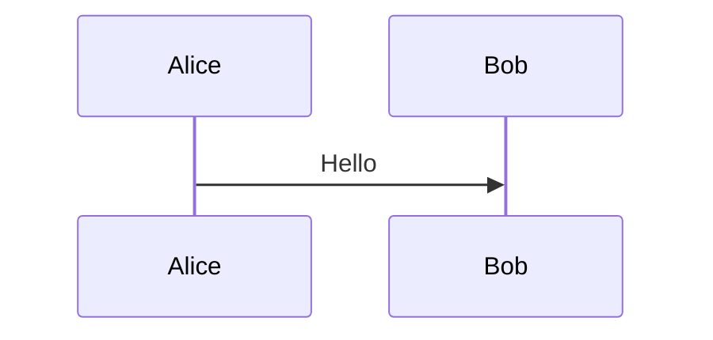

### 参与者别名

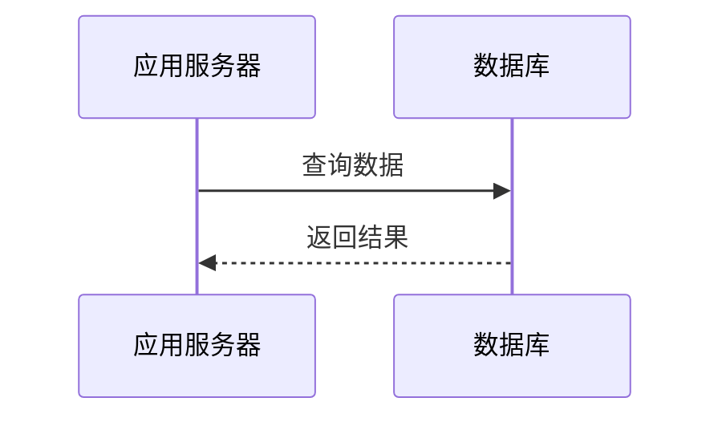

### 参与者顺序

使用 `participant` 显式声明可以控制顺序：

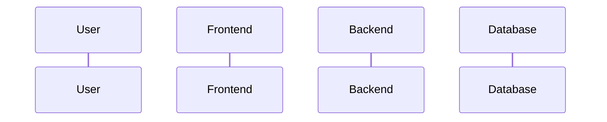

## 激活框

### 基本用法


### 简写

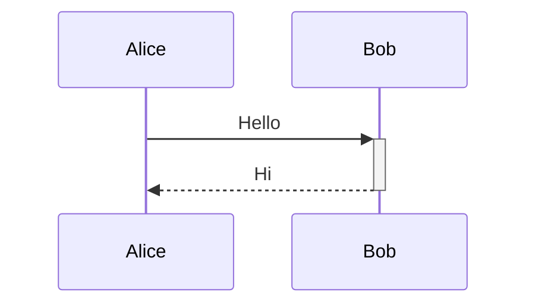

### 嵌套激活

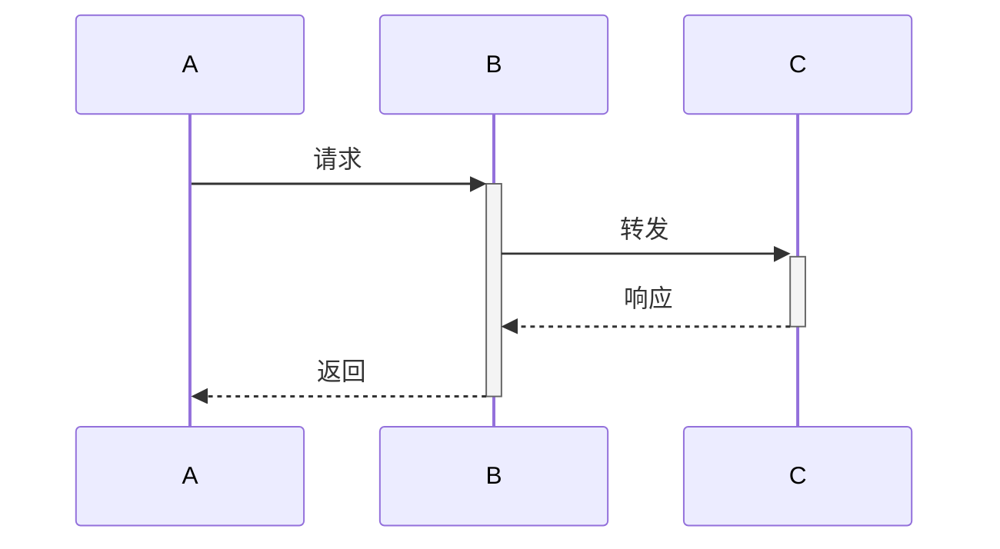

## 注解

### 添加注解

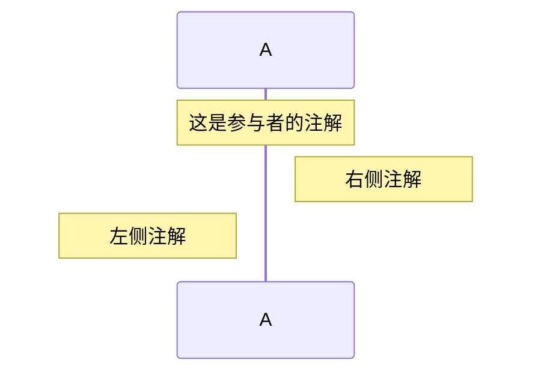

### 跨参与者注解

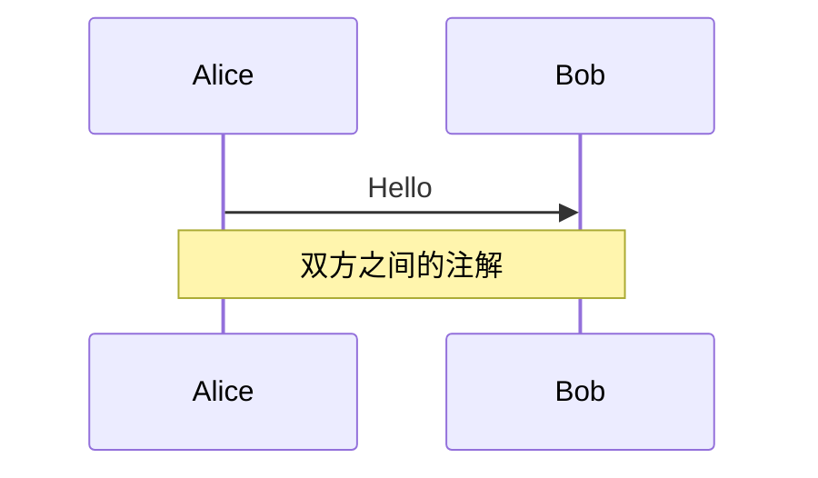

## 循环

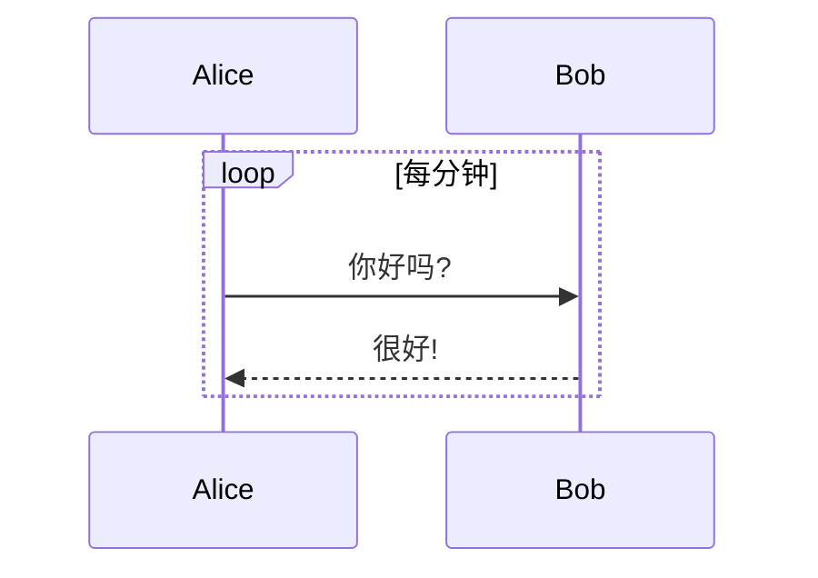

## 条件分支

### ALT 分支

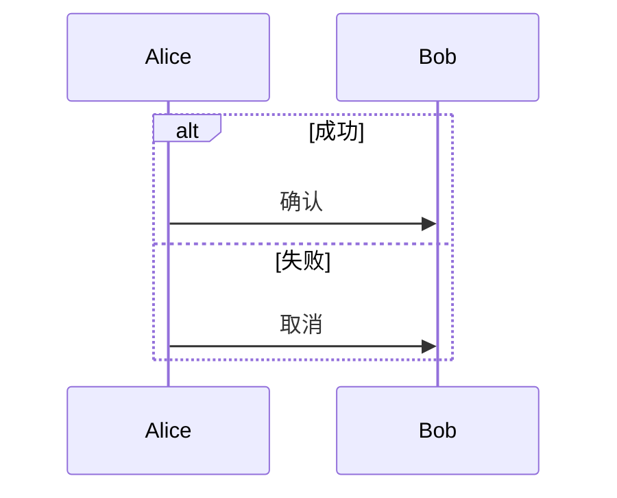

### OPT 可选

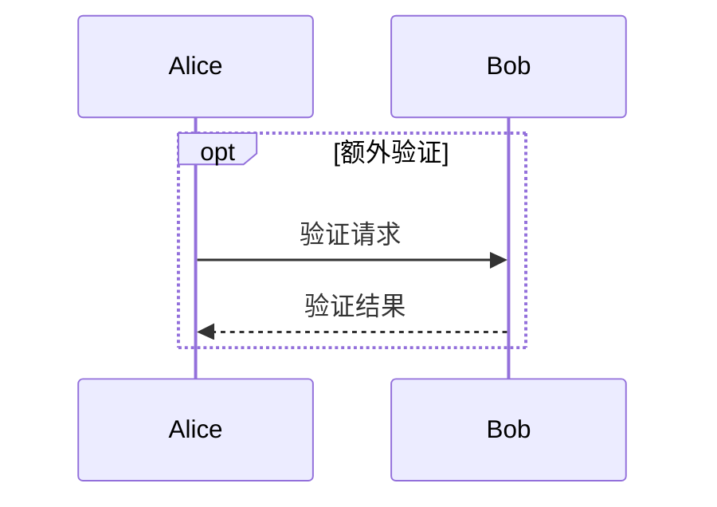

## 并行

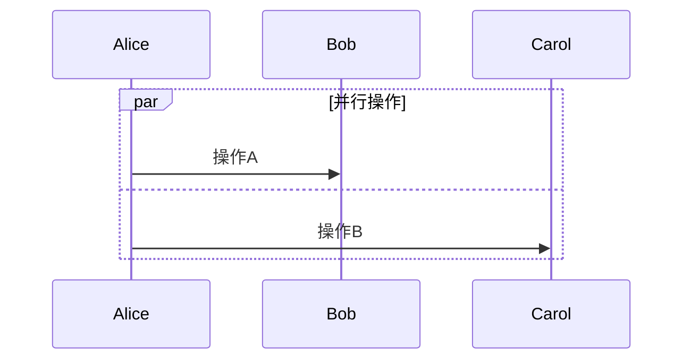

## 分组

### RECT 背景色

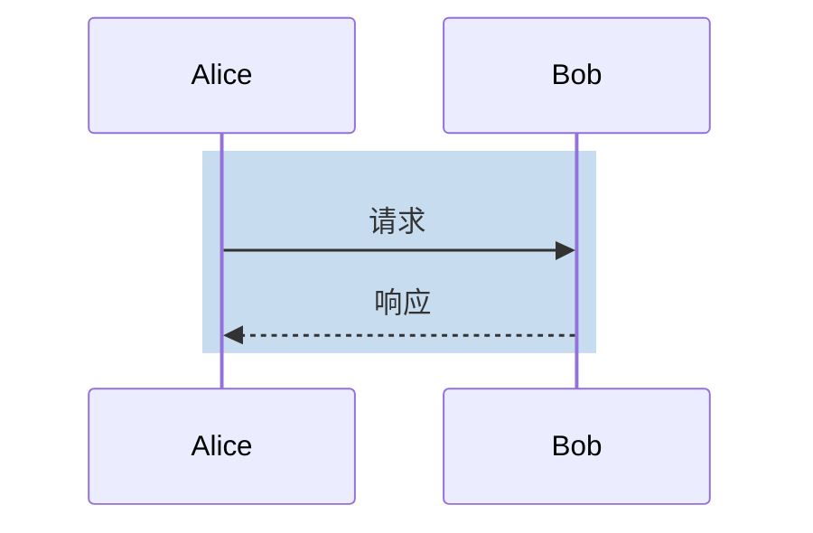

### 背景色带透明度

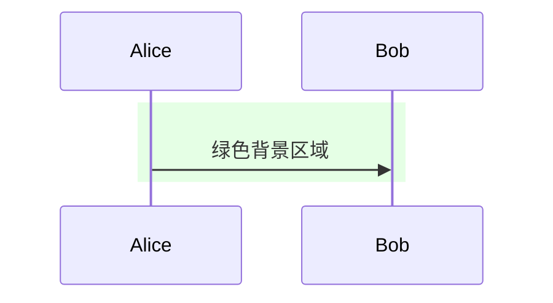

## 延迟

```mermaid
sequenceDiagram
    Alice ->> Bob: 发送消息
    ...
    Bob -->> Alice: 延迟响应
```

## 参与者创建与销毁

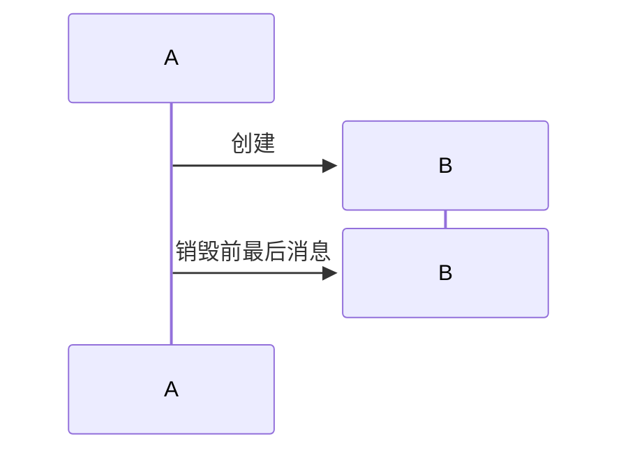

## 链接

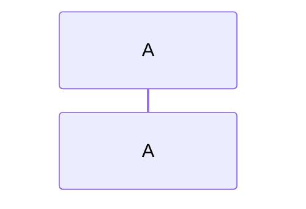

## 高级特性

### 自动编号

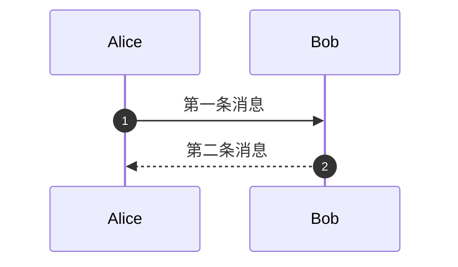

### 菜单

```mermaid
sequenceDiagram
    participant A
    participant B
    A ->> B: Hello
    menu
        Option 1
        Option 2
        Option 3
    end
```

## 最佳实践

### 命名规范

- 参与者名称简洁明了
- 消息内容描述清晰
- 使用别名提高可读性

### 布局建议

- 控制参与者数量（建议 ≤ 10）
- 使用激活框表示处理时间
- 使用注解补充说明

### 示例：完整时序图

```mermaid
sequenceDiagram
    autonumber
    participant U as 用户
    participant F as 前端
    participant B as 后端
    participant D as 数据库

    U ->> F: 点击登录
    activate F
    F ->> B: POST /api/login
    activate B
    B ->> D: 查询用户
    activate D
    D -->> B: 用户信息
    deactivate D

    alt 验证成功
        B -->> F: 200 OK + Token
        F -->> U: 跳转首页
    else 验证失败
        B -->> F: 401 Unauthorized
        F -->> U: 显示错误
    end
    deactivate B
    deactivate F

    Note over U, D: 登录流程完成
```

## 参考链接

- [Mermaid 官方文档 - Sequence Diagram](https://mermaid.js.org/syntax/sequenceDiagram.html)
