# Mermaid 状态图 (State Diagram)

状态图用于描述系统行为，展示状态之间的转换和事件驱动的流程。

## 基本语法

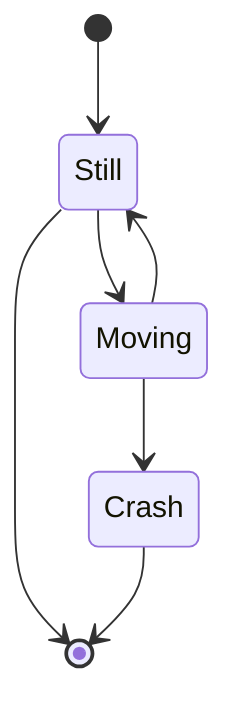

## 状态定义

### 简单状态

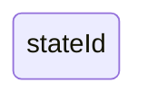

### 带描述的状态


### 起始和终止状态

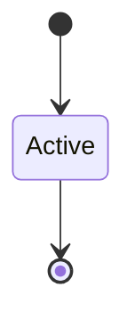

## 状态转换

### 基本转换

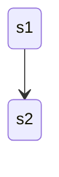

### 带标签的转换

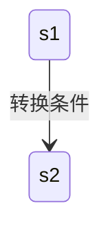

### 转换语法

```
<源状态> --> <目标状态> : <转换标签>
```

## 复合状态

### 定义复合状态

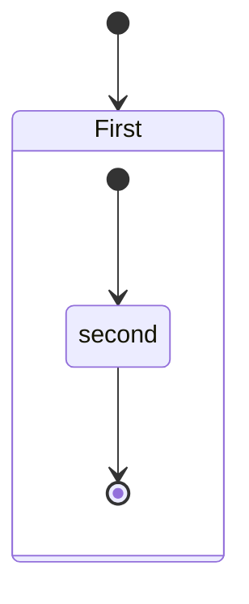

### 多层嵌套

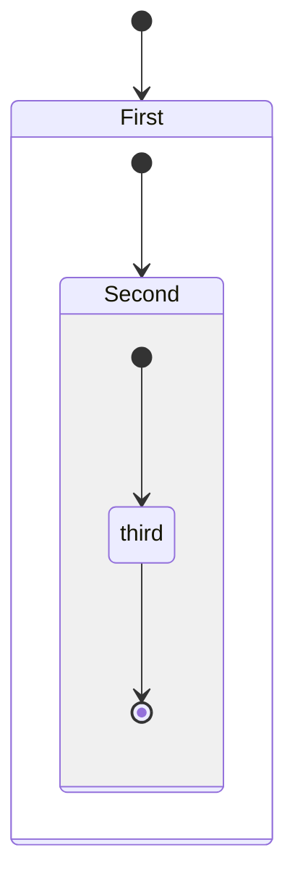

### 复合状态间转换

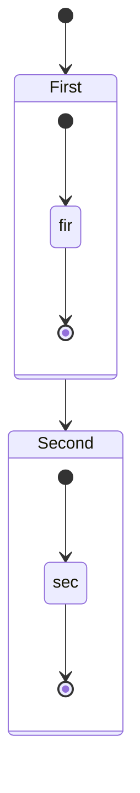

## 选择节点

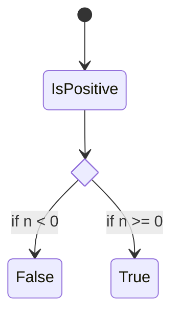

## 分支与合并

### Fork 分支

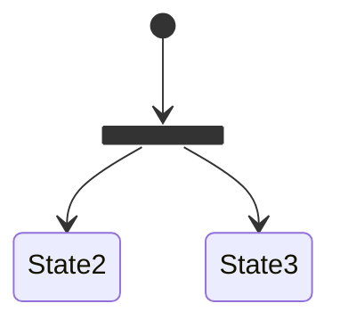

### Join 合并

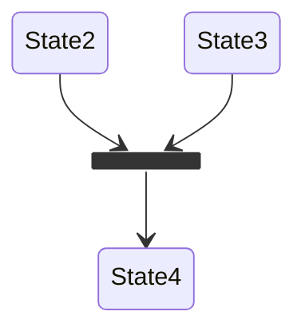

### 完整示例

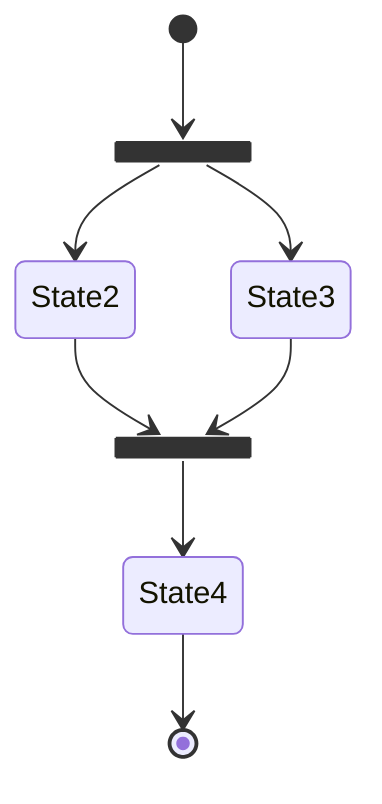

## 并发状态

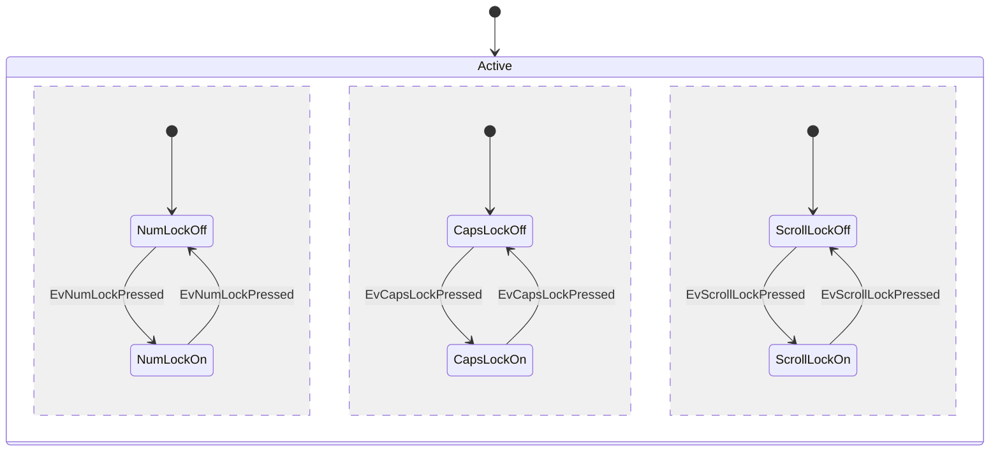

使用 `--` 分隔并发区域。

## 注解

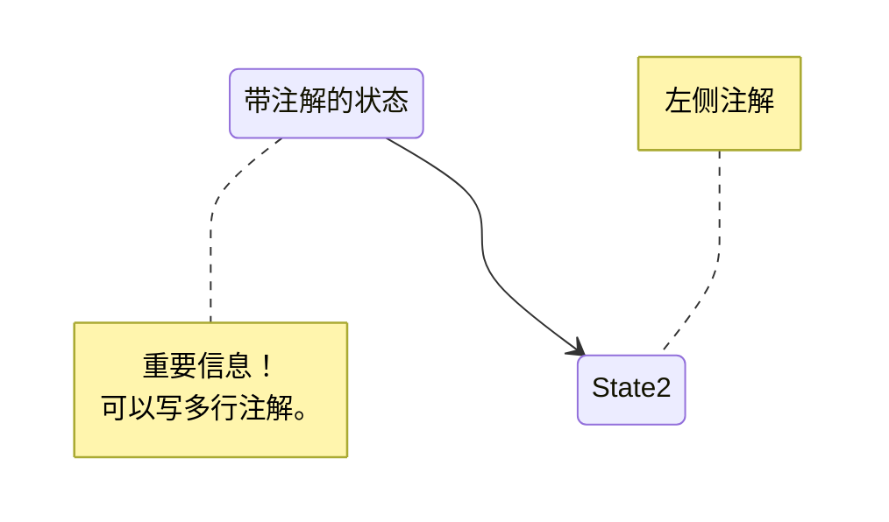

### 跨状态注解

```mermaid
stateDiagram-v2
    State1 --> State2
    note over State1, State2: 跨状态注解
```

## 方向设置

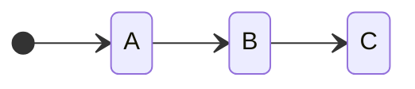

方向选项：
- `TB` - 从上到下
- `BT` - 从下到上
- `LR` - 从左到右
- `RL` - 从右到左

## 注释

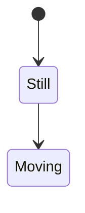

## 样式

### classDef 定义

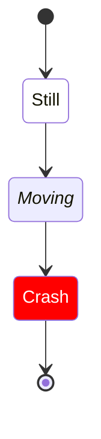

### ::: 运算符

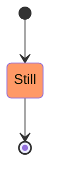

### 样式属性

| 属性 | 说明 |
| --- | --- | --- |
| `fill` | 填充颜色 |
| `stroke` | 边框颜色 |
| `color` | 文字颜色 |
| `font-style` | 字体样式 |
| `font-weight` | 字体粗细 |
| `stroke-width` | 边框宽度 |

## 空格处理

```mermaid
stateDiagram-v2
    yswsii: 带空格的状态名称
    [*] --> yswsii
    yswsii --> AnotherState
```

## 最佳实践

### 命名规范

- 状态名称使用 PascalCase
- 转换标签使用动词短语
- 注解简洁明了

### 设计建议

- 控制状态数量（建议 ≤ 20）
- 合理使用复合状态分组
- 使用注解补充说明

### 示例：订单状态

```mermaid
stateDiagram-v2
    direction TB

    [*] --> Pending
    Pending --> Confirmed: 支付成功
    Pending --> Cancelled: 取消订单

    state Confirmed {
        [*] --> Processing
        Processing --> Shipped: 发货
        Shipped --> Delivered: 签收
    }

    Confirmed --> Completed: 交易完成
    Confirmed --> Refunded: 申请退款

    Completed --> [*]
    Cancelled --> [*]
    Refunded --> [*]

    note right of Pending: 等待支付
    note right of Confirmed: 订单处理中
```

## 参考链接

- [Mermaid 官方文档 - State Diagram](https://mermaid.js.org/syntax/stateDiagram.html)
