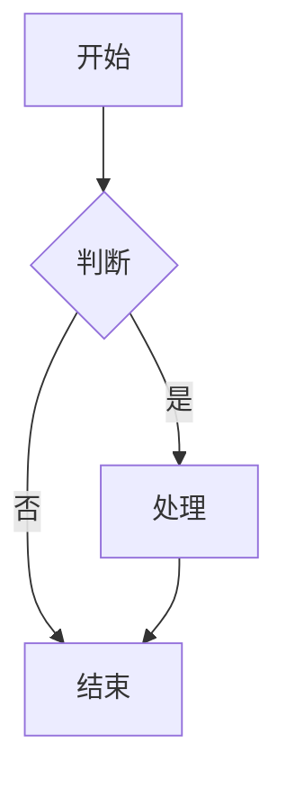
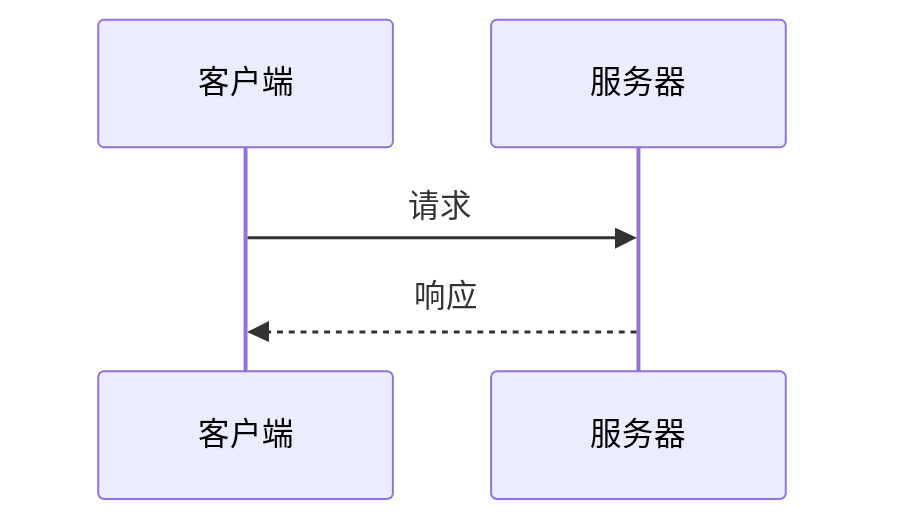
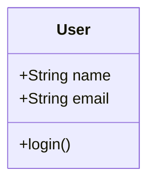
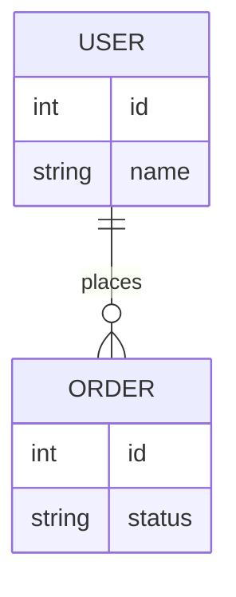
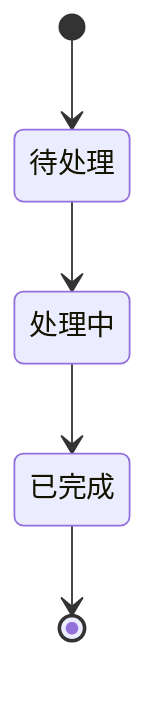

# Mermaid 图表规范

## 相关 Skills

| 场景 | Skill | 说明 |
|------|-------|------|
| 核心规范 | Skills(core) | Markdown 格式规范 |

## 流程图



```markdown
flowchart TD
    A[开始] --> B{判断}
    B -->|是| C[处理]
    B -->|否| D[结束]
    C --> D
```

## 序列图



```markdown
sequenceDiagram
    participant A as 客户端
    participant B as 服务器
    A->>B: 请求
    B-->>A: 响应
```

## 类图



```markdown
classDiagram
    class User {
        +String name
        +String email
        +login()
    }
```

## ER 图



## 状态图



## 检查清单

- [ ] 使用正确的图表类型
- [ ] 节点命名清晰
- [ ] 连接关系正确
- [ ] 添加必要的标签
