# Mermaid 图表规范

Mermaid 11.x 在 GitHub / GitLab / Docusaurus / VitePress / Obsidian 等平台原生渲染。
所有图表写在 Markdown 的 ```` ```mermaid ```` 代码块内。Markdown 通用规范参见
`markdown-core`。

## 强制约定

1. 图表类型在首行声明（`flowchart TD` / `sequenceDiagram` / 等），不可省略。
2. 节点 ID 用 ASCII（字母 / 数字 / 下划线），显示文本写在 `[label]` / `(label)` 中。
3. 节点文本含特殊字符（`(`、`:`、`-`、空格、中文标点）时用 `"..."` 包裹。
4. 一张图聚焦单一意图；> 25 节点或 > 4 层嵌套应拆分多图。
5. 配色用主题变量或 `themeVariables`，禁硬编码 `style A fill:#f00` 满图刷色。
6. 含可访问性需求时加 `accTitle` / `accDescr`，供屏幕阅读器与导出 alt。
7. 流程图方向：纵向 `TD`（top-down）、横向 `LR`（left-right），团队内统一。
8. 文本不嵌入 HTML 标签（`<br>` 除外，平台支持不一致）；多行用 `"line1\nline2"`。
9. 提交前在目标平台（GitHub / 站点）至少预览一次，避免语法在不同 Mermaid 版本下失败。

## init 指令与主题

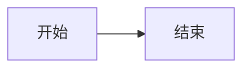
```mermaid
%%{init: {
  "theme": "default",
  "themeVariables": {
    "primaryColor": "#1e88e5",
    "fontFamily": "ui-monospace, SFMono-Regular, monospace"
  },
  "flowchart": { "curve": "basis", "htmlLabels": false }
}}%%
flowchart LR
    A[开始] --> B[结束]
```

- `theme`：`default` / `dark` / `forest` / `neutral` / `base`（`base` 才允许自定义变量）。
- 全局指令必须放在图表声明前，仅一行 `%%{init: ... }%%`。

## 流程图（flowchart）

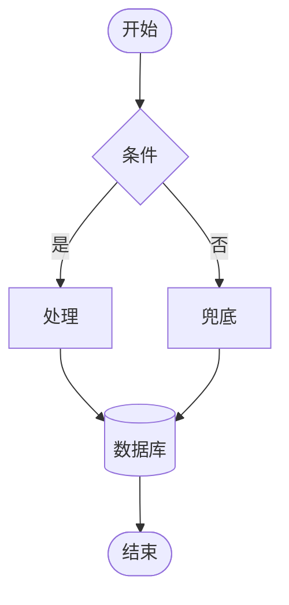
```mermaid
flowchart TD
    A([开始]) --> B{条件}
    B -- 是 --> C[处理]
    B -- 否 --> D[兜底]
    C --> E[(数据库)]
    D --> E
    E --> F([结束])
```

节点形状速查：

| 语法 | 形状 | 用途 |
|------|------|------|
| `A[text]` | 矩形 | 普通步骤 |
| `A(text)` | 圆角矩形 | 起止 |
| `A([text])` | 体育场 | 流程边界 |
| `A[[text]]` | 子流程 | 复合步骤 |
| `A[(text)]` | 圆柱 | 数据库 / 存储 |
| `A((text))` | 圆 | 连接点 |
| `A{text}` | 菱形 | 判断 |
| `A{{text}}` | 六边形 | 准备 / 配置 |
| `A>text]` | 旗帜 | 输入 / 输出 |

连线：`-->`（实线箭头）、`---`（实线）、`-.->`（虚线箭头）、`==>`（粗线箭头）、
`-- label -->`（带标签）。

## 序列图（sequenceDiagram）

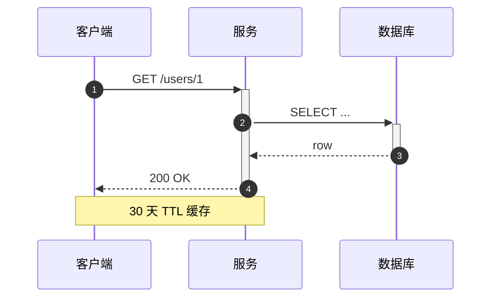
```mermaid
sequenceDiagram
    autonumber
    participant C as 客户端
    participant API as 服务
    participant DB as 数据库

    C->>+API: GET /users/1
    API->>+DB: SELECT ...
    DB-->>-API: row
    API-->>-C: 200 OK
    Note over C,API: 30 天 TTL 缓存
```

- `autonumber` 自动编号步骤。
- `->>` 实线箭头，`-->>` 虚线返回；`+` / `-` 控制激活条。
- 分组：`alt / else / end`、`opt / end`、`loop / end`、`par / and / end`、
  `critical / option / end`、`break / end`。

## 类图（classDiagram）

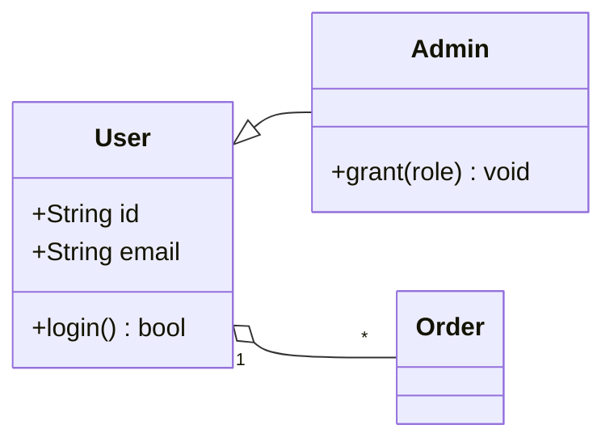
```mermaid
classDiagram
    direction LR
    class User {
        +String id
        +String email
        +login() bool
    }
    class Admin {
        +grant(role) void
    }
    User <|-- Admin
    User "1" o-- "*" Order
```

关系：`<|--` 继承、`*--` 组合、`o--` 聚合、`-->` 关联、`..>` 依赖、`..|>` 实现。

## ER 图（erDiagram）

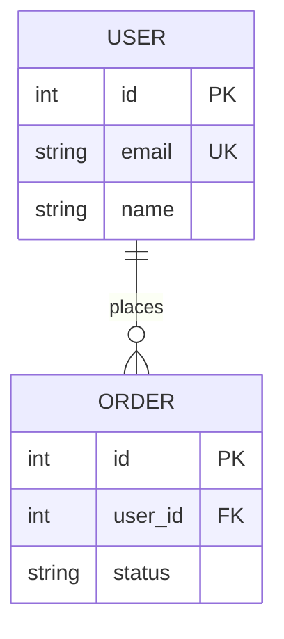
```mermaid
erDiagram
    USER ||--o{ ORDER : places
    USER {
        int id PK
        string email UK
        string name
    }
    ORDER {
        int id PK
        int user_id FK
        string status
    }
```

基数：`||--||` 一对一、`||--o{` 一对多、`}o--o{` 多对多；可选用 `o`。

## 状态图（stateDiagram-v2）

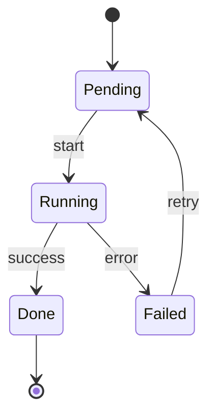
```mermaid
stateDiagram-v2
    [*] --> Pending
    Pending --> Running: start
    Running --> Done: success
    Running --> Failed: error
    Failed --> Pending: retry
    Done --> [*]
```

支持并发 `--` 分区、复合状态 `state X { ... }`、选择 `<<choice>>`、分叉 `<<fork>>`。

## 甘特图（gantt）

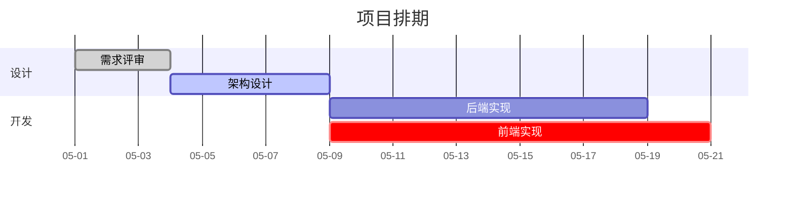
```mermaid
gantt
    title 项目排期
    dateFormat YYYY-MM-DD
    axisFormat %m-%d
    section 设计
    需求评审      :done,   d1, 2026-05-01, 3d
    架构设计      :active, d2, after d1, 5d
    section 开发
    后端实现      :        d3, after d2, 10d
    前端实现      :crit,   d4, after d2, 12d
```

任务状态：`done` / `active` / `crit` / `milestone`；时间用 `after id` 或绝对日期。

## 时间轴（timeline）

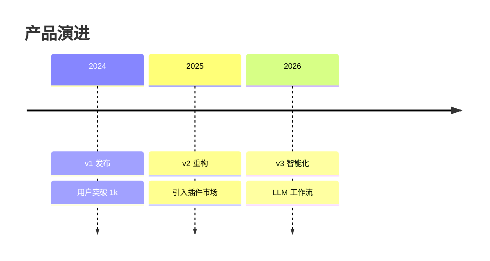
```mermaid
timeline
    title 产品演进
    2024 : v1 发布 : 用户突破 1k
    2025 : v2 重构 : 引入插件市场
    2026 : v3 智能化 : LLM 工作流
```

## 思维导图（mindmap）

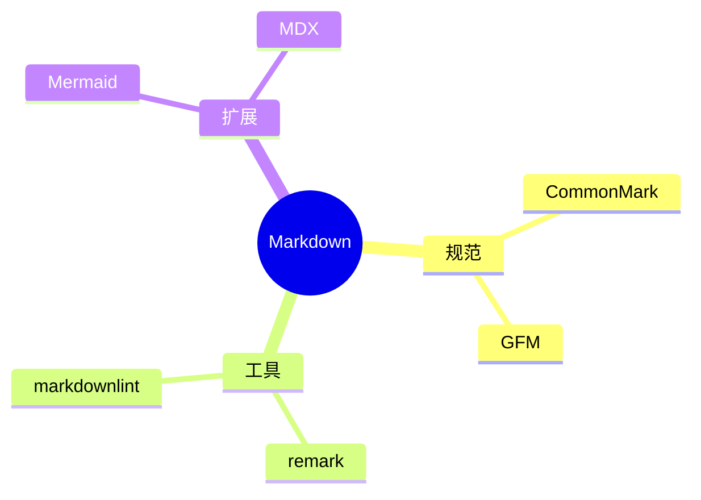
```mermaid
mindmap
  root((Markdown))
    规范
      CommonMark
      GFM
    工具
      remark
      markdownlint
    扩展
      Mermaid
      MDX
```

## 用户旅程（journey）

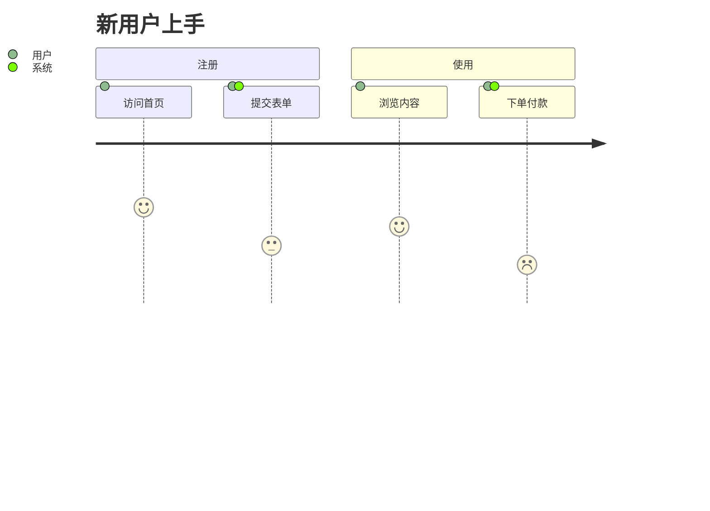
```mermaid
journey
    title 新用户上手
    section 注册
      访问首页: 5: 用户
      提交表单: 3: 用户, 系统
    section 使用
      浏览内容: 4: 用户
      下单付款: 2: 用户, 系统
```

评分 1–5，越大体验越好。

## 其它图表

| 类型 | 关键字 | 用途 |
|------|--------|------|
| C4 上下文 / 容器 | `C4Context` / `C4Container` | 系统架构（C4 模型） |
| Git 图 | `gitGraph` | 分支演示 |
| 饼图 | `pie` | 比例分布 |
| 象限图 | `quadrantChart` | 2×2 矩阵分析 |
| 需求图 | `requirementDiagram` | 需求追溯 |
| 桑基图 | `sankey-beta` | 流量分配（实验性） |
| XY 图 | `xychart-beta` | 折线 / 柱状（实验性） |

beta 图表在 GitHub / GitLab 渲染器版本滞后时可能失败，关键文档慎用。

## 可访问性

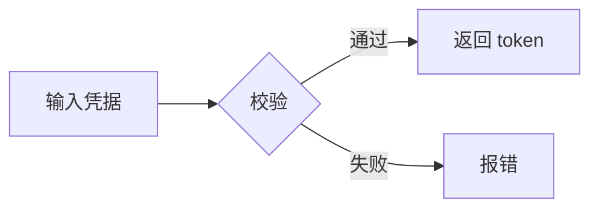
```mermaid
flowchart LR
    accTitle: 用户登录流程
    accDescr: 用户输入账号密码，服务端校验后返回 token
    A[输入凭据] --> B{校验}
    B -- 通过 --> C[返回 token]
    B -- 失败 --> D[报错]
```

`accTitle` / `accDescr` 是 Mermaid 内置 a11y 字段，导出 SVG 时写入 `<title>` /
`<desc>`。

## 常见陷阱

| 陷阱 | 现象 | 修复 |
|------|------|------|
| 节点 ID 含中文 / 空格 | 解析失败 | ID 用 ASCII，文本写 `[label]` |
| 标签内有 `(` `:` `-` | 截断 / 错位 | 用 `"..."` 包裹 |
| 主题变量未生效 | 仍是默认色 | `theme: base` + `themeVariables` |
| `init` 不在首行 | 指令被忽略 | 必须图声明之前 |
| GitHub 与本地渲染不一致 | 版本差 | 锁定 Mermaid 版本，跑预览 |
| 图过大 | 移动端不可读 | 拆图 / 横向布局 / 折叠节点 |

## 检查清单

- [ ] 图表类型在首行声明
- [ ] 节点 ID 全 ASCII，文本在 `[label]` 内
- [ ] 含特殊字符的文本用 `"..."` 包裹
- [ ] 配色经主题变量统一
- [ ] 关键图含 `accTitle` / `accDescr`
- [ ] 节点数 ≤ 25，必要时拆分
- [ ] 已在目标渲染平台预览

## 参考

- [Mermaid 官方文档](https://mermaid.js.org/intro/)
- [Mermaid 语法总览](https://mermaid.js.org/syntax/flowchart.html)
- [GitHub 渲染 Mermaid](https://docs.github.com/zh/get-started/writing-on-github/working-with-advanced-formatting/creating-diagrams)
- [Mermaid Live Editor](https://mermaid.live/)
- [C4 Model](https://c4model.com/)
