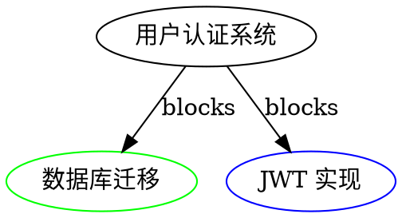

# Task Plugin 工具参考

> 版本：0.5.0 | 工具数量：20+ | 最后更新：2025-12-28

## 目录

### 核心操作
- [task_create](#task_create---创建任务) - 创建任务
- [task_list](#task_list---列出任务) - 列出任务
- [task_show](#task_show---查看任务详情) - 查看详情
- [task_update](#task_update---更新任务) - 更新任务
- [task_delete](#task_delete---删除任务) - 删除任务
- [task_close](#task_close---关闭任务) - 关闭任务
- [task_reopen](#task_reopen---重新打开任务) - 重新打开任务

### 依赖管理
- [task_dep_add](#task_dep_add---添加依赖) - 添加依赖
- [task_dep_remove](#task_dep_remove---移除依赖) - 移除依赖
- [task_dep_list](#task_dep_list---列出依赖) - 列出依赖
- [task_dep_graph](#task_dep_graph---依赖图) - 生成依赖图

### 查询工具
- [task_ready](#task_ready---就绪任务) - 就绪任务（无阻塞）
- [task_blocked](#task_blocked---阻塞任务) - 阻塞任务
- [task_search](#task_search---搜索任务) - 全文搜索
- [task_similar](#task_similar---相似任务) - 查找相似任务

### 统计分析
- [task_stats](#task_stats---统计信息) - 统计信息
- [task_report](#task_report---生成报表) - 生成报表
- [task_timeline](#task_timeline---时间线) - 任务时间线

### 批量操作
- [task_batch_update](#task_batch_update---批量更新) - 批量更新
- [task_batch_close](#task_batch_close---批量关闭) - 批量关闭

### 导入导出
- [task_export](#task_export---导出任务) - 导出任务
- [task_import](#task_import---导入任务) - 导入任务

### 管理工具
- [task_context](#task_context---工作空间管理) - 工作空间管理
- [task_validate](#task_validate---数据验证) - 数据验证
- [task_cleanup](#task_cleanup---清理数据) - 清理数据

---

## 核心操作

### task_create - 创建任务

创建新的任务。支持多种任务类型（bug/feature/task/epic/chore）和完整的元数据。

#### 参数

| 参数 | 类型 | 必需 | 默认值 | 说明 |
|------|------|------|--------|------|
| `title` | string | ✅ | - | 任务标题（1-200 字符） |
| `description` | string | ❌ | `""` | 任务描述（最大 10000 字符） |
| `task_type` | string | ❌ | `"task"` | 任务类型（bug/feature/task/epic/chore） |
| `priority` | integer | ❌ | `2` | 优先级（0=Critical, 1=High, 2=Medium, 3=Low, 4=Backlog） |
| `tags` | string[] | ❌ | `[]` | 标签列表（最多 20 个） |
| `assignee` | string | ❌ | `null` | 负责人 |
| `acceptance_criteria` | string | ❌ | `null` | 验收标准 |
| `parent_id` | string | ❌ | `null` | 父任务 ID（用于子任务） |
| `dependencies` | string[] | ❌ | `[]` | 依赖任务 ID 列表 |
| `estimated_hours` | float | ❌ | `null` | 预估工时（小时） |
| `due_date` | string | ❌ | `null` | 截止日期（ISO 8601 格式） |
| `metadata` | object | ❌ | `{}` | 自定义元数据 |
| `brief` | boolean | ❌ | `true` | 返回简化结果 |

#### 返回值

**brief=true**（默认）：
```json
{
  "id": "tk-a1b2c3",
  "action": "created",
  "title": "实现用户认证",
  "status": "open",
  "priority": 1
}
```

**brief=false**：
```json
{
  "id": "tk-a1b2c3",
  "title": "实现用户认证",
  "description": "添加 JWT 认证功能，支持多因素认证",
  "task_type": "feature",
  "status": "open",
  "priority": 1,
  "tags": ["feature", "auth", "security"],
  "assignee": "alice",
  "created_at": "2025-12-28T10:00:00Z",
  "updated_at": "2025-12-28T10:00:00Z",
  "dependencies": [],
  "metadata": {}
}
```

#### 示例

```python
# 最小参数
task_create(title="修复登录 Bug")

# Bug 修复（高优先级）
task_create(
    title="修复登录超时问题",
    description="用户登录后 5 分钟自动登出，需要延长会话时间",
    task_type="bug",
    priority=0,  # Critical
    tags=["bug", "urgent", "security"],
    assignee="bob",
    estimated_hours=4.0
)

# 功能开发（带验收标准）
task_create(
    title="实现数据导出功能",
    description="支持导出 CSV、JSON、Excel 格式",
    task_type="feature",
    priority=2,  # Medium
    tags=["feature", "export"],
    acceptance_criteria="""
    - 支持 CSV 格式导出
    - 支持 JSON 格式导出
    - 支持 Excel 格式导出
    - 大数据量（10万+）不超时
    - 通过单元测试
    """,
    estimated_hours=16.0,
    due_date="2025-01-15T00:00:00Z"
)

# Epic 任务（包含子任务）
task_create(
    title="用户认证系统重构",
    task_type="epic",
    priority=1,
    tags=["epic", "auth"],
    description="重构整个认证系统，支持多种认证方式"
)

# 子任务（关联 Epic）
task_create(
    title="实现 JWT 认证",
    parent_id="tk-epic-001",
    task_type="task",
    tags=["auth", "jwt"],
    dependencies=["tk-task-db-migration"]
)

# 自定义元数据
task_create(
    title="优化数据库查询",
    metadata={
        "sprint": "Sprint 23",
        "story_points": 5,
        "jira_id": "PROJ-123",
        "team": "backend"
    }
)
```

#### 错误处理

| 错误代码 | 说明 | 解决方法 |
|---------|------|----------|
| `INVALID_TITLE` | 标题为空或过长 | 提供 1-200 字符的标题 |
| `INVALID_PRIORITY` | 优先级不在 0-4 范围 | 使用 0-4 的整数 |
| `INVALID_TASK_TYPE` | 任务类型无效 | 使用 bug/feature/task/epic/chore |
| `PARENT_NOT_FOUND` | 父任务不存在 | 检查 parent_id 是否正确 |
| `DEPENDENCY_NOT_FOUND` | 依赖任务不存在 | 检查 dependencies 中的 ID |
| `CIRCULAR_DEPENDENCY` | 循环依赖 | 移除循环依赖关系 |

---

### task_list - 列出任务

列出和过滤任务。支持多维度过滤、排序、分页。

#### 参数

| 参数 | 类型 | 必需 | 默认值 | 说明 |
|------|------|------|--------|------|
| `status` | string | ❌ | `null` | 状态过滤（open/in_progress/blocked/deferred/closed） |
| `task_type` | string | ❌ | `null` | 类型过滤（bug/feature/task/epic/chore） |
| `priority` | integer | ❌ | `null` | 优先级过滤（0-4） |
| `assignee` | string | ❌ | `null` | 负责人过滤 |
| `tags` | string[] | ❌ | `[]` | 标签过滤（AND，必须包含所有标签） |
| `tags_any` | string[] | ❌ | `[]` | 标签过滤（OR，包含任一标签即可） |
| `parent_id` | string | ❌ | `null` | 父任务 ID（查询子任务） |
| `query` | string | ❌ | `null` | 标题搜索（不区分大小写） |
| `created_after` | string | ❌ | `null` | 创建时间过滤（>=，ISO 8601） |
| `created_before` | string | ❌ | `null` | 创建时间过滤（<=，ISO 8601） |
| `unassigned` | boolean | ❌ | `false` | 仅未分配任务 |
| `limit` | integer | ❌ | `20` | 返回数量（1-100） |
| `offset` | integer | ❌ | `0` | 偏移量（用于分页） |
| `sort_by` | string | ❌ | `"created_at"` | 排序字段（created_at/updated_at/priority/title） |
| `sort_order` | string | ❌ | `"desc"` | 排序方向（asc/desc） |
| `brief` | boolean | ❌ | `false` | 简化输出 |
| `fields` | string[] | ❌ | `null` | 自定义字段投影 |

#### 返回值

**brief=false**（默认）：
```json
[
  {
    "id": "tk-a1b2c3",
    "title": "修复登录 Bug",
    "description": "...",
    "status": "in_progress",
    "priority": 0,
    "tags": ["bug", "urgent"],
    "assignee": "bob",
    "created_at": "2025-12-28T10:00:00Z",
    "updated_at": "2025-12-28T11:00:00Z"
  }
]
```

**brief=true**：
```json
[
  {"id": "tk-a1b2c3", "title": "修复登录 Bug", "status": "in_progress", "priority": 0},
  {"id": "tk-d4e5f6", "title": "优化查询", "status": "open", "priority": 2}
]
```

**fields** 自定义字段：
```json
[
  {"id": "tk-a1b2c3", "title": "修复登录 Bug", "assignee": "bob"}
]
```

#### 示例

```python
# 列出所有任务（默认 20 条）
task_list()

# 列出进行中的任务
task_list(status="in_progress")

# 列出高优先级的 bug
task_list(task_type="bug", priority=1)

# 列出 alice 负责的开放任务
task_list(status="open", assignee="alice")

# 标签过滤（AND）：必须同时有 feature 和 urgent 标签
task_list(tags=["feature", "urgent"])

# 标签过滤（OR）：有 bug 或 critical 标签即可
task_list(tags_any=["bug", "critical"])

# 标题搜索
task_list(query="登录")

# 列出未分配的高优先级任务
task_list(priority=1, unassigned=true)

# 分页查询（第 2 页，每页 10 条）
task_list(limit=10, offset=10)

# 按优先级排序（升序）
task_list(sort_by="priority", sort_order="asc")

# 时间范围过滤（最近 7 天创建的任务）
task_list(
    created_after="2025-12-21T00:00:00Z",
    created_before="2025-12-28T23:59:59Z"
)

# 查询 Epic 的所有子任务
task_list(parent_id="tk-epic-001")

# 简化输出（减少上下文）
task_list(status="open", brief=true)

# 自定义字段投影
task_list(fields=["id", "title", "assignee", "priority"])

# 组合查询：开放的高优先级 feature，由 alice 负责
task_list(
    status="open",
    task_type="feature",
    priority=1,
    assignee="alice",
    sort_by="created_at",
    sort_order="desc",
    limit=10
)
```

#### 性能优化

- ✅ 自动索引优化（status, priority, assignee, created_at）
- ✅ 查询缓存（TTL 60 秒）
- ✅ 分页支持（避免一次返回大量数据）
- ✅ 字段投影（只返回需要的字段）

---

### task_show - 查看任务详情

获取任务的完整信息，包括依赖关系、子任务、历史记录。

#### 参数

| 参数 | 类型 | 必需 | 默认值 | 说明 |
|------|------|------|--------|------|
| `task_id` | string | ✅ | - | 任务 ID |
| `brief` | boolean | ❌ | `false` | 简化输出 |
| `brief_deps` | boolean | ❌ | `false` | 简化依赖信息 |
| `include_children` | boolean | ❌ | `false` | 包含子任务 |
| `include_history` | boolean | ❌ | `false` | 包含状态历史 |

#### 返回值

```json
{
  "id": "tk-a1b2c3",
  "title": "实现用户认证",
  "description": "添加 JWT 认证功能",
  "task_type": "feature",
  "status": "in_progress",
  "priority": 1,
  "tags": ["feature", "auth"],
  "assignee": "alice",
  "created_at": "2025-12-28T10:00:00Z",
  "updated_at": "2025-12-28T12:00:00Z",
  "started_at": "2025-12-28T11:00:00Z",
  "dependencies": [
    {
      "id": "tk-d4e5f6",
      "title": "数据库迁移",
      "type": "blocks",
      "status": "closed"
    }
  ],
  "dependents": [
    {
      "id": "tk-g7h8i9",
      "title": "用户管理界面",
      "type": "blocks",
      "status": "open"
    }
  ],
  "children": [
    {
      "id": "tk-j1k2l3",
      "title": "JWT 实现",
      "status": "open",
      "priority": 1
    }
  ],
  "history": [
    {
      "timestamp": "2025-12-28T10:00:00Z",
      "action": "created",
      "user": "alice"
    },
    {
      "timestamp": "2025-12-28T11:00:00Z",
      "action": "status_changed",
      "from": "open",
      "to": "in_progress",
      "user": "alice"
    }
  ]
}
```

#### 示例

```python
# 基本使用
task_show(task_id="tk-a1b2c3")

# 简化输出
task_show(task_id="tk-a1b2c3", brief=true)

# 简化依赖信息
task_show(task_id="tk-a1b2c3", brief_deps=true)

# 包含子任务
task_show(task_id="tk-epic-001", include_children=true)

# 包含状态历史
task_show(task_id="tk-a1b2c3", include_history=true)

# 完整信息
task_show(
    task_id="tk-a1b2c3",
    include_children=true,
    include_history=true
)
```

---

### task_update - 更新任务

更新任务的属性。支持部分更新（只传需要更新的字段）。

#### 参数

| 参数 | 类型 | 必需 | 默认值 | 说明 |
|------|------|------|--------|------|
| `task_id` | string | ✅ | - | 任务 ID |
| `status` | string | ❌ | - | 更新状态 |
| `priority` | integer | ❌ | - | 更新优先级 |
| `assignee` | string | ❌ | - | 更新负责人 |
| `title` | string | ❌ | - | 更新标题 |
| `description` | string | ❌ | - | 更新描述 |
| `tags` | string[] | ❌ | - | 更新标签（替换） |
| `add_tags` | string[] | ❌ | `[]` | 添加标签 |
| `remove_tags` | string[] | ❌ | `[]` | 移除标签 |
| `acceptance_criteria` | string | ❌ | - | 更新验收标准 |
| `estimated_hours` | float | ❌ | - | 更新预估工时 |
| `due_date` | string | ❌ | - | 更新截止日期 |
| `metadata` | object | ❌ | - | 更新元数据（合并） |
| `brief` | boolean | ❌ | `true` | 返回简化结果 |

#### 返回值

**brief=true**（默认）：
```json
{
  "id": "tk-a1b2c3",
  "action": "updated",
  "changes": [
    "status: open -> in_progress",
    "assignee: null -> alice"
  ]
}
```

**brief=false**：
```json
{
  "id": "tk-a1b2c3",
  "title": "实现用户认证",
  "status": "in_progress",
  "assignee": "alice",
  ...
}
```

#### 示例

```python
# 开始任务（更新状态）
task_update(task_id="tk-a1b2c3", status="in_progress")

# 分配任务
task_update(task_id="tk-a1b2c3", assignee="bob")

# 提升优先级
task_update(task_id="tk-a1b2c3", priority=0)  # Critical

# 添加标签（不删除已有标签）
task_update(task_id="tk-a1b2c3", add_tags=["urgent", "blocker"])

# 移除标签
task_update(task_id="tk-a1b2c3", remove_tags=["low-priority"])

# 替换所有标签
task_update(task_id="tk-a1b2c3", tags=["bug", "critical", "security"])

# 批量更新多个字段
task_update(
    task_id="tk-a1b2c3",
    status="blocked",
    priority=0,
    assignee="alice",
    add_tags=["blocker"]
)

# 更新元数据
task_update(
    task_id="tk-a1b2c3",
    metadata={
        "actual_hours": 10.5,
        "blocked_reason": "等待 API 设计完成"
    }
)

# 暂停任务
task_update(task_id="tk-a1b2c3", status="deferred")
```

#### 状态转换规则

| 当前状态 | 允许转换到 |
|---------|-----------|
| `open` | in_progress, closed, deferred |
| `in_progress` | blocked, closed, open |
| `blocked` | in_progress, open |
| `deferred` | open, closed |
| `closed` | open（重新打开） |

**自动状态推导**：
- 添加未完成的 `blocks` 依赖时，自动设为 `blocked`
- 所有 `blocks` 依赖完成时，自动从 `blocked` 恢复为 `in_progress`

---

### task_delete - 删除任务

删除任务及其关联数据。支持级联删除子任务。

#### 参数

| 参数 | 类型 | 必需 | 默认值 | 说明 |
|------|------|------|--------|------|
| `task_id` | string | ✅ | - | 任务 ID |
| `cascade` | boolean | ❌ | `false` | 级联删除子任务 |
| `force` | boolean | ❌ | `false` | 强制删除（即使有依赖） |

#### 返回值

```json
{
  "id": "tk-a1b2c3",
  "action": "deleted",
  "cascade_count": 3,
  "removed_dependencies": 2
}
```

#### 示例

```python
# 删除任务
task_delete(task_id="tk-a1b2c3")

# 级联删除（包括所有子任务）
task_delete(task_id="tk-epic-001", cascade=true)

# 强制删除（即使有其他任务依赖它）
task_delete(task_id="tk-a1b2c3", force=true)
```

#### 警告

- ⚠️ 删除操作不可撤销
- ⚠️ 删除 Epic 时建议使用 `cascade=true` 删除所有子任务
- ⚠️ 删除被依赖的任务时需要 `force=true`

---

### task_close - 关闭任务

关闭（完成）任务。

#### 参数

| 参数 | 类型 | 必需 | 默认值 | 说明 |
|------|------|------|--------|------|
| `task_id` | string | ✅ | - | 任务 ID |
| `reason` | string | ❌ | `"Completed"` | 关闭原因 |
| `actual_hours` | float | ❌ | `null` | 实际工时（小时） |
| `close_children` | boolean | ❌ | `false` | 同时关闭所有子任务 |
| `brief` | boolean | ❌ | `true` | 返回简化结果 |

#### 返回值

```json
{
  "id": "tk-a1b2c3",
  "action": "closed",
  "reason": "Completed",
  "closed_at": "2025-12-28T15:00:00Z",
  "duration_hours": 10.5
}
```

#### 示例

```python
# 基本使用
task_close(task_id="tk-a1b2c3")

# 带原因
task_close(
    task_id="tk-a1b2c3",
    reason="功能已实现并通过测试"
)

# 记录实际工时
task_close(
    task_id="tk-a1b2c3",
    actual_hours=12.5
)

# 关闭 Epic 及所有子任务
task_close(
    task_id="tk-epic-001",
    close_children=true,
    reason="所有子任务已完成"
)
```

---

### task_reopen - 重新打开任务

重新打开已关闭的任务。

#### 参数

| 参数 | 类型 | 必需 | 默认值 | 说明 |
|------|------|------|--------|------|
| `task_id` | string | ✅ | - | 任务 ID（单个或多个） |
| `reason` | string | ❌ | `null` | 重新打开原因 |
| `brief` | boolean | ❌ | `true` | 返回简化结果 |

#### 返回值

```json
{
  "id": "tk-a1b2c3",
  "action": "reopened",
  "status": "open",
  "reason": "发现新问题需要修复"
}
```

#### 示例

```python
# 重新打开单个任务
task_reopen(task_id="tk-a1b2c3")

# 带原因
task_reopen(
    task_id="tk-a1b2c3",
    reason="发现新问题需要修复"
)

# 批量重新打开（传数组）
task_reopen(task_id=["tk-a1b2c3", "tk-d4e5f6"])
```

---

## 依赖管理

### task_dep_add - 添加依赖

添加任务间的依赖关系。支持 4 种依赖类型。

#### 参数

| 参数 | 类型 | 必需 | 默认值 | 说明 |
|------|------|------|--------|------|
| `task_id` | string | ✅ | - | 任务 ID |
| `depends_on_id` | string | ✅ | - | 依赖的任务 ID |
| `dep_type` | string | ❌ | `"blocks"` | 依赖类型 |
| `reason` | string | ❌ | `null` | 依赖原因说明 |

#### 依赖类型

| 类型 | 说明 | 影响 |
|------|------|------|
| `blocks` | 硬阻塞 | depends_on 未完成时，task 自动设为 blocked |
| `related` | 软关联 | 仅表示关联，不影响状态 |
| `parent-child` | 层级关系 | Epic 包含子任务 |
| `discovered-from` | 发现关系 | 在某任务工作时发现的新任务 |

#### 返回值

```json
{
  "task_id": "tk-a1b2c3",
  "depends_on_id": "tk-d4e5f6",
  "dep_type": "blocks",
  "action": "dependency_added"
}
```

#### 示例

```python
# 添加阻塞依赖
task_dep_add(
    task_id="tk-a1b2c3",
    depends_on_id="tk-d4e5f6",
    dep_type="blocks",
    reason="需要先完成数据库迁移"
)

# 添加关联
task_dep_add(
    task_id="tk-a1b2c3",
    depends_on_id="tk-g7h8i9",
    dep_type="related"
)

# 添加父子关系
task_dep_add(
    task_id="tk-subtask-001",
    depends_on_id="tk-epic-001",
    dep_type="parent-child"
)

# 标记发现关系
task_dep_add(
    task_id="tk-new-bug",
    depends_on_id="tk-feature-impl",
    dep_type="discovered-from",
    reason="在实现功能时发现的 Bug"
)
```

#### 错误处理

| 错误代码 | 说明 | 解决方法 |
|---------|------|----------|
| `CIRCULAR_DEPENDENCY` | 循环依赖 | 移除导致循环的依赖 |
| `DEPENDENCY_EXISTS` | 依赖已存在 | 无需重复添加 |
| `TASK_NOT_FOUND` | 任务不存在 | 检查任务 ID |

---

### task_dep_remove - 移除依赖

移除任务间的依赖关系。

#### 参数

| 参数 | 类型 | 必需 | 默认值 | 说明 |
|------|------|------|--------|------|
| `task_id` | string | ✅ | - | 任务 ID |
| `depends_on_id` | string | ✅ | - | 依赖的任务 ID |

#### 返回值

```json
{
  "task_id": "tk-a1b2c3",
  "depends_on_id": "tk-d4e5f6",
  "action": "dependency_removed"
}
```

#### 示例

```python
# 移除依赖
task_dep_remove(
    task_id="tk-a1b2c3",
    depends_on_id="tk-d4e5f6"
)
```

---

### task_dep_list - 列出依赖

列出任务的依赖关系。

#### 参数

| 参数 | 类型 | 必需 | 默认值 | 说明 |
|------|------|------|--------|------|
| `task_id` | string | ✅ | - | 任务 ID |
| `direction` | string | ❌ | `"both"` | 方向（dependencies/dependents/both） |
| `dep_type` | string | ❌ | `null` | 过滤依赖类型 |
| `recursive` | boolean | ❌ | `false` | 递归查询 |

#### 返回值

```json
{
  "task_id": "tk-a1b2c3",
  "dependencies": [
    {
      "id": "tk-d4e5f6",
      "title": "数据库迁移",
      "type": "blocks",
      "status": "closed"
    }
  ],
  "dependents": [
    {
      "id": "tk-g7h8i9",
      "title": "用户管理界面",
      "type": "blocks",
      "status": "open"
    }
  ]
}
```

#### 示例

```python
# 列出所有依赖关系
task_dep_list(task_id="tk-a1b2c3")

# 只列出此任务依赖的任务
task_dep_list(task_id="tk-a1b2c3", direction="dependencies")

# 只列出依赖此任务的任务
task_dep_list(task_id="tk-a1b2c3", direction="dependents")

# 只列出阻塞依赖
task_dep_list(task_id="tk-a1b2c3", dep_type="blocks")

# 递归查询（包括间接依赖）
task_dep_list(task_id="tk-a1b2c3", recursive=true)
```

---

### task_dep_graph - 依赖图

生成任务依赖关系图。支持多种输出格式。

#### 参数

| 参数 | 类型 | 必需 | 默认值 | 说明 |
|------|------|------|--------|------|
| `task_id` | string | ❌ | `null` | 任务 ID（不指定则显示所有） |
| `format` | string | ❌ | `"ascii"` | 输出格式（ascii/dot/json） |
| `max_depth` | integer | ❌ | `3` | 最大深度 |

#### 返回值

**format=ascii**（默认）：
```
tk-epic-001: 用户认证系统
  ├─ blocks ─> tk-task-001: 数据库迁移 [closed]
  ├─ blocks ─> tk-task-002: JWT 实现 [in_progress]
  │   ├─ blocks ─> tk-task-003: JWT 库选型 [closed]
  │   └─ blocks ─> tk-task-004: 单元测试 [open]
  └─ blocks ─> tk-task-005: 前端集成 [blocked]
      └─ blocks ─> tk-task-002: JWT 实现
```

**format=dot**（Graphviz）：


**format=json**：
```json
{
  "nodes": [
    {"id": "tk-epic-001", "title": "用户认证系统", "status": "open"},
    {"id": "tk-task-001", "title": "数据库迁移", "status": "closed"}
  ],
  "edges": [
    {"from": "tk-epic-001", "to": "tk-task-001", "type": "blocks"}
  ]
}
```

#### 示例

```python
# 生成指定任务的依赖图
task_dep_graph(task_id="tk-epic-001")

# 生成所有任务的依赖图
task_dep_graph()

# 生成 Graphviz 格式（可用于可视化）
task_dep_graph(task_id="tk-epic-001", format="dot")

# JSON 格式（用于程序处理）
task_dep_graph(task_id="tk-epic-001", format="json")

# 限制深度
task_dep_graph(task_id="tk-epic-001", max_depth=2)
```

---

## 查询工具

### task_ready - 就绪任务

查找可以开始工作的任务（无未完成的阻塞依赖）。

#### 参数

| 参数 | 类型 | 必需 | 默认值 | 说明 |
|------|------|------|--------|------|
| `limit` | integer | ❌ | `10` | 返回数量（1-100） |
| `priority` | integer | ❌ | `null` | 优先级过滤 |
| `assignee` | string | ❌ | `null` | 负责人过滤 |
| `tags` | string[] | ❌ | `[]` | 标签过滤 |
| `tags_any` | string[] | ❌ | `[]` | 标签过滤（OR） |
| `unassigned` | boolean | ❌ | `false` | 仅未分配任务 |
| `sort_policy` | string | ❌ | `"hybrid"` | 排序策略 |
| `brief` | boolean | ❌ | `false` | 简化输出 |

#### 排序策略

| 策略 | 说明 |
|------|------|
| `hybrid` | 综合排序（优先级 + 年龄 + 依赖权重） |
| `priority` | 仅按优先级排序 |
| `oldest` | 仅按创建时间排序（最老的在前） |

#### 返回值

```json
[
  {
    "id": "tk-a1b2c3",
    "title": "修复登录 Bug",
    "priority": 0,
    "status": "open",
    "tags": ["bug", "urgent"],
    "effective_priority": -2.5,
    "age_days": 3,
    "blocks_count": 2
  }
]
```

#### 示例

```python
# 获取前 5 个就绪任务
task_ready(limit=5)

# 获取高优先级的就绪任务
task_ready(priority=1, limit=5)

# 获取未分配的就绪任务
task_ready(unassigned=true, limit=10)

# 按优先级排序
task_ready(sort_policy="priority", limit=10)

# 按年龄排序（最老的在前）
task_ready(sort_policy="oldest", limit=10)

# 综合排序（推荐）
task_ready(sort_policy="hybrid", limit=10)

# 简化输出
task_ready(limit=10, brief=true)
```

#### 有效优先级计算

```
effective_priority = base_priority + age_weight + dependency_weight

其中：
- base_priority: 基础优先级（0-4）
- age_weight: 年龄权重（-0.1 × 天数）
- dependency_weight: 依赖权重（-0.5 × 阻塞任务数量）
```

---

### task_blocked - 阻塞任务

查找被阻塞的任务及其阻塞原因。

#### 参数

| 参数 | 类型 | 必需 | 默认值 | 说明 |
|------|------|------|--------|------|
| `brief` | boolean | ❌ | `false` | 简化输出 |
| `brief_deps` | boolean | ❌ | `false` | 简化依赖信息 |

#### 返回值

```json
[
  {
    "id": "tk-a1b2c3",
    "title": "前端集成",
    "status": "blocked",
    "priority": 1,
    "blocked_by": [
      {
        "id": "tk-d4e5f6",
        "title": "API 设计",
        "status": "in_progress",
        "assignee": "bob"
      }
    ]
  }
]
```

#### 示例

```python
# 列出所有阻塞任务
task_blocked()

# 简化输出
task_blocked(brief=true)

# 简化依赖信息
task_blocked(brief_deps=true)
```

---

### task_search - 搜索任务

全文搜索任务（标题、描述、标签）。

#### 参数

| 参数 | 类型 | 必需 | 默认值 | 说明 |
|------|------|------|--------|------|
| `query` | string | ✅ | - | 搜索关键词 |
| `fields` | string[] | ❌ | `["title", "description"]` | 搜索字段 |
| `fuzzy` | boolean | ❌ | `false` | 模糊匹配 |
| `limit` | integer | ❌ | `20` | 返回数量 |
| `brief` | boolean | ❌ | `false` | 简化输出 |

#### 返回值

```json
[
  {
    "id": "tk-a1b2c3",
    "title": "修复登录超时问题",
    "description": "用户登录后 5 分钟自动登出",
    "score": 0.95,
    "highlights": {
      "title": "修复<em>登录</em>超时问题",
      "description": "用户<em>登录</em>后 5 分钟自动登出"
    }
  }
]
```

#### 示例

```python
# 基本搜索
task_search(query="登录")

# 搜索标题和描述
task_search(query="认证", fields=["title", "description"])

# 搜索所有字段（包括标签）
task_search(query="bug", fields=["title", "description", "tags"])

# 模糊匹配
task_search(query="authen", fuzzy=true)

# 限制结果数量
task_search(query="优化", limit=10)
```

---

### task_similar - 相似任务

查找与指定任务相似的任务（基于标题、标签、类型）。

#### 参数

| 参数 | 类型 | 必需 | 默认值 | 说明 |
|------|------|------|--------|------|
| `task_id` | string | ✅ | - | 任务 ID |
| `limit` | integer | ❌ | `5` | 返回数量 |
| `min_score` | float | ❌ | `0.5` | 最小相似度（0-1） |
| `brief` | boolean | ❌ | `false` | 简化输出 |

#### 返回值

```json
[
  {
    "id": "tk-d4e5f6",
    "title": "修复注册超时问题",
    "similarity_score": 0.85,
    "reasons": [
      "相同标签: bug, urgent",
      "相同类型: bug",
      "标题相似度: 0.78"
    ]
  }
]
```

#### 示例

```python
# 查找相似任务
task_similar(task_id="tk-a1b2c3")

# 限制结果
task_similar(task_id="tk-a1b2c3", limit=3)

# 设置最小相似度
task_similar(task_id="tk-a1b2c3", min_score=0.7)
```

---

## 统计分析

### task_stats - 统计信息

获取任务统计信息。

#### 参数

| 参数 | 类型 | 必需 | 默认值 | 说明 |
|------|------|------|--------|------|
| `assignee` | string | ❌ | `null` | 负责人过滤 |
| `date_range` | string | ❌ | `null` | 时间范围（7d/30d/90d/all） |

#### 返回值

```json
{
  "total_count": 150,
  "open_count": 30,
  "in_progress_count": 20,
  "blocked_count": 5,
  "deferred_count": 5,
  "closed_count": 90,
  "bug_count": 40,
  "feature_count": 60,
  "task_count": 35,
  "epic_count": 10,
  "chore_count": 5,
  "critical_count": 5,
  "high_count": 15,
  "medium_count": 50,
  "low_count": 60,
  "backlog_count": 20,
  "avg_completion_time": 259200.0,
  "completion_rate": 0.6,
  "generated_at": "2025-12-28T10:00:00Z"
}
```

#### 示例

```python
# 全局统计
task_stats()

# 指定负责人
task_stats(assignee="alice")

# 时间范围（最近 7 天）
task_stats(date_range="7d")

# 组合过滤
task_stats(assignee="bob", date_range="30d")
```

---

### task_report - 生成报表

生成任务报表。支持多种格式。

#### 参数

| 参数 | 类型 | 必需 | 默认值 | 说明 |
|------|------|------|--------|------|
| `report_type` | string | ❌ | `"summary"` | 报表类型 |
| `format` | string | ❌ | `"markdown"` | 输出格式（markdown/html/json） |
| `date_range` | string | ❌ | `"30d"` | 时间范围 |
| `assignee` | string | ❌ | `null` | 负责人过滤 |

#### 报表类型

| 类型 | 说明 |
|------|------|
| `summary` | 概要报表（统计 + 趋势） |
| `detail` | 详细报表（任务列表 + 统计） |
| `velocity` | 速度报表（完成率、吞吐量） |
| `burndown` | 燃尽图数据 |

#### 返回值（summary, markdown）

```markdown
# 任务报表

**生成时间**: 2025-12-28 10:00:00
**时间范围**: 最近 30 天

## 概要统计

- 总任务数: 150
- 已完成: 90 (60.0%)
- 进行中: 20 (13.3%)
- 待处理: 30 (20.0%)
- 阻塞中: 5 (3.3%)

## 类型分布

| 类型 | 数量 | 占比 |
|------|------|------|
| Bug | 40 | 26.7% |
| Feature | 60 | 40.0% |
| Task | 35 | 23.3% |

## 优先级分布

| 优先级 | 数量 | 占比 |
|--------|------|------|
| Critical | 5 | 3.3% |
| High | 15 | 10.0% |
| Medium | 50 | 33.3% |

## 性能指标

- 平均完成时间: 3.0 天
- 完成率: 60.0%
- 吞吐量: 3.0 任务/天
```

#### 示例

```python
# 生成概要报表
task_report()

# 详细报表
task_report(report_type="detail")

# HTML 格式
task_report(format="html")

# 指定时间范围
task_report(date_range="7d")

# 个人报表
task_report(assignee="alice", date_range="30d")
```

---

### task_timeline - 时间线

显示任务的时间线视图。

#### 参数

| 参数 | 类型 | 必需 | 默认值 | 说明 |
|------|------|------|--------|------|
| `date_range` | string | ❌ | `"30d"` | 时间范围 |
| `assignee` | string | ❌ | `null` | 负责人过滤 |
| `group_by` | string | ❌ | `"day"` | 分组方式（day/week/month） |

#### 返回值

```json
{
  "timeline": [
    {
      "date": "2025-12-28",
      "created": 5,
      "closed": 3,
      "in_progress": 2
    }
  ]
}
```

#### 示例

```python
# 最近 30 天的时间线
task_timeline()

# 按周分组
task_timeline(group_by="week")

# 指定负责人
task_timeline(assignee="alice", date_range="90d")
```

---

## 批量操作

### task_batch_update - 批量更新

批量更新多个任务。

#### 参数

| 参数 | 类型 | 必需 | 默认值 | 说明 |
|------|------|------|--------|------|
| `task_ids` | string[] | ✅ | - | 任务 ID 列表 |
| `updates` | object | ✅ | - | 更新内容 |

#### 返回值

```json
{
  "updated_count": 10,
  "failed_count": 0,
  "results": [
    {"id": "tk-a1b2c3", "status": "success"},
    {"id": "tk-d4e5f6", "status": "success"}
  ]
}
```

#### 示例

```python
# 批量更新状态
task_batch_update(
    task_ids=["tk-a1b2c3", "tk-d4e5f6", "tk-g7h8i9"],
    updates={"status": "in_progress"}
)

# 批量分配
task_batch_update(
    task_ids=["tk-a1b2c3", "tk-d4e5f6"],
    updates={"assignee": "alice"}
)

# 批量添加标签
task_batch_update(
    task_ids=["tk-a1b2c3", "tk-d4e5f6"],
    updates={"add_tags": ["sprint-23"]}
)
```

---

### task_batch_close - 批量关闭

批量关闭多个任务。

#### 参数

| 参数 | 类型 | 必需 | 默认值 | 说明 |
|------|------|------|--------|------|
| `task_ids` | string[] | ✅ | - | 任务 ID 列表 |
| `reason` | string | ❌ | `"Completed"` | 关闭原因 |

#### 返回值

```json
{
  "closed_count": 10,
  "failed_count": 0
}
```

#### 示例

```python
# 批量关闭
task_batch_close(
    task_ids=["tk-a1b2c3", "tk-d4e5f6"],
    reason="Sprint 23 完成"
)
```

---

## 导入导出

### task_export - 导出任务

导出任务数据。支持多种格式。

#### 参数

| 参数 | 类型 | 必需 | 默认值 | 说明 |
|------|------|------|--------|------|
| `format` | string | ❌ | `"json"` | 导出格式（json/csv/markdown） |
| `filters` | object | ❌ | `{}` | 过滤条件 |
| `output_path` | string | ❌ | `null` | 输出路径 |

#### 返回值

```json
{
  "format": "json",
  "count": 150,
  "file_path": "/path/to/tasks.json",
  "size_bytes": 102400
}
```

#### 示例

```python
# 导出所有任务（JSON）
task_export()

# 导出 CSV 格式
task_export(format="csv")

# 导出 Markdown 格式
task_export(format="markdown")

# 导出特定任务
task_export(
    format="json",
    filters={"status": "open", "priority": 1}
)

# 指定输出路径
task_export(
    format="json",
    output_path="/tmp/tasks-backup.json"
)
```

---

### task_import - 导入任务

从文件导入任务。

#### 参数

| 参数 | 类型 | 必需 | 默认值 | 说明 |
|------|------|------|--------|------|
| `file_path` | string | ✅ | - | 文件路径 |
| `format` | string | ❌ | `"json"` | 文件格式 |
| `skip_duplicates` | boolean | ❌ | `true` | 跳过重复任务 |

#### 返回值

```json
{
  "imported_count": 100,
  "skipped_count": 10,
  "failed_count": 0
}
```

#### 示例

```python
# 导入 JSON 文件
task_import(file_path="/path/to/tasks.json")

# 导入 CSV 文件
task_import(file_path="/path/to/tasks.csv", format="csv")

# 不跳过重复
task_import(
    file_path="/path/to/tasks.json",
    skip_duplicates=false
)
```

---

## 管理工具

### task_context - 工作空间管理

管理工作空间上下文。

#### 参数

| 参数 | 类型 | 必需 | 默认值 | 说明 |
|------|------|------|--------|------|
| `action` | string | ❌ | `"show"` | 操作（set/show/init/list） |
| `workspace` | string | ❌ | `null` | 工作空间名称 |

#### 操作

| 操作 | 说明 |
|------|------|
| `set` | 设置当前工作空间 |
| `show` | 显示当前工作空间 |
| `init` | 初始化新工作空间 |
| `list` | 列出所有工作空间 |

#### 返回值

```json
{
  "current_workspace": "project-a",
  "workspace_path": "~/.task-plugin/workspaces/project-a",
  "database_path": "~/.task-plugin/workspaces/project-a/tasks.db",
  "task_count": 150
}
```

#### 示例

```python
# 显示当前工作空间
task_context()

# 切换工作空间
task_context(action="set", workspace="project-b")

# 初始化新工作空间
task_context(action="init", workspace="project-c")

# 列出所有工作空间
task_context(action="list")
```

---

### task_validate - 数据验证

验证数据库完整性。

#### 参数

| 参数 | 类型 | 必需 | 默认值 | 说明 |
|------|------|------|--------|------|
| `checks` | string[] | ❌ | `["all"]` | 检查项 |
| `fix` | boolean | ❌ | `false` | 自动修复 |

#### 检查项

- `orphans` - 孤立依赖
- `circular` - 循环依赖
- `duplicates` - 重复任务
- `integrity` - 数据完整性

#### 返回值

```json
{
  "status": "healthy",
  "issues": [],
  "fixed_count": 0
}
```

#### 示例

```python
# 运行所有检查
task_validate()

# 运行特定检查
task_validate(checks=["orphans", "circular"])

# 自动修复
task_validate(fix=true)
```

---

### task_cleanup - 清理数据

清理过期或无用的数据。

#### 参数

| 参数 | 类型 | 必需 | 默认值 | 说明 |
|------|------|------|--------|------|
| `target` | string | ❌ | `"closed"` | 清理目标 |
| `days` | integer | ❌ | `90` | 天数阈值 |
| `dry_run` | boolean | ❌ | `true` | 预览模式 |

#### 清理目标

- `closed` - 已关闭的任务
- `deferred` - 延期的任务
- `all` - 所有任务

#### 返回值

```json
{
  "target": "closed",
  "candidates_count": 50,
  "cleaned_count": 0,
  "dry_run": true
}
```

#### 示例

```python
# 预览清理（默认）
task_cleanup()

# 清理 90 天前关闭的任务
task_cleanup(target="closed", days=90, dry_run=false)

# 清理 180 天前延期的任务
task_cleanup(target="deferred", days=180, dry_run=false)
```

---

## 附录

### 快速参考

#### 常用命令

```python
# 创建任务
task_create(title="任务标题")

# 列出任务
task_list(status="open")

# 查看详情
task_show(task_id="tk-xxx")

# 更新任务
task_update(task_id="tk-xxx", status="in_progress")

# 关闭任务
task_close(task_id="tk-xxx")

# 添加依赖
task_dep_add(task_id="tk-xxx", depends_on_id="tk-yyy")

# 就绪任务
task_ready(limit=5)

# 阻塞任务
task_blocked()

# 统计信息
task_stats()
```

#### 错误代码速查

| 代码 | 说明 |
|------|------|
| `TASK_NOT_FOUND` | 任务不存在 |
| `INVALID_STATUS_TRANSITION` | 不允许的状态转换 |
| `CIRCULAR_DEPENDENCY` | 循环依赖 |
| `INVALID_PRIORITY` | 无效的优先级 |

### 版本历史

| 版本 | 日期 | 变更 |
|------|------|------|
| v0.5.0 | 2025-12-28 | 添加批量操作、导入导出、高级查询 |
| v0.4.0 | - | 添加状态机、调度器、报表 |
| v0.3.0 | - | 添加依赖管理 |
| v0.2.0 | - | 添加 SQLAlchemy 存储 |
| v0.1.0 | 2025-01-15 | 初始版本 |

---

**文档版本**: 0.5.0
**最后更新**: 2025-12-28
**维护者**: luoxin
**许可证**: MIT
