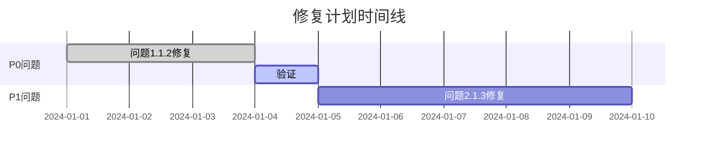

## 清单报告格式

### 适用场景
- 质量检查
- 代码审查
- 安全审计
- 合规检查
- 验收测试

### 目标受众
- QA团队
- 审核者
- 开发团队
- 项目经理
- 合规部门

### 格式特点
- **长度**：5-15页
- **风格**：结构化、可检查、状态明确
- **重点**：检查项、状态、问题、行动项

## 输出模板

```markdown
# [检查主题] 清单报告

## 报告概览

### 检查信息
| 项目 | 内容 |
|------|------|
| **检查类型** | [代码审查/安全审计/质量检查等] |
| **检查范围** | [范围描述] |
| **检查日期** | [YYYY-MM-DD] |
| **检查人员** | [姓名] |
| **参考标准** | [标准/规范] |
| **报告版本** | [版本号] |

### 检查结果汇总
| 类别 | 总数 | 通过 | 失败 | 警告 | 通过率 |
|------|------|------|------|------|--------|
| [类别1] | N | ✅ X | ❌ Y | ⚠️ Z | X% |
| [类别2] | N | ✅ X | ❌ Y | ⚠️ Z | X% |
| [类别3] | N | ✅ X | ❌ Y | ⚠️ Z | X% |
| **总计** | **N** | **✅ X** | **❌ Y** | **⚠️ Z** | **X%** |

### 整体评估
🎯 **整体状态**：[优秀/良好/一般/需改进]

📊 **关键指标**：
- 严重问题：[数量] 个
- 高优先级问题：[数量] 个
- 中优先级问题：[数量] 个
- 低优先级问题：[数量] 个

---

## 1. [检查类别1]

### 1.1 检查项清单

| ID | 检查项 | 状态 | 优先级 | 负责人 | 截止日期 |
|----|--------|------|--------|--------|----------|
| 1.1.1 | [检查项描述] | ✅ 通过 | - | - | - |
| 1.1.2 | [检查项描述] | ❌ 失败 | P0 | [姓名] | [日期] |
| 1.1.3 | [检查项描述] | ⚠️ 警告 | P1 | [姓名] | [日期] |
| 1.1.4 | [检查项描述] | ✅ 通过 | - | - | - |
| 1.1.5 | [检查项描述] | ⚚ 跳过 | - | - | - |

**图例**：
- ✅ 通过：符合标准
- ❌ 失败：不符合标准，必须修复
- ⚠️ 警告：部分符合，建议改进
- ⚚ 跳过：不适用或未检查

### 1.2 问题详情

#### 问题 1.1.2：[标题]
**严重性**：🔴 严重 / 🟠 高 / 🟡 中 / 🟢 低

**问题描述**：
[详细描述问题]

**影响范围**：
- 影响：[描述影响]
- 风险：[潜在风险]

**根本原因**：
[分析问题原因]

**修复建议**：
```markdown
1. [具体修复步骤1]
2. [具体修复步骤2]
3. [具体修复步骤3]
```

**验证方法**：
[如何验证修复有效]

---

## 2. [检查类别2]

### 2.1 检查项清单

| ID | 检查项 | 状态 | 优先级 | 负责人 | 截止日期 |
|----|--------|------|--------|--------|----------|
| 2.1.1 | [检查项描述] | ✅ 通过 | - | - | - |
| 2.1.2 | [检查项描述] | ❌ 失败 | P0 | [姓名] | [日期] |

### 2.2 问题详情

[按相同结构]

---

## 3. [检查类别3]

[按相同结构]

---

## 严重问题清单

### 🔴 P0级别（必须立即修复）

| ID | 问题 | 影响 | 负责人 | 状态 |
|----|------|------|--------|------|
| [ID] | [描述] | [影响] | [姓名] | 待处理/处理中 |

### 🟠 P1级别（高优先级）

| ID | 问题 | 影响 | 负责人 | 状态 |
|----|------|------|--------|------|
| [ID] | [描述] | [影响] | [姓名] | 待处理/处理中 |

### 🟡 P2级别（中优先级）

| ID | 问题 | 影响 | 负责人 | 状态 |
|----|------|------|--------|------|
| [ID] | [描述] | [影响] | [姓名] | 待处理/处理中 |

---

## 行动计划

### 立即行动（0-1周）

| 任务 | 负责人 | 预期完成 | 当前状态 |
|------|--------|----------|----------|
| [任务1] | [姓名] | [日期] | 进行中 |
| [任务2] | [姓名] | [日期] | 未开始 |

### 短期行动（1-2周）

[按相同结构]

### 中期行动（2-4周）

[按相同结构]

---

## 进度追踪

### 修复进度

| 优先级 | 总数 | 已完成 | 进行中 | 待开始 | 完成率 |
|--------|------|--------|--------|--------|--------|
| P0 | N | X | Y | Z | X% |
| P1 | N | X | Y | Z | X% |
| P2 | N | X | Y | Z | X% |

### 时间线



---

## 最佳实践建议

### 发现的优势

✅ **[优势1]**
[描述发现的好的实践]

✅ **[优势2]**
[描述发现的好的实践]

### 改进建议

💡 **建议1**
- 当前：[现状]
- 建议：[改进方向]
- 预期收益：[收益]

💡 **建议2**
[按相同结构]

---

## 合规性评估

### 标准符合度

| 标准/规范 | 要求 | 符合度 | 备注 |
|-----------|------|--------|------|
| [标准1] | [要求] | ✅ 符合 | [说明] |
| [标准2] | [要求] | ⚠️ 部分符合 | [说明] |
| [标准3] | [要求] | ❌ 不符合 | [说明] |

### 风险评估

| 风险类别 | 风险等级 | 缓解措施 |
|---------|---------|----------|
| [类别1] | 高/中/低 | [措施] |
| [类别2] | 高/中/低 | [措施] |

---

## 附录

### A. 详细检查标准
[完整的检查标准说明]

### B. 检查方法
[使用的检查方法和工具]

### C. 参考文档
- [文档1](链接)
- [文档2](链接)

### D. 变更历史

| 版本 | 日期 | 修改人 | 变更说明 |
|------|------|--------|----------|
| 1.0 | [日期] | [姓名] | 初始版本 |
| 1.1 | [日期] | [姓名] | [变更] |

---

## 签名确认

| 角色 | 姓名 | 签名 | 日期 |
|------|------|------|------|
| 检查执行人 | | | |
| 技术审核人 | | | |
| 项目负责人 | | | |
| 质量保证人 | | | |

---

*报告生成时间：[YYYY-MM-DD HH:MM:SS]*
*下次检查计划：[日期]*
```

## 质量标准

### 清单设计
- 检查项必须具体可验证
- 每个检查项有明确的通过/失败标准
- 清单项互不重叠
- 覆盖所有重要方面

### 状态管理
- 状态定义清晰
- 严重程度分级合理
- 优先级排序准确
- 责任人明确

### 问题描述
- 问题描述准确具体
- 包含足够上下文
- 提供重现步骤
- 给出修复建议

### 可追踪性
- 每个问题有唯一ID
- 记录问题发现时间
- 追踪修复进度
- 记录验证结果

### 格式规范
- 使用表格结构化信息
- 使用符号和颜色增强可读
- 保持一致的格式
- 提供清晰的汇总
```

## 清单类型示例

### 代码审查清单
```
- 代码风格符合规范
- 变量命名清晰
- 函数职责单一
- 错误处理完善
- 注释充分准确
- 测试覆盖充分
```

### 安全审计清单
```
- 输入验证
- 输出编码
- 认证授权
- 会话管理
- 加密存储
- 日志安全
```

### 质量检查清单
```
- 功能完整性
- 性能达标
- 兼容性测试
- 稳定性验证
- 文档完整
```
```

### 视觉建议
```markdown
严重性标识：
🔴 P0 - 严重 - 必须立即修复
🟠 P1 - 高 - 尽快修复
🟡 P2 - 中 - 计划修复
🟢 P3 - 低 - 可选修复

状态标识：
✅ 通过
❌ 失败
⚠️ 警告
⚚ 跳过
🔄 进行中
```
