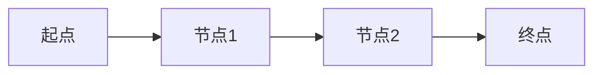

## 演示文稿格式

### 适用场景
- 会议分享
- 团队汇报
- 客户演示
- 培训材料
- 项目展示

### 目标受众
- 团队成员
- 管理层
- 客户
- 会议听众

### 格式特点
- **长度**：10-30页幻灯片
- **风格**：可视化、简洁、互动性强
- **重点**：关键点、图表、视觉元素

## 输出模板

```markdown
# [演示标题]

## 幻灯片结构建议

### 第1页：标题页
```markdown
# [研究主题]

[副标题/研究问题]

汇报人：[姓名]
日期：[YYYY-MM-DD]
```

### 第2页：目录
```markdown
## 目录

1. 研究背景
2. 研究方法
3. 核心发现
4. 关键洞察
5. 建议与行动
6. Q&A
```

### 第3页：研究背景
```markdown
## 研究背景

### 为什么进行这项研究？

- **业务需求**：[描述]
- **技术挑战**：[描述]
- **市场机遇**：[描述]

### 研究目标

> [一句话概括核心目标]
```

### 第4页：研究方法
```markdown
## 研究方法

### 数据来源
| 来源 | 类型 | 规模 |
|------|------|------|
| [来源1] | [类型] | [规模] |
| [来源2] | [类型] | [规模] |

### 分析方法
- 方法1：[简述]
- 方法2：[简述]
- 方法3：[简述]
```

### 第5页：核心发现1
```markdown
## 核心发现

### [发现标题]

**关键数据**：
- 指标1：[数值] 📈
- 指标2：[数值] 📊
- 指标3：[数值] ⚡

**重要洞察**：
> [核心洞察的简洁表述]
```

### 第6页：核心发现2（图表）
```markdown
## 数据可视化

### [图表标题]

[推荐使用mermaid图表]


**关键趋势**：
- 趋势1：[描述]
- 趋势2：[描述]
```

### 第7页：对比分析
```markdown
## 对比分析

| 维度 | 方案A | 方案B | 推荐 |
|------|-------|-------|------|
| 成本 | [值] | [值] | ⭐ |
| 性能 | [值] | [值] | ⭐ |
| 易用性 | [值] | [值] | ⭐ |

**结论**：[推荐方案的简要理由]
```

### 第8页：问题与挑战
```markdown
## 识别的问题

### 🔴 高优先级
- 问题1：[描述]
- 问题2：[描述]

### 🟡 中优先级
- 问题3：[描述]
- 问题4：[描述]

### 🟢 低优先级
- 问题5：[描述]
```

### 第9页：解决方案
```markdown
## 推荐方案

### 方案概述
[1-2句话描述方案]

### 核心优势
✅ 优势1：[描述]
✅ 优势2：[描述]
✅ 优势3：[描述]

### 预期效果
- 效果1：[量化指标]
- 效果2：[量化指标]
- 效果3：[量化指标]
```

### 第10页：实施计划
```markdown
## 实施路线图

### 第一阶段（0-1个月）
- [任务1]
- [任务2]

### 第二阶段（1-3个月）
- [任务1]
- [任务2]

### 第三阶段（3-6个月）
- [任务1]
- [任务2]
```

### 第11页：资源需求
```markdown
## 资源需求

### 人力
| 角色 | 人数 | 时间 |
|------|------|------|
| [角色] | [N] | [周期] |

### 预算
| 类别 | 金额 |
|------|------|
| [类别1] | [金额] |
| [类别2] | [金额] |
| **总计** | **[总金额]** |
```

### 第12页：风险评估
```markdown
## 风险与缓解

| 风险 | 影响 | 可能性 | 缓解措施 |
|------|------|--------|----------|
| 风险1 | 高/中/低 | 高/中/低 | [措施] |
| 风险2 | 高/中/低 | 高/中/低 | [措施] |
```

### 第13页：成功指标
```markdown
## 成功指标

### KPI追踪
| KPI | 基线 | 目标 | 当前 |
|-----|------|------|------|
| [指标1] | [值] | [值] | [值] |
| [指标2] | [值] | [值] | [值] |

### 里程碑
- [ ] 里程碑1：[描述] - [日期]
- [ ] 里程碑2：[描述] - [日期]
- [ ] 里程碑3：[描述] - [日期]
```

### 第14页：总结与建议
```markdown
## 总结

### 核心要点
1. 要点1：[描述]
2. 要点2：[描述]
3. 要点3：[描述]

### 行动建议
🎯 **立即行动**：[建议]
🎯 **短期规划**：[建议]
🎯 **长期战略**：[建议]
```

### 第15页：Q&A
```markdown
## Q&A

### 常见问题

**Q1：[常见问题]**
A：[答案]

**Q2：[常见问题]**
A：[答案]

### 联系方式
- 邮箱：[email@example.com]
- 文档：[链接]
```

---

## 视觉元素建议

### 图表类型选择
```markdown
- 趋势展示 → 折线图
- 比较对比 → 柱状图
- 占比关系 → 饼图
- 流程展示 → 流程图
- 层级关系 → 树状图
```

### 配色方案
```markdown
- 主色：[品牌色/主题色]
- 辅助色：[补充色]
- 强调色：[高亮色]
- 背景色：[浅色/深色]
```

### 图标使用
```markdown
📊 数据
📈 趋势
⚡ 性能
🎯 目标
✅ 优势
❌ 劣势
🔴 高优先级
🟡 中优先级
🟢 低优先级
```

## 质量标准

### 内容要求
- 每页幻灯片只讲一个核心观点
- 文字简洁，每页不超过6行
- 使用图表而非大量文字
- 关键数据用视觉元素突出

### 视觉要求
- 保持一致的视觉风格
- 使用高对比度便于阅读
- 图表清晰标注
- 合理使用留白

### 互动要求
- 设计互动环节
- 预留Q&A时间
- 准备补充材料
- 考虑听众参与度

### 演讲技巧
- 每页准备2-3分钟演讲内容
- 准备开场和结尾
- 设计过渡语
- 预演和计时
```

## 转换为实际演示工具

### 转换为Marp（Markdown演示）
```bash
marp presentation.md -o presentation.pdf
marp presentation.md -o presentation.pptx
```

### 转换为Reveal.js
```html
<!-- 使用在线工具或本地转换 -->
```

### 手动创建PPT
- 按照幻灯片结构逐页创建
- 复制markdown内容到对应页面
- 应用视觉风格
- 添加图表和视觉元素
