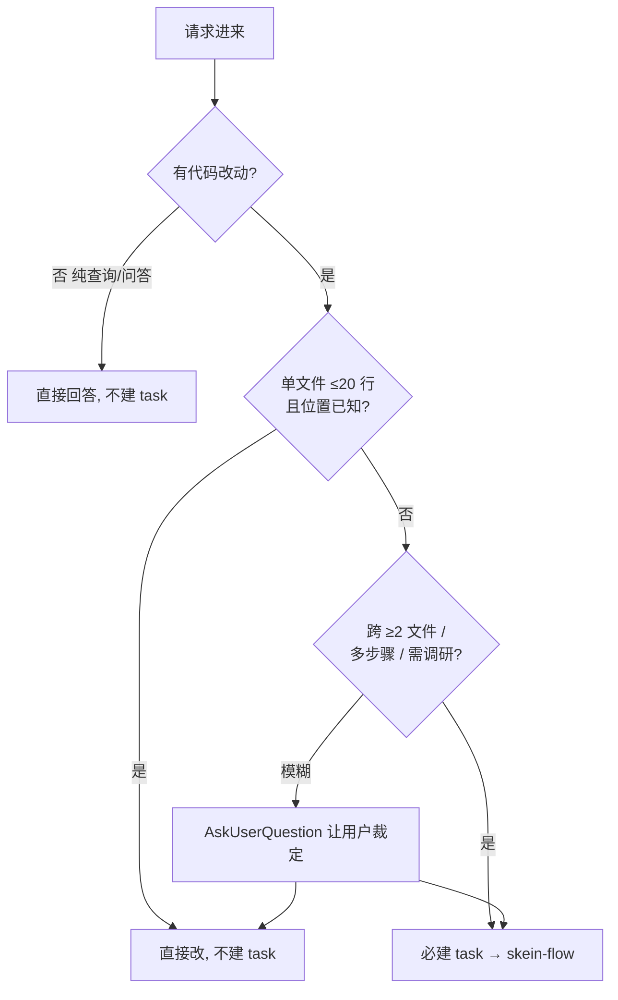
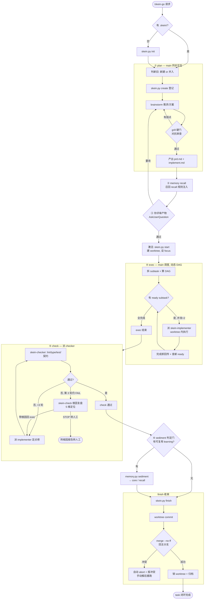
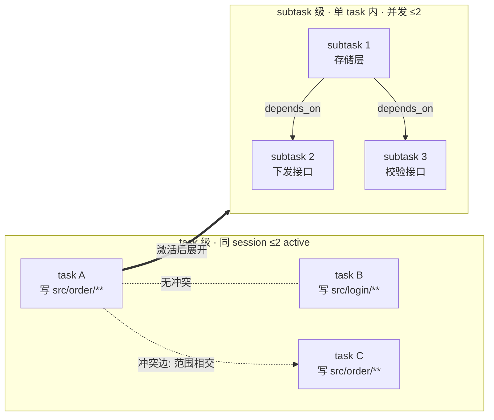

# 最佳实践 + 流程图

## 决策: 这个请求要不要建 task

## 最佳实践主流程 (plan → exec → check → finish)

## 双层调度 DAG 心智模型

> 两层**同构**: 同一套「冲突自算边 ∪ 显式 depends_on → 就绪即派 → 并发 2 → 完成即派」算法, 只是调度对象一个是 task、一个是 subtask。

## 做得好 vs 做得糟

| 维度 | 好 | 糟 |
| --- | --- | --- |
| plan 深度 | 需求方案在 plan 阶段对齐透, exec 一路顺 | plan 潦草, exec 中途反复停下问「先做哪个」 |
| 顺序决策 | 依赖关系在 planning 用 depends_on / 调度图定死 | 到 exec 才临时问用户顺序 |
| 改动落点 | 全落 worktree, 主工作区零改动 | main 亲自在主工作区改源码 |
| 写前把关 | 每个待改文件先 Read 全文 + 复述契约/reason 再 Edit | 不读上下文直接改, 契约事后 check 才发现被破 |
| 执行方式 | 实质工作派具名 subagent | main 假装派 agent 但没真调 Agent 工具 |
| 进度回传 | 每个 agent 完成即回传 | 批量攒到最后一次性汇报 |
| 闭环 | 走完 finish + archive 才算完 | check 没过就宣告 Done |
| 记忆 | 只沉淀可复用契约, 全无增量就跳过 | 硬凑, 把一次性 bug 也塞进 core |

## 反例黑名单 (命中 = 流程错误)

1. main 直接改源码 / 跑 check (非特别例外) → 派 subagent。
2. 把 `skein.py` 脚本派 agent 执行 → main 同步跑。
3. inline 跳过 task (即使请求极简且已显式 `/skein-go`) → 走闭环。
4. check 未过就推进 finish → 先定点修复重检。
5. check / finish 未走完就宣告 Done → 未 archive = 未闭环。
6. 口头宣称「已派 agent / 已建 task」但本回复无对应 tool_use → 先真实调用再回传。
7. exec subagent 直接在主工作区改源码 (无 worktree) → 必在 task worktree 内。
8. 直接 Edit/Write `.skein/task.md` → 经 `skein.py board` (guard hook 硬阻)。
9. 直接读写 `.skein/state.json` → 经 `skein.py current` / create/start/finish。
10. 纯文本提问代替 AskUserQuestion → 用户确认必用工具。
11. exec 阶段 subtask 之间停下问用户顺序 → 顺序归 planning。

## 效率贴士

- **策略分档轻量路由** — planning 先给任务定档 (`direct-fix` 单点微改直接豁免 / `standard` 常规闭环 / `heavy` 跨子系统强化 grill + 拆多 task), 按档投入 planning 力度, 别对小改也上重流程 (仅路由启发, 无新机器)。
- **契约当可复用验收基准** — planning 锁进 `contracts` 的不变量既是本 task check 的逐条验收项, 值得复用的 (如「必须走异步队列」) finish 时再 sediment 成规则, 供后续 task 复用。
- **写前先读、复述契约再改** — implementer 对每个待改文件必过 写前 CHECKPOINT (先 Read 全文 → 复述适用契约 + reason → 才 Edit/Write), 把契约约束从 check 事后验前移到写前, 少一轮返工。dispatch 时逐文件带 reason (改它满足哪条契约/需求), 别甩一个笼统范围让 agent 猜。文件现状与契约矛盾 → 标 `需要:` 回传, **别擅改**。
- **空仓先播种基线** — 首次接入且 `.claude/rules` 为空时, 先走 `skein-memory` 冷启动播种 (`references/bootstrap-seeding.md`) 扫既有约定播种规则 (默认多归 recall, 仅硬约束进 core), 让第一个 task 就能召回项目习惯; 之后靠正常 finish sediment 增量累积, 别再重复播种。
- **第 3 轮别硬撞** — check 反复不过到第 3 轮, 走 `skein-check` 根因复盘协议 (`references/root-cause-protocol.md`) 做 5 维复盘 (需求/设计/实现/环境/测试), 定位真根因再定向重修, 别在同一层症状上无脑加轮。
- **plan 一次到位** — 省下 exec 反复返工。grill 硬门就是逼你在动手前把漏洞暴露完。
- **并行别硬凑** — 写文件范围相交的 subtask 让它串行, 别为并行而并行 (冲突边会自动挡)。
- **core 层克制** — 只放「后续同类任务必再踩」的强约束。长尾经验进 recall, 别把 core 撑爆 (有预算警戒)。
- **一个 session 内闭环跨包改动** — 别拆多次, 保决策一致性 (尤其破坏式重构)。
