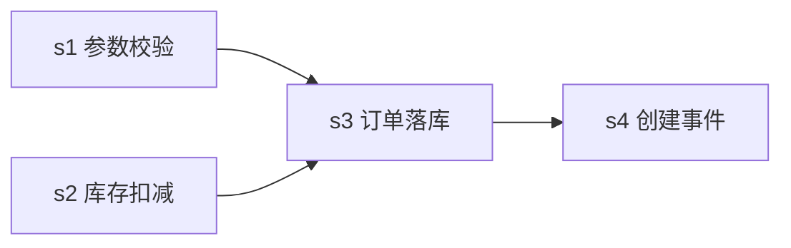

# 实现方案 / 调度图 — order-create-api 订单创建 API

> planning 工件。subtask 拆分 + 顺序在此定, 落进 `task.json` 的 `subtasks[]` (`skein.py subtask add`)。
> **subtask 运行态不看这里, 看 `skein.py subtask list order-create-api`** (状态由脚本落盘)。

## subtask 拆分

| sid | 名称 | 写文件 | 依赖 | reason |
| --- | --- | --- | --- | --- |
| s1 | 请求参数校验 | `internal/order/validate*.go` | — | 校验商品/数量/收货地址, 契约前置 |
| s2 | 库存扣减 | `internal/inventory/*.go` | — | Redis 原子 decr, 不足即拒 (契约2) |
| s3 | 订单落库 | `internal/order/repo*.go` | — | 幂等键唯一索引落单 (契约1) |
| s4 | 订单创建事件 | `internal/event/*.go` | s3 | 落单成功后发 MQ 事件 |

## 调度图



- s1 / s2 / s3 写文件三者不相交 → 本可并行, 但并发上限 2, 故首轮跑 s1+s2, s3 补位。
- s4 显式 `depends_on: s3` → s3 已完成前不就绪。
- **本快照定格在 exec 中途**: s1 已完成, s2 运行中, s3 首跑失败 (幂等键冲突, 待重试), s4 仍待处理。真实调度环会 `subtask start order-create-api s3` 重试 s3, 成功后 s4 才就绪。

## 落盘命令 (planning 执行)

```bash
skein.py subtask add order-create-api s1 --name "请求参数校验" --write "internal/order/validate*.go" --reason "..."
skein.py subtask add order-create-api s2 --name "库存扣减"     --write "internal/inventory/*.go"    --reason "..."
skein.py subtask add order-create-api s3 --name "订单落库"     --write "internal/order/repo*.go"     --reason "..."
skein.py subtask add order-create-api s4 --name "订单创建事件" --deps "s3" --write "internal/event/*.go" --reason "..."
```
