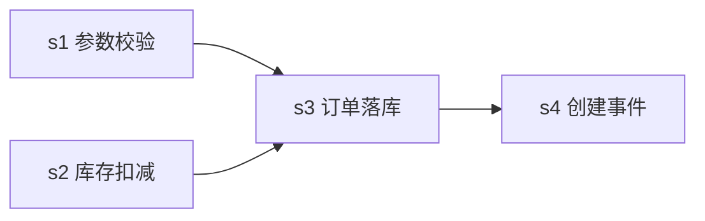

# 实现方案 / 调度图 — order-create-api 订单创建 API

> planning 工件。subtask 拆分 + 顺序在此定, 落进 `task.json` 的 `subtasks[]` (`skein.py subtask add`)。
> **subtask 运行态不看这里, 看 `skein.py subtask list order-create-api`** (状态由脚本落盘)。

## subtask 拆分

| sid | 名称 | 依赖 (depends_on) | 验收标准 (checklist) |
| --- | --- | --- | --- |
| s1 | 请求参数校验 | — | 缺商品/数量/收货地址返回 400; 数量 ≤ 0 拒绝 |
| s2 | 库存扣减 | — | 扣减不允许负库存; 库存不足返回 409 |
| s3 | 订单落库 | s1, s2 | 幂等键冲突返回既有订单 (不重复落单) |
| s4 | 订单创建事件 | s3 | 落单成功后发一次 MQ 事件; 发送失败可重试 |

## 调度图



- s1 / s2 无依赖 → 可并行 (并发上限 2, 首轮跑 s1+s2)。
- s3 显式 `depends_on: s1, s2` → 两者完成前不就绪; s4 显式 `depends_on: s3` → s3 完成前不就绪。并行与否只看这张 DAG。
- **本快照定格在 exec 中途**: s1 已完成, s2 运行中, s3 首跑失败 (幂等键冲突, 待重试), s4 仍待处理。真实调度环会 `subtask start order-create-api s3` 重试 s3, 成功后 s4 才就绪。

## 落盘命令 (planning 执行)

```bash
skein.py subtask add order-create-api s1 --name "请求参数校验" --check "缺商品/数量/收货地址返回 400; 数量 ≤ 0 拒绝"
skein.py subtask add order-create-api s2 --name "库存扣减"     --check "扣减不允许负库存; 库存不足返回 409"
skein.py subtask add order-create-api s3 --name "订单落库"     --deps "s1,s2" --check "幂等键冲突返回既有订单 (不重复落单)"
skein.py subtask add order-create-api s4 --name "订单创建事件" --deps "s3"    --check "落单成功后发一次 MQ 事件; 发送失败可重试"
```
