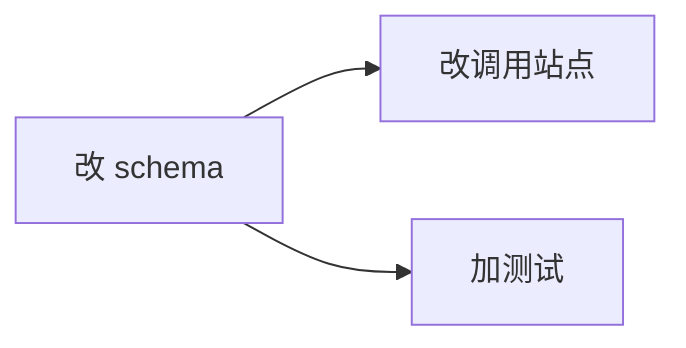

# 调度图 (implement.md 必含)

exec 阶段的 DAG 靠这张图。缺失 → exec 无法调度 → 禁进 exec (退回本步补)。

配 subtask 表 (每行还须定 `agent` + `skills`: agent 省略默认 `skein-executor`, skills 0-n 逗号分隔):

| subtask | depends_on | 验收标准 (checklist) | agent | skills |
|---|---|---|---|---|
| st1 | - | 迁移可回滚; 新列有默认值 | skein-executor | db-migration |
| st2 | st1 | 新字段透传响应; 旧字段不删 | skein-executor | - |
