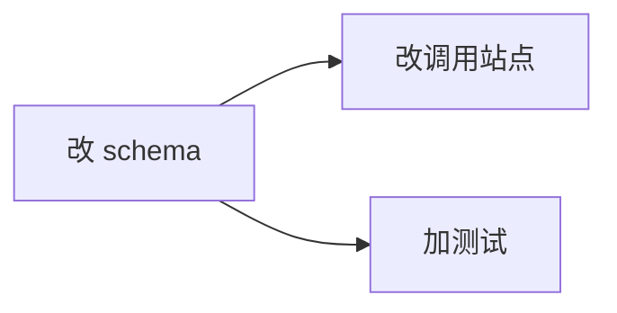

# skein-planning — planning 入口

**planning 单一真值源**。判新旧 + 登记 + brainstorm + grill, 产出 planning 工件。**全程 main 同步前台** — brainstorm/grill 需逐问用户 (`AskUserQuestion`), subagent 不能与用户对话, 故不派执行 subagent (纯信息调研可派 `skein-researcher` 只读 subagent, 但设计决策 main 汇总裁定)。

## 入参

- 无参 → 跑完 planning **停在 start 前** (等用户直呼激活)。
- `--continue` → 跑完 planning **不停**, 返回工件路径 (供 `skein-flow` 自接激活)。

## 流程

1. **判新旧** — 全新任务 vs 对现有 active task 的补充/延续。不准 → `AskUserQuestion` 用户裁定。并入现有 → 更新其工件, 不新建。
2. **登记** — 全新 → `skein.py create <name> [--desc ..] [--deps ..]`, 得 `<id>` + 工件目录。→ 更新看板。
3. **brainstorm 需求/方案** (main 交互式) — 逐问澄清: 目标 / 用户价值 / 边界 / 非目标 / 验收基准 / 方案取舍。禁 main 自行凭空设计。用 `AskUserQuestion` 拍板关键分歧。
4. **grill 硬门** — 委托 `skein-grill` 全轴对抗校对, 重点确认「用户想法 = PRD 写的」。弱点表交用户过, 补齐后放行。**未跑 grill 禁进 exec**。
5. **产出工件** — 写进 `.skein/task/<id>/`:
   - `prd.md` — 需求: 目标 / 用户价值 / 边界 / 非目标 / 验收基准。
   - `design.md` (可选, 复杂方案) — 架构 / 取舍 / 技术选型。
   - `implement.md` — 实现拆解: subtask 列表 (每个含 write-files glob + exec-scope + depends_on) + **调度图** (mermaid, 供 exec 阶段 DAG)。
6. **返回** — `--continue` → 返回工件路径给调用方; 无参 → 停, 提示用户激活。

## 调度图 (implement.md 必含)

exec 阶段的 DAG 靠这张图。缺失 → exec 无法调度 → 禁进 exec (退回本步补)。

配 subtask 表:

| subtask | write-files | exec-scope | depends_on |
|---|---|---|---|
| st1 | src/schema.* | 数据层 | - |
| st2 | src/api/** | API 层 | st1 |

## ⛔ 反例

| 禁 | 改为 |
|---|---|
| main/agent 凭空设计需求方案 | brainstorm 主导, 逐问用户 |
| 派 subagent 做 brainstorm (它不能问用户) | main 同步前台交互 |
| 跳过 grill 硬门进 exec | 未跑 grill 禁进 exec |
| implement.md 缺调度图 | 必含 mermaid + subtask 表 |
| 纯文本提问代替 AskUserQuestion | 用工具 |
