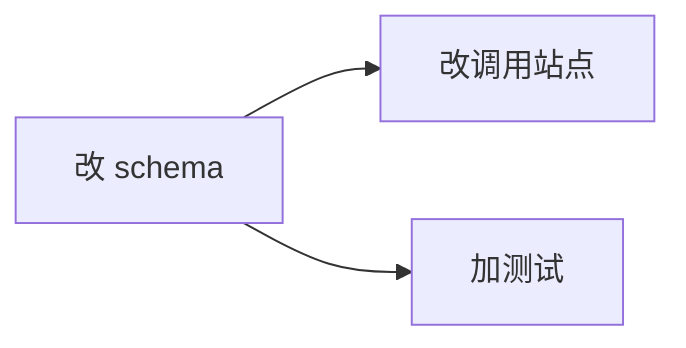

# 调度图 (implement.md 必含)

exec 阶段的 DAG 靠这张图。缺失 → exec 无法调度 → 禁进 exec (退回本步补)。

配 subtask 表:

| subtask | write-files | exec-scope | depends_on |
|---|---|---|---|
| st1 | src/schema.* | 数据层 | - |
| st2 | src/api/** | API 层 | st1 |
