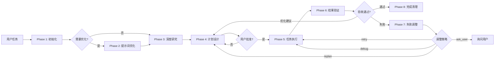

# Task - 任务管理插件

> 基于 PDCA 循环的智能任务编排引擎，集成项目探索、计划设计、并行执行和质量递进的完整工作流

## 概述

Task 是一个任务管理框架插件，提供规划、执行、验证和迭代的完整流程。它不绑定任何具体的执行 agents，而是让用户灵活选择其他插件或自定义 agents 来完成实际工作。这种设计使得框架可以适配任意技术栈和项目类型。

**核心特性**：

- **🔄 MindFlow 执行引擎**：基于 PDCA 循环的 8 阶段持续迭代（初始化 → 提示词优化 → 深度研究 → 计划设计 → 任务执行 → 结果验证 → 失败调整 → 完成清理）
- **🔍 项目探索体系**：4 个专业 Explorer Agents（通用/代码/前端/后端），基于 AST+PageRank 代码分析（2024-2025 最新研究）
- **📊 智能任务分解**：MECE 原则的原子任务拆分、DAG 依赖建模、多 agent 协作编排
- **✅ 质量递进机制**：60→75→85→90 分的深度迭代，自动优化建议，失败自愈策略
- **🎯 统一用户交互**：Team Leader 模式集中管理所有调度和用户沟通，避免多 agent 混乱

**核心理念**：以 /loop 命令作为 team leader 角色，统一管理所有调度和用户交互。Agents 只需通过 SendMessage 向 leader 上报，leader 通过 AskUserQuestion 与用户沟通。这种集中式设计确保了清晰的信息流和一致的用户体验。

---

## 快速开始

### 安装

```bash
/plugin install task@ccplugin-market
```

### 基础用法

| 命令 | 说明 |
|------|------|
| `/loop [任务目标]` | 进入循环迭代模式，作为 team leader 执行完整流程 |
| `/add [补充内容]` | 补充任务说明、纠正方向或添加约束 |
| `/cancel` | 取消当前执行，保留已完成工作 |

### 主流程说明

MindFlow 执行引擎的完整 PDCA 循环流程：



**8 个阶段详解**：

1. **初始化（Initialization）** - 初始化状态变量、列出可用资源（skills、agents）
2. **提示词优化（Prompt Optimization）** - 仅首次执行，质量评分 <8 分时使用 5W1H 框架澄清需求
3. **深度研究（Deep Research）** - 复杂度 >8 或失败 2 次时触发，收集项目上下文和最佳实践
4. **计划设计（Planning）** - 分析项目结构、MECE 分解任务、建立 DAG 依赖、分配 agents/skills
5. **任务执行（Execution）** - 按依赖顺序并行调度（最多 2 个并行），实时输出进度
6. **结果验证（Verification）** - 检查验收标准，通过→完成，有建议→继续迭代，失败→调整
7. **失败调整（Adjustment）** - 分析失败原因，应用分级策略（retry→debug→replan→ask_user）
8. **完成清理（Finalization）** - 清理资源、删除临时文件、输出最终报告

**关键决策点**：

- **用户批准**：首次规划和用户重新设计需确认，自动重规划跳过确认
- **验收结果**：通过+无建议→完成，通过+有建议→自动迭代，失败→调整
- **调整策略**：retry（重试）→ debug（诊断）→ replan（重新规划）→ ask_user（请求用户）

**质量递进**：60→75→85→90 分，每轮迭代提升质量直到达到目标

### Agent 选择速查

根据任务类型快速选择合适的 Agent：

| 场景 | 推荐 Agent | 说明 | 典型任务 |
|------|-----------|------|---------|
| **项目探索** | `task:explorer-general` | 宏观理解、技术栈识别 | 首次接触新项目、识别框架和依赖 |
| **代码分析** | `task:explorer-code` | 符号索引、依赖追踪 | 理解模块关系、分析代码结构 |
| **前端项目** | `task:explorer-frontend` | 组件树、状态管理、路由 | React/Vue 项目架构分析 |
| **后端项目** | `task:explorer-backend` | API 映射、数据模型、服务 | Go/Python API 架构分析 |
| **任务规划** | `task:planner` | 计划设计、任务分解 | 复杂任务 MECE 分解 |
| **任务执行** | `task:execute` | 并行编排、进度跟踪 | 多任务调度、依赖管理 |
| **结果验证** | `task:verifier` | 验收标准检查 | 质量门禁、完成度验证 |
| **失败恢复** | `task:adjuster` | 失败分析、策略升级 | 错误诊断、Circuit Breaker |

**决策树**：

```
项目类型判断：
├── 首次接触 / 不确定项目类型
│   └── explorer-general（通用探索）
│       → 输出项目概览后，根据 project_type 继续选择
│
├── 需要代码级分析（非特定领域）
│   └── explorer-code（代码探索）
│       → 符号索引、依赖追踪、模式识别
│
├── 前端项目（React/Vue/Svelte/Angular）
│   └── explorer-frontend（前端探索）
│       → 继承 code 能力 + 组件树/状态/路由分析
│
└── 后端项目（Go/Python/Node.js/Java）
    └── explorer-backend（后端探索）
        → 继承 code 能力 + API/模型/服务分析
```

---

## 核心概念

### MindFlow 执行引擎

MindFlow 是 Task 插件的核心执行引擎，基于 PDCA 循环（Plan-Do-Check-Act）实现持续迭代和质量递进。

**设计原则**：

- **框架与执行分离** - Task 只负责流程编排，具体任务由外部 agents 完成，同一框架可驱动不同技术栈
- **集中式通信** - /loop 命令作为唯一 team leader，agents 不能直接向用户提问，必须通过 SendMessage 上报
- **原子任务拆分** - 每个子任务必须不可再分，并行执行时最多 2 个任务同时运行且不修改同一文件
- **按需创建 Team** - 单任务不创建 team，多任务在执行阶段创建，执行完成后立即删除

### PDCA 循环

**Plan（计划）**：
- 使用 explorer agents 收集项目信息
- MECE 原则分解任务（互相独立、完全穷尽）
- 建立 DAG 依赖关系图
- 为每个任务分配 agent 和 skills
- 定义可量化的验收标准

**Do（执行）**：
- 判断任务数量（单任务不创建 team，多任务创建 team）
- 按依赖顺序调度（最多 2 个并行）
- 实时输出进度和中间结果
- 执行完成后删除 team

**Check（检查）**：
- 检查所有验收标准（acceptance_criteria）
- 验收通过 + 无建议 → 完成
- 验收通过 + 有建议 → 自动继续迭代
- 验收失败 → 失败调整

**Act（改进）**：
- 分析失败原因和停滞模式
- 应用分级升级策略（retry → debug → replan → ask_user）
- 指数退避（0秒 → 2秒 → 4秒）
- 回到相应阶段继续执行

### 项目探索工作流

Task 插件提供了完整的项目探索体系，通过 4 个专业 Explorer Agents 实现从宏观到微观的渐进式理解。

**Explorer Agents 继承关系**：

```
explorer-general（宏观层）
    ↓ 识别项目类型
explorer-code（基础层）
    ├─→ explorer-frontend（前端特化，继承 code 符号索引能力）
    └─→ explorer-backend（后端特化，继承 code 符号索引能力）
```

**典型协作模式**：

```json
{
  "tasks": [
    {
      "id": "T0",
      "description": "了解项目全貌和技术栈",
      "agent": "task:explorer-general",
      "output": "项目概览 JSON（技术栈、目录结构、项目类型）"
    },
    {
      "id": "T1",
      "description": "分析前端组件架构和状态管理",
      "agent": "task:explorer-frontend",
      "dependencies": ["T0"],
      "output": "前端架构 JSON（组件树、状态管理、路由）"
    },
    {
      "id": "T2",
      "description": "分析后端 API 路由和数据模型",
      "agent": "task:explorer-backend",
      "dependencies": ["T0"],
      "output": "后端架构 JSON（API 映射、数据模型、服务）"
    }
  ]
}
```

**工作流特点**：

- **渐进式理解** - 从 general（宏观）→ code/frontend/backend（微观）
- **能力继承** - frontend/backend 继承 code 的符号索引和依赖分析能力
- **结构化输出** - 所有 explorer agents 输出标准 JSON 格式，便于后续处理
- **智能路径选择** - 根据 project_type 自动选择 frontend 或 backend explorer

### 质量递进机制

Task 通过深度迭代实现质量递进，目标是从 60 分（可工作）提升到 90 分（优秀）。

**质量阈值**：

- **60 分** - 基本功能可工作，通过验收标准
- **75 分** - 良好质量，代码规范、测试覆盖
- **85 分** - 高质量，性能优化、边界处理
- **90 分** - 优秀质量，最佳实践、文档完善

**迭代流程**：

1. 第一轮：完成基本功能，达到 60 分，通过验收
2. Verifier 提出优化建议（如增加测试、优化性能）
3. 自动触发下一轮迭代，planner 根据建议调整计划
4. 执行优化，质量提升到 75 分
5. 继续迭代直到达到 90 分或无更多优化建议

**终止条件**：

| 条件 | 触发 | 行为 |
|------|------|------|
| 目标达成 | 结果验证全部通过且无优化建议 | 正常退出，输出报告 |
| 停滞过多 | 连续 3 次相同错误 | 请求用户指导后继续（不退出） |
| 用户中断 | 用户主动中断 | 根据用户指令处理 |

---

## Agent 清单

Task 插件提供 11 个 Agents，按职责分为 3 类：任务编排（3 个）、项目探索（4 个）、辅助工具（4 个）。

### 任务编排 Agents

| Agent | 职责 | 模型 | 内存 | 输出格式 | 适用场景 |
|-------|------|------|------|---------|---------|
| `task:planner` | 计划设计与任务分解 | sonnet | project | JSON | 复杂任务规划、MECE 分解、依赖建模 |
| `task:execute` | 并行任务编排执行 | sonnet | project | 执行报告 | 多任务调度、依赖管理、进度跟踪 |
| `task:verifier` | 结果验证与质量检查 | sonnet | project | 验收报告 | 质量门禁、验收标准检查、优化建议 |

#### task:planner

**核心职责**：
- 收集项目上下文（使用 explorer agents）
- 使用 MECE 原则分解任务（互相独立、完全穷尽）
- 建立 DAG 依赖关系图
- 为每个任务分配合适的 agent 和 skills
- 定义可量化的验收标准

**工作流程**：
1. 项目探索阶段 - 调用 explorer-general/code/frontend/backend 收集信息
2. 任务分解阶段 - 应用 MECE 原则拆分原子任务
3. 依赖建模阶段 - 识别任务间依赖，构建 DAG
4. Agent 分配阶段 - 根据任务类型选择最佳 agent（参考 planner-agents-guide.md）
5. 验收定义阶段 - 为每个任务定义可量化标准

**输出格式**：
```json
{
  "project_context": {...},
  "tasks": [
    {
      "id": "T1",
      "description": "任务描述",
      "agent": "coder（开发者）",
      "skills": ["python:dev（开发）"],
      "dependencies": [],
      "acceptance_criteria": ["标准1", "标准2"],
      "files": ["file1.py"]
    }
  ],
  "dag": {...},
  "summary": "计划总结"
}
```

#### task:execute

**核心职责**：
- 解析任务 DAG，确定执行顺序
- 按依赖关系调度任务（最多 2 个并行）
- 创建和管理 team（多任务时）
- 实时输出执行进度
- 执行完成后清理 team

**工作流程**：
1. 判断任务数量（单任务不创建 team）
2. 创建 team（多任务时）
3. 按 DAG 顺序调度任务
4. 收集执行结果
5. 删除 team（如果创建了）

**输出格式**：
```
执行报告：
- T1: 完成（agent: coder, 耗时: 2m）
- T2: 完成（agent: tester, 耗时: 3m）
- 总耗时: 5m
```

#### task:verifier

**核心职责**：
- 检查所有验收标准（acceptance_criteria）
- 评估任务完成质量（60-90 分）
- 识别优化空间，提出改进建议
- 判断是否需要继续迭代

**工作流程**：
1. 遍历每个任务的验收标准
2. 检查标准是否通过（运行测试、检查文件等）
3. 评估整体质量分数
4. 生成优化建议（如果有）
5. 决定下一步（完成/继续迭代/失败）

**输出格式**：
```json
{
  "status": "passed|suggestions|failed",
  "score": 75,
  "results": [
    {"task": "T1", "passed": true, "details": "..."}
  ],
  "suggestions": [
    {"priority": "high", "suggestion": "增加边界测试"}
  ],
  "report": "验收报告..."
}
```

### 项目探索 Agents

| Agent | 职责 | 模型 | 内存 | 输出格式 | 继承关系 | 适用场景 |
|-------|------|------|------|---------|---------|---------|
| `task:explorer-general` | 项目宏观理解 | sonnet | project | JSON | - | 首次接触、技术栈识别、目录结构 |
| `task:explorer-code` | 代码结构分析 | sonnet | project | JSON | - | 符号索引、依赖追踪、AST 分析 |
| `task:explorer-frontend` | 前端架构探索 | sonnet | project | JSON | ← explorer-code | React/Vue 组件树、状态管理 |
| `task:explorer-backend` | 后端架构探索 | sonnet | project | JSON | ← explorer-code | API 映射、数据模型、服务架构 |

#### task:explorer-general

**核心职责**：
- 快速识别项目类型（frontend/backend/fullstack/library/CLI/monorepo）
- 识别技术栈（JS/Go/Python/Rust/Java 等）
- 分析目录结构和组织方式
- 识别主要框架和依赖

**工作流程**：
1. 文档扫描 - 读取 package.json/go.mod/pyproject.toml/Cargo.toml
2. 目录结构 - 分析 src/、app/、pages/ 等目录
3. 技术栈识别 - 根据配置文件和依赖识别框架
4. 项目类型判断 - 根据目录模式判断项目类型

**输出格式**：
```json
{
  "project_type": "frontend|backend|fullstack|library|CLI|monorepo",
  "tech_stack": {
    "language": "JavaScript|Go|Python|Rust|Java",
    "frameworks": ["React", "Next.js"],
    "dependencies": {...}
  },
  "directory_structure": {...},
  "summary": "项目总结"
}
```

**典型使用**：
```
任务：了解新项目
→ explorer-general 输出项目概览
→ 根据 project_type 选择 frontend/backend explorer
→ planner 设计详细计划
```

#### task:explorer-code

**核心职责**：
- 使用 serena LSP 进行符号索引
- 追踪模块和符号依赖关系
- 识别代码模式（设计模式、架构模式）
- 基于 AST+PageRank 算法分析代码结构（比 RAG 快 3-4 倍）

**工作流程**：
1. 目录扫描 - 识别源码目录和文件
2. 符号索引 - 使用 serena:get_symbols_overview 获取符号
3. 依赖分析 - 使用 serena:find_referencing_symbols 追踪依赖
4. 模式识别 - 识别设计模式和架构模式

**输出格式**：
```json
{
  "modules": [
    {
      "name": "模块名",
      "path": "路径",
      "symbols": [...],
      "dependencies": [...]
    }
  ],
  "patterns": ["Singleton", "Factory"],
  "architecture": "架构总结"
}
```

**关键工具**：
- `serena:get_symbols_overview` - 获取文件符号列表
- `serena:find_symbol` - 查找符号定义
- `serena:find_referencing_symbols` - 查找符号引用
- `serena:search_for_pattern` - 搜索代码模式

#### task:explorer-frontend

**核心职责**：
- 分析组件树（从 App/Root 向下遍历）
- 追踪状态管理（Redux/Zustand/Pinia/Vuex/Context）
- 分析路由结构（react-router/vue-router/Next.js）
- 识别样式体系（Tailwind/CSS Modules/styled-components）
- 继承 explorer-code 的符号索引能力

**支持框架**：
- **React**: React 18+、Next.js（App Router/Pages Router）、Remix
- **Vue**: Vue 3（Composition API）、Nuxt 3、Vue 2
- **Svelte**: SvelteKit、Svelte 5（Runes）
- **Angular**: Angular 17+（Standalone Components）

**工作流程**：
1. 框架识别 - 检查 package.json 和配置文件
2. 组件树分析 - 从根组件向下遍历
3. 状态管理探索 - 识别 store 定义和消费
4. 路由和样式分析 - 映射路由到组件，识别样式方案

**输出格式**：
```json
{
  "framework": {
    "name": "React",
    "version": "18.x",
    "variant": "Next.js"
  },
  "component_tree": [
    {
      "name": "App",
      "path": "src/App.tsx",
      "children": ["Header", "Main"],
      "props": [...],
      "state": [...]
    }
  ],
  "state_management": {
    "solution": "Redux",
    "stores": [...]
  },
  "routing": {...},
  "styling": {...}
}
```

**典型使用**：
```
任务：分析 React 项目组件树
→ explorer-general 识别 React + Next.js
→ explorer-frontend 分析组件树、Redux 状态、路由
→ 输出完整的前端架构 JSON
```

#### task:explorer-backend

**核心职责**：
- 映射 API 路由到处理函数
- 分析数据模型（GORM/SQLAlchemy/Prisma/TypeORM）
- 理解服务架构（单体/微服务/分层）
- 识别中间件链和依赖注入
- 继承 explorer-code 的符号索引能力

**支持框架**：
- **Go**: Gin、Echo、Fiber、go-zero
- **Python**: FastAPI、Flask、Django
- **Node.js**: Express、NestJS、Fastify、Koa
- **Java**: Spring Boot、Quarkus

**工作流程**：
1. 框架识别 - 检查依赖和配置文件
2. API 路由映射 - 追踪路由注册到处理函数
3. 数据模型分析 - 识别 ORM 模型和数据库 schema
4. 服务架构理解 - 分析分层结构和服务划分

**输出格式**：
```json
{
  "framework": {
    "name": "Gin",
    "version": "1.x",
    "language": "Go"
  },
  "api_routes": [
    {
      "method": "GET",
      "path": "/users/:id",
      "handler": "GetUser",
      "file": "handlers/user.go"
    }
  ],
  "data_models": [...],
  "services": [...],
  "architecture": "分层架构总结"
}
```

**典型使用**：
```
任务：理解 Go 项目 API 架构
→ explorer-general 识别 Gin 框架
→ explorer-backend 映射 API 路由、分析数据模型
→ 输出后端架构 JSON
```

### 辅助工具 Agents

| Agent | 职责 | 模型 | 内存 | 输出格式 | 适用场景 |
|-------|------|------|------|---------|---------|
| `task:adjuster` | 失败分析与策略调整 | sonnet | project | 调整报告 | Circuit Breaker、失败恢复 |
| `task:finalizer` | 资源清理与任务收尾 | sonnet | project | 清理报告 | 删除临时文件、停止任务 |
| `task:prompt-optimizer` | 提示词优化与需求澄清 | sonnet | project | 优化后提示词 | 5W1H 分析、歧义消除 |
| `task:plan-formatter` | 计划格式化为 Markdown | sonnet | project | Markdown 文件 | 生成计划文档、Mermaid 图 |

#### task:adjuster

**核心职责**：
- 分析任务失败原因
- 检测停滞模式（连续相同错误）
- 应用分级升级策略（retry → debug → replan → ask_user）
- 基于 Circuit Breaker 模式防止级联失败

**调整策略**：
1. **retry** - 简单重试（网络错误、暂时性失败）
2. **debug** - 深度诊断（添加日志、检查状态）
3. **replan** - 重新设计计划（方案不可行）
4. **ask_user** - 请求用户指导（停滞 3 次）

**输出格式**：
```json
{
  "strategy": "retry|debug|replan|ask_user",
  "reason": "失败原因分析",
  "fixes": ["修复建议1", "修复建议2"],
  "report": "调整报告"
}
```

#### task:finalizer

**核心职责**：
- 停止所有运行中的任务
- 删除计划文件和临时资源
- 清理 team（如果存在）
- 生成最终报告和统计

**输出格式**：
```json
{
  "cleaned": ["file1.md", "file2.html"],
  "stopped_tasks": ["task1", "task2"],
  "report": "清理完成"
}
```

#### task:prompt-optimizer

**核心职责**：
- 评估提示词质量（清晰度、完整性、可执行性）
- 使用 5W1H 框架（What/Why/Who/When/Where/How）系统性提问
- 质量 <6 分时搜索最新提示词工程最佳实践
- 生成结构化的优化提示词

**质量评分**：

| 得分 | 等级 | 行为 |
|------|------|------|
| 8-10 | 优秀/良好 | 静默跳过 |
| 6-7.9 | 中等 | 提问澄清 |
| 4-5.9 | 较低 | 提问 + WebSearch |
| 0-3.9 | 很低 | 多次提问 + WebSearch |

**输出格式**：
```
# 任务目标
优化后的任务描述

## 技术上下文
- 技术栈：...
- 当前状态：...

## 验收标准
1. 标准1
2. 标准2
```

#### task:plan-formatter

**核心职责**：
- 将 planner 输出的 JSON 转换为标准 Markdown
- 生成 Mermaid 流程图（单行文本）
- 包含 YAML Frontmatter 元数据
- 写入计划文件

**输出格式**：Markdown 文件，包含：
- YAML Frontmatter（任务名、创建时间等）
- 执行计划总结
- Mermaid DAG 图
- 任务清单表格
- 验收标准列表

---

## Skills 清单

Task 插件提供多个 Skills，按职责分为 3 类：核心流程（3 个）、项目探索（4 个）、辅助工具（多个）。

### 核心流程 Skills

| Skill | 职责 | 调用者 | 输出格式 | 关键特性 |
|-------|------|--------|---------|---------|
| `task:loop` | MindFlow 执行引擎 | 用户 | 迭代报告 | PDCA 循环、深度迭代、质量递进 |
| `task:flows/plan` | 计划流程编排 | loop | 计划文档 | Plan Mode、用户确认、自动重规划 |
| `task:flows/verify` | 验证流程编排 | loop | 验收报告 | 标准检查、优化建议、失败诊断 |

#### task:loop

**核心原则**：
- 所有输出必须以 `[MindFlow]` 开头
- 每次调用必须重置状态（避免任务间状态混淆）
- 计划确认阶段必须执行（首次+用户重新设计使用 Plan Mode，自动重规划跳过）
- 输出状态追踪日志：`[MindFlow·任务·步骤/迭代·状态]`

**8 个阶段**：
1. 初始化 - 重置状态、检查任务 ID
2. 提示词优化 - 仅首次，质量 <8 分时优化
3. 深度研究 - 复杂度 >8 或失败 2 次触发
4. 计划设计与确认 - Plan Mode（首次/用户）或直接生成（自动）
5. 任务执行 - 调用 task:execute
6. 结果验证 - 调用 task:verifier
7. 失败调整 - 调用 task:adjuster（如需）
8. 完成清理 - 调用 task:finalizer

**详细文档**：[skills/loop/detailed-flow.md](skills/loop/detailed-flow.md)

#### task:flows/plan

**核心职责**：
- 编排计划设计流程（调用 planner → plan-formatter）
- 管理 Plan Mode 生命周期（EnterPlanMode/ExitPlanMode）
- 智能路径选择（首次/用户重新设计使用 Plan Mode，自动重规划跳过）
- 处理用户反馈和计划调整

**关键逻辑**：
```python
if iteration > 1 and replan_trigger in ["adjuster", "verifier"]:
    # 自动重规划：跳过 Plan Mode
    planner_result = Agent(agent="task:planner", ...)
    formatter_result = Agent(agent="task:plan-formatter", ...)
    # 自动批准
else:
    # 首次或用户重新设计：使用 Plan Mode
    EnterPlanMode()
    planner_result = Agent(subagent_type="Plan", agent="task:planner", ...)
    formatter_result = Agent(agent="task:plan-formatter", ...)
    exit_result = ExitPlanMode()
    # 等待用户批准
```

#### task:flows/verify

**核心职责**：
- 编排验证流程（调用 verifier）
- 根据验证结果决定下一步（完成/继续迭代/失败调整）
- 提取优化建议触发自动迭代

**输出路径**：
- `status: passed` + 无建议 → 完成
- `status: suggestions` → 自动继续迭代（回到计划设计）
- `status: failed` → 失败调整

### 项目探索 Skills

| Skill | 职责 | 输出格式 | 关键工具 | 支持框架 | 典型场景 |
|-------|------|---------|---------|---------|---------|
| `task:explorer-general` | 项目概览分析 | JSON | Read, Glob, Grep | 所有语言 | 技术栈识别、目录结构、项目类型 |
| `task:explorer-code` | 代码结构分析 | JSON | serena LSP | 所有语言 | 符号索引、依赖追踪、AST 分析 |
| `task:explorer-frontend` | 前端架构探索 | JSON | serena + Glob/Grep | React/Vue/Svelte/Angular | 组件树、状态管理、路由分析 |
| `task:explorer-backend` | 后端架构探索 | JSON | serena + Glob/Grep | Go/Python/Node/Java | API 映射、数据模型、服务架构 |

#### task:explorer-general

**核心原则**：
- 快速宏观理解（不深入代码细节）
- 技术栈识别优先（决定后续探索路径）
- 结构化输出（便于 planner 使用）

**识别规则**：
- **JavaScript**: package.json + node_modules/
- **Go**: go.mod + .go 文件
- **Python**: pyproject.toml/setup.py + .py 文件
- **Rust**: Cargo.toml + .rs 文件

**目录模式**：
- `src/components/` → frontend
- `src/api/` or `src/handlers/` → backend
- 同时存在 → fullstack
- `lib/` or `pkg/` → library
- `cmd/` → CLI

**文档**：[skills/explorer-general/SKILL.md](skills/explorer-general/SKILL.md)

#### task:explorer-code

**核心原则**：
- 结构分析 > 语义搜索（基于 Aider AST+PageRank 研究）
- 符号优先，仅在需要时读取符号体
- 智能逐步获取信息（避免读取整个文件）

**关键工具**：
- `serena:get_symbols_overview` - 获取文件符号概览
- `serena:find_symbol` - 查找符号定义（name_path + relative_path）
- `serena:find_referencing_symbols` - 追踪符号引用
- `serena:search_for_pattern` - 搜索代码模式

**优势**：
- 比 RAG 快 3-4 倍（AST 解析 vs 语义嵌入）
- 精确定位（符号级别）
- 理解依赖关系（引用追踪）

**文档**：[skills/explorer-code/SKILL.md](skills/explorer-code/SKILL.md)

#### task:explorer-frontend

**核心原则**：
- 组件优先（前端核心是组件树）
- 状态溯源完整性（定义 → 消费）
- 路由驱动页面结构
- 样式体系识别精准

**框架检测**：
- React: package.json 包含 `react`、`react-dom`
- Vue: package.json 包含 `vue`，vite.config.ts 中 `@vitejs/plugin-vue`
- Svelte: package.json 包含 `svelte`，svelte.config.js 存在
- Angular: angular.json 存在

**状态管理识别**：
- Redux: `@reduxjs/toolkit`、`createSlice`、`configureStore`
- Zustand: `zustand`、`create()`、`useStore`
- Pinia: `pinia`、`defineStore`、`useXxxStore`
- Context: `createContext`、`useContext`、`Provider`

**文档**：[skills/explorer-frontend/SKILL.md](skills/explorer-frontend/SKILL.md)

#### task:explorer-backend

**核心原则**：
- API 路由映射优先
- 数据模型理解（ORM/schema/migrations）
- 服务架构识别（单体/微服务/分层）

**路由注册模式**：
- Gin: `r.GET("/path", handler)`、`r.Group("/api")`
- FastAPI: `@app.get("/path")`、`APIRouter()`
- Express: `app.get("/path", handler)`、`router.use()`
- Spring: `@GetMapping("/path")`、`@RestController`

**数据模型模式**：
- GORM: `type User struct { gorm.Model ... }`
- SQLAlchemy: `class User(Base): __tablename__ = "users"`
- Prisma: `model User { id Int @id }`
- TypeORM: `@Entity() class User { @PrimaryColumn() }`

**文档**：[skills/explorer-backend/SKILL.md](skills/explorer-backend/SKILL.md)

### 辅助工具 Skills

| Skill | 职责 | 输出格式 | 适用场景 |
|-------|------|---------|---------|
| `task:deep-research` | 深度研究流程 | 研究报告 | 复杂度 >8、失败 2 次 |
| `task:deep-iteration` | 质量递进机制 | 迭代报告 | 60→75→85→90 分递进 |
| `task:planner/*` | 规划相关工具 | - | Agent 选择指南、模板等 |
| `task:prompt-optimizer` | 提示词优化规范 | 优化后提示词 | 5W1H 框架、质量评分 |

---

## 使用示例

### 示例 1：基础任务执行

```bash
用户：/loop 实现用户认证功能

→ [MindFlow·实现用户认证·初始化/0·completed]

→ [MindFlow·实现用户认证·提示词优化/0·进行中]
AI 评估：质量 5 分，需要优化
AI 提问："关于认证方式，请问："
  1. JWT（无状态、适合分布式）
  2. Session（有状态、适合单体应用）
  3. OAuth 2.0（第三方登录）

用户回答："JWT"

→ [MindFlow·实现用户认证·提示词优化/0·completed]
优化报告：5 分 → 8.5 分

→ [MindFlow·实现用户认证·计划设计/1·进行中]
（调用 planner，分解为 3 个任务：T1 用户模型、T2 API 接口、T3 测试）

→ [MindFlow·实现用户认证·计划确认/1·等待确认]
（用户批准计划）

→ [MindFlow·实现用户认证·任务执行/1·进行中]
执行 T1 → T2 → T3

→ [MindFlow·实现用户认证·结果验证/1·completed]
验收通过，质量 75 分，有优化建议（增加边界测试）

→ [MindFlow·实现用户认证·计划设计/2·进行中]
（自动重规划，跳过 Plan Mode）

→ [MindFlow·实现用户认证·任务执行/2·进行中]
（执行优化任务）

→ [MindFlow·实现用户认证·结果验证/2·completed]
验收通过，质量 90 分，无建议

→ [MindFlow·实现用户认证·完成清理/final·completed]
✓ 任务完成！共 2 次迭代，质量 60→75→90 分
```

### 示例 2：前端项目探索

```bash
用户：/loop 分析这个 React 项目的组件树和状态管理

→ [MindFlow·分析React项目·初始化/0·completed]

→ （提示词质量 9.5 分，静默跳过优化）

→ [MindFlow·分析React项目·计划设计/1·进行中]

（调用 planner，生成探索计划）

计划：
  T0: 使用 explorer-general 识别项目全貌
  T1: 使用 explorer-frontend 分析组件树和状态管理

→ [MindFlow·分析React项目·计划确认/1·等待确认]
（用户批准）

→ [MindFlow·分析React项目·任务执行/1·进行中]

T0 执行结果：
{
  "project_type": "frontend",
  "tech_stack": {
    "language": "JavaScript",
    "frameworks": ["React 18.2", "Next.js 14.0"],
    "state_management": ["Redux Toolkit"],
    "styling": ["Tailwind CSS"]
  },
  "directory_structure": {
    "src/components/": "UI 组件",
    "src/app/": "Next.js App Router 页面",
    "src/store/": "Redux store"
  }
}

T1 执行结果：
{
  "framework": {
    "name": "React",
    "version": "18.2",
    "variant": "Next.js",
    "variant_version": "14.0"
  },
  "component_tree": [
    {
      "name": "RootLayout",
      "path": "src/app/layout.tsx",
      "type": "layout",
      "children": ["Header", "MainContent", "Footer"]
    },
    {
      "name": "Header",
      "path": "src/components/Header.tsx",
      "type": "component",
      "props": ["user"],
      "state": ["isMenuOpen (useState)"]
    }
  ],
  "state_management": {
    "solution": "Redux Toolkit",
    "stores": [
      {
        "name": "userSlice",
        "path": "src/store/userSlice.ts",
        "state_keys": ["currentUser", "isAuthenticated"],
        "actions": ["login", "logout", "updateProfile"]
      }
    ]
  },
  "routing": {
    "solution": "Next.js App Router",
    "routes": [
      {
        "path": "/",
        "component": "HomePage",
        "file": "src/app/page.tsx"
      },
      {
        "path": "/users/[id]",
        "component": "UserProfile",
        "file": "src/app/users/[id]/page.tsx"
      }
    ]
  },
  "styling": {
    "solution": "Tailwind CSS",
    "config": "tailwind.config.js"
  }
}

→ [MindFlow·分析React项目·结果验证/1·completed]
验收通过，质量 90 分

→ [MindFlow·分析React项目·完成清理/final·completed]
✓ 探索完成！

总结：
- 项目类型：前端（React 18 + Next.js 14 App Router）
- 状态管理：Redux Toolkit（1 个 userSlice）
- 路由方案：Next.js 文件系统路由
- 样式方案：Tailwind CSS
- 组件树：3 层（Layout → Header/MainContent/Footer）
```

### 示例 3：后端项目探索

```bash
用户：/loop 理解这个 Go 项目的 API 架构

→ [MindFlow·理解Go项目API·初始化/0·completed]

→ （提示词质量 8.2 分，静默跳过优化）

→ [MindFlow·理解Go项目API·计划设计/1·进行中]

计划：
  T0: 使用 explorer-general 识别项目全貌
  T1: 使用 explorer-backend 映射 API 路由和数据模型

→ [MindFlow·理解Go项目API·计划确认/1·等待确认]
（用户批准）

→ [MindFlow·理解Go项目API·任务执行/1·进行中]

T0 执行结果：
{
  "project_type": "backend",
  "tech_stack": {
    "language": "Go",
    "frameworks": ["Gin 1.9"],
    "database": ["PostgreSQL (pgx)"],
    "orm": ["GORM"]
  },
  "directory_structure": {
    "cmd/server/": "入口",
    "internal/handlers/": "HTTP 处理",
    "internal/models/": "数据模型",
    "internal/services/": "业务逻辑"
  }
}

T1 执行结果：
{
  "framework": {
    "name": "Gin",
    "version": "1.9",
    "language": "Go"
  },
  "api_routes": [
    {
      "method": "GET",
      "path": "/api/users",
      "handler": "handlers.ListUsers",
      "file": "internal/handlers/user.go",
      "middleware": ["auth.RequireAuth"]
    },
    {
      "method": "POST",
      "path": "/api/users",
      "handler": "handlers.CreateUser",
      "file": "internal/handlers/user.go"
    },
    {
      "method": "GET",
      "path": "/api/users/:id",
      "handler": "handlers.GetUser",
      "file": "internal/handlers/user.go"
    }
  ],
  "data_models": [
    {
      "name": "User",
      "file": "internal/models/user.go",
      "fields": {
        "ID": "uint",
        "Email": "string",
        "PasswordHash": "string",
        "CreatedAt": "time.Time"
      },
      "associations": []
    }
  ],
  "services": [
    {
      "name": "UserService",
      "file": "internal/services/user_service.go",
      "methods": ["Create", "GetByID", "List", "Update", "Delete"]
    }
  ],
  "architecture": "分层架构（Handlers → Services → Models）"
}

→ [MindFlow·理解Go项目API·结果验证/1·completed]
验收通过，质量 90 分

→ [MindFlow·理解Go项目API·完成清理/final·completed]
✓ 探索完成！

总结：
- 项目类型：后端（Go + Gin 框架）
- API 路由：3 个 RESTful 端点（GET/POST /api/users）
- 数据模型：1 个 User 模型（GORM ORM）
- 服务层：UserService 提供业务逻辑
- 架构模式：分层架构（Handlers → Services → Models）
- 中间件：auth.RequireAuth 用于认证
```

---

## 参考

### 📖 完整导航

本文档提供快速入门指南。如需查找特定功能、agent、skill 或解决方案，请参阅：

👉 [**Task 插件完整导航索引**](./NAVIGATION.md)

导航索引包含：
- 11 个核心 Agents 详细说明（任务编排/项目探索/辅助工具）
- 15+ 个 Skills 功能索引
- 按场景分类的快速查找表
- 常见问题解答
- 高级主题和最佳实践

### 目录结构

```
task/
├── agents/                      # Agent 定义（11 个）
│   ├── prompt-optimizer.md      # 提示词优化
│   ├── planner.md               # 计划设计
│   ├── execute.md               # 任务执行
│   ├── verifier.md              # 结果验证
│   ├── adjuster.md              # 失败调整
│   ├── finalizer.md             # 资源清理
│   ├── plan-formatter.md        # 计划格式化
│   ├── explorer-general.md      # 通用探索
│   ├── explorer-code.md         # 代码探索
│   ├── explorer-frontend.md     # 前端探索
│   └── explorer-backend.md      # 后端探索
├── skills/
│   ├── loop/                    # 循环控制规范
│   │   ├── SKILL.md
│   │   ├── detailed-flow.md     # 8 阶段详细流程
│   │   ├── phases/              # 按阶段拆分的文档
│   │   └── flows/               # 子流程（plan/verify）
│   ├── planner/                 # 计划设计规范
│   │   ├── SKILL.md
│   │   └── planner-agents-guide.md  # Agent 选择指南
│   ├── execute/                 # 任务执行规范
│   ├── verifier/                # 结果验证规范
│   ├── adjuster/                # 失败调整规范
│   ├── finalizer/               # 完成清理规范
│   ├── prompt-optimizer/        # 提示词优化规范
│   ├── explorer-general/        # 通用探索规范
│   ├── explorer-code/           # 代码探索规范
│   ├── explorer-frontend/       # 前端探索规范
│   ├── explorer-backend/        # 后端探索规范
│   ├── deep-research/           # 深度研究规范
│   ├── deep-iteration/          # 深度迭代规范
│   ├── memory-bridge/           # 记忆桥接（模式提取）
│   └── hooks/                   # 生命周期钩子
├── docs/                        # 文档
├── NAVIGATION.md                # 完整导航索引
└── README.md                    # 本文档
```

### Agent 来源

Task 插件不提供执行 agents，而是使用以下来源：

- **其他插件提供的专业 agents** - 如 golang、python、flutter 插件
- **用户或项目自定义的 agents** - 项目特定的执行 agents
- **通用 agents** - 如 general-purpose、Explore
- **Task 内置 agents** - 仅用于流程编排（planner/execute/verifier/adjuster/finalizer/prompt-optimizer/plan-formatter/explorer-*）

---

## 许可证

AGPL-3.0-or-later
