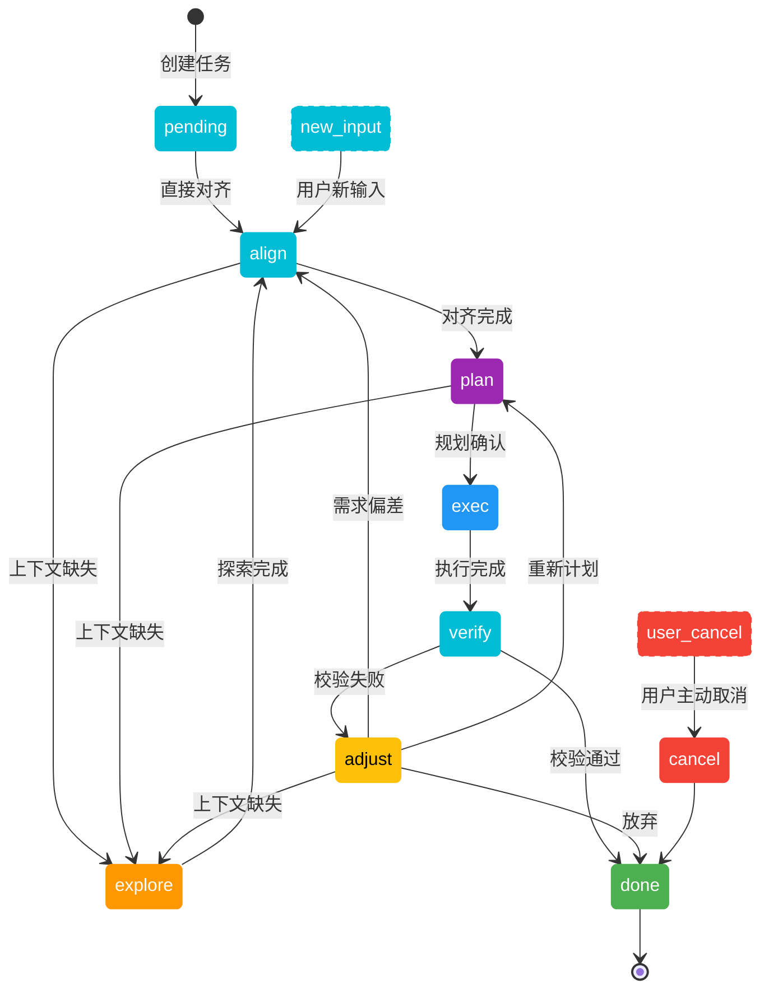

# 任务状态管理

## 状态定义

| 状态 | 语义 |
|------|------|
| pending | 等待调度，任务已创建但尚未分配执行 |
| explore | 现状探索，收集当前上下文信息并构建理解 |
| align | 范围对齐，与用户确认任务范围、验收标准、边界和禁止事项 |
| plan | 规划中，任务分解与执行方案制定中 |
| exec | 执行中，实际执行工作（含自我修复重试） |
| verify | 校验中，验证执行结果是否符合预期 |
| adjust | 调整中，分析校验失败原因并制定修正策略 |
| done | 完成，任务终结（唯一终态） |
| cancel | 取消，用户主动终止（进入 done） |

## 状态转换图

## 转换规则

### 触发条件

- `pending → align`: 任务创建后直接进入对齐阶段
- `align → explore`: 对齐时发现上下文缺失（context.json 不存在或不完整）
- `explore → align`: 现状探索完成后返回对齐
- `align → plan`: 范围对齐完成且上下文充足
- `plan → exec`: 规划方案经用户确认
- `plan → explore`: 规划时发现上下文缺失
- `exec → verify`: 执行阶段完成（所有子任务执行完毕）
- `verify → done`: 校验通过，质量达标
- `verify → adjust`: 校验失败
- `adjust → explore`: 上下文缺失，需重新探索
- `adjust → align`: 需求偏差，重新对齐
- `adjust → plan`: 重新计划
- `adjust → done`: 放弃

### 入口

- `[*] → pending`: 创建新任务
- `new_input → align`: 用户有新输入
- `user_cancel → cancel`: 用户主动取消

### 终结状态

`done` 为唯一终态。`cancel` 为用户终止状态，最终流入 `done`。

### 范围对齐阶段

`explore` 完成后进入 `align`，与用户确认：
- 任务范围（做什么/不做什么）
- 验收标准（完成的判定条件）
- 任务边界（允许修改的范围）
- 禁止事项（不可实现的范围）
- 详细描述（确认理解是否有误）

此阶段**不涉及实现方案**，仅确认需求理解是否一致。对齐完成后进入 `plan`。

校验失败统一经过 `adjust` 阶段，分析原因并制定修正策略：
- 上下文缺失（需搜索代码/web）→ `explore`
- 需求偏差 → `align`
- 其他原因 → `plan`
- 放弃 → `done`
