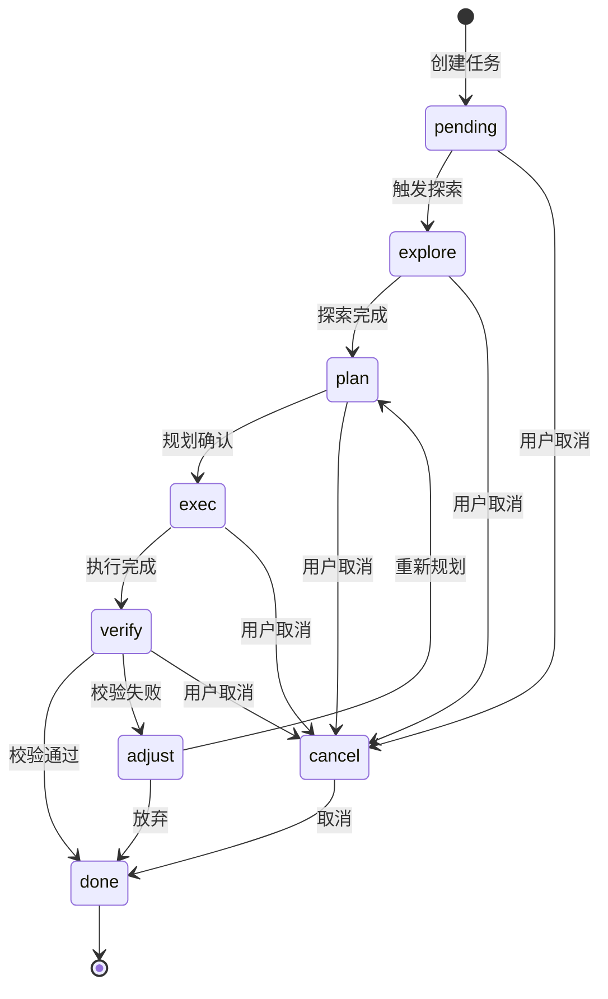

# 任务状态管理

## 状态定义

| 状态 | 语义 |
|------|------|
| pending | 等待调度，任务已创建但尚未分配执行 |
| explore | 现状探索，收集当前上下文信息并构建理解 |
| plan | 规划中，任务分解与执行方案制定中 |
| exec | 执行中，实际执行工作（含自我修复重试） |
| verify | 校验中，验证执行结果是否符合预期 |
| adjust | 调整中，分析校验失败原因并制定修正策略 |
| done | 完成，任务终结（唯一终态） |
| cancel | 取消，用户主动终止（进入 done） |

## 状态转换图

## 转换规则

### 触发条件

- `pending → explore`: 用户确认进入现状探索
- `explore → plan`: 现状探索完成
- `plan → exec`: 规划方案经用户确认
- `exec → verify`: 执行阶段完成（所有子任务执行完毕）
- `verify → done`: 校验通过，质量达标
- `verify → adjust`: 校验失败
- `adjust → plan`: 调整后重新规划
- `adjust → done`: 放弃
- `* → cancel`: 用户在任何非终结状态取消
- `cancel → done`: 取消后终结

### 终结状态

`done` 是唯一终态。`cancel` 为用户终止状态，最终流入 `done`。

### 调整阶段

校验失败统一经过 `adjust` 阶段，分析原因并制定修正策略，调整后重新进入 `plan` 制定新方案，或放弃转为 `done`。

## 与 Loop 阶段的对应关系

| 状态 | Loop 阶段 |
|------|-----------|
| pending | initialization |
| explore | context gathering |
| plan | planning |
| exec | execution |
| verify | verification |
| adjust | adjustment |
| done / cancel | cleanup |
