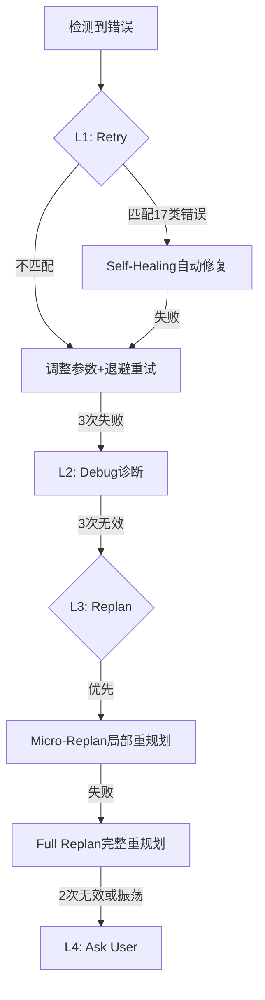

# Adjuster 升级策略与自愈机制

## 四级渐进式升级（Circuit Breaker模式）

| 级别 | 策略(status) | 触发条件 | 操作 | 下一步 |
|------|-------------|---------|------|--------|
| L1 | retry | 首次失败/临时错误 | 调整参数+指数退避(delay=base×2^n, max 60s)。匹配17类可预测错误时自动修复 | PromptOptimization |
| L2 | debug | Retry×3失败 | 收集日志+检查依赖配置+诊断报告 | PromptOptimization |
| L3 | replan | Debug×3无效 | 优先Micro-Replan(仅失败任务+直接依赖，保留成功任务)，失败则Full Replan | PromptOptimization |
| L4 | ask_user | Replan×2失败/振荡/总失败≥15 | 总结失败历史+结构化提问 | 用户决定→PromptOptimization |

### Micro-Replan（L3 内部优先策略）

仅重规划失败任务+直接依赖，保留成功任务。输出`replan_scope{failed_tasks, direct_dependencies, keep_completed, new_approach}`。失败则升级为 Full Replan。

### 升级流程图



## 停滞与振荡检测

- **相同错误重复**：最近3次failure_history错误相同 → stalled=true
- **策略无效循环**：同一策略使用≥2次 → 升级到下一级
- **振荡检测**：A→B→A→B模式 → 直接升级到Ask User
- **紧急逃逸**：总失败≥15 → 直接升级到Ask User

### Circuit Breaker 状态

Closed(正常) →[N次失败]→ Open(熔断) →[冷却]→ Half-Open(尝试) →[成功]→ Closed / →[失败]→ Open

## Self-Healing 自愈机制（L1内部）

17类可预测错误的即时修复。流程：失败检测→错误分类→匹配目录→执行修复→验证→成功则继续/失败降级Retry。

### 可自愈错误目录

| # | 错误类型 | 特征 | 修复策略 |
|---|---------|------|---------|
| 1 | 依赖缺失 | `ModuleNotFoundError`/`ImportError` | 识别项目类型→安装(pip/npm/cargo) |
| 2 | 端口占用 | `EADDRINUSE` | lsof→换端口或终止进程 |
| 3 | 目录不存在 | `ENOENT`/`No such file` | 验证路径→`mkdir -p` |
| 4 | 权限不足 | `Permission denied` | 检查→chmod(+x/755/644) |
| 5 | 配置缺失 | `config not found`/`env not set` | 查.example/.template→复制或默认 |
| 6 | 网络超时 | `ETIMEDOUT` | 超时×2(max120s)→重试3次 |
| 7 | API 4xx | `HTTP 4xx` | 400:修正参数; 401:刷新令牌; 404:检查URL |
| 8 | API 5xx | `HTTP 5xx` | 指数退避重试→降级备用 |
| 9 | 数据格式 | `JSONDecodeError`/`Invalid YAML` | 替代格式→默认值 |
| 10 | 内存不足 | `MemoryError`/`ENOMEM` | 批次减半→清缓存→增max-old-space |
| 11 | 磁盘不足 | `ENOSPC` | 清临时文件→清构建产物 |
| 12 | CPU过载 | `SIGKILL` | 并行度减半→添加间隔 |
| 13 | 文件锁 | `EAGAIN`/`lock exists` | 等待2s重试→创建副本→替换 |
| 14 | 数据库锁 | `SQLITE_BUSY`/`deadlock` | 退避重试事务→回滚调整顺序 |
| 15 | 环境变量 | `env not set` | 查.env.example→设默认值 |
| 16 | 版本不兼容 | `version incompatible` | 升级兼容→降级稳定版 |
| 17 | 系统依赖 | `command not found` | 识别OS→生成安装命令 |

### 自定义自愈规则

支持用户在 `.claude/rules/loop.extra.yaml` 定义自定义规则（优先级高于内置）：

```yaml
rules:
  - name: "Python模块缺失"
    pattern: "ModuleNotFoundError: No module named '(.+)'"
    action: "pip install $1"
    verify: "python -c 'import $1'"
    priority: high
```

字段：name(必需) | pattern(regex,必需) | action(修复命令,必需) | verify(验证命令) | priority(high/medium/low) | max_retries(默认3)

加载优先级：用户自定义 → 项目级(.claude/rules/loop.extra.yaml) → 内置(17种)
