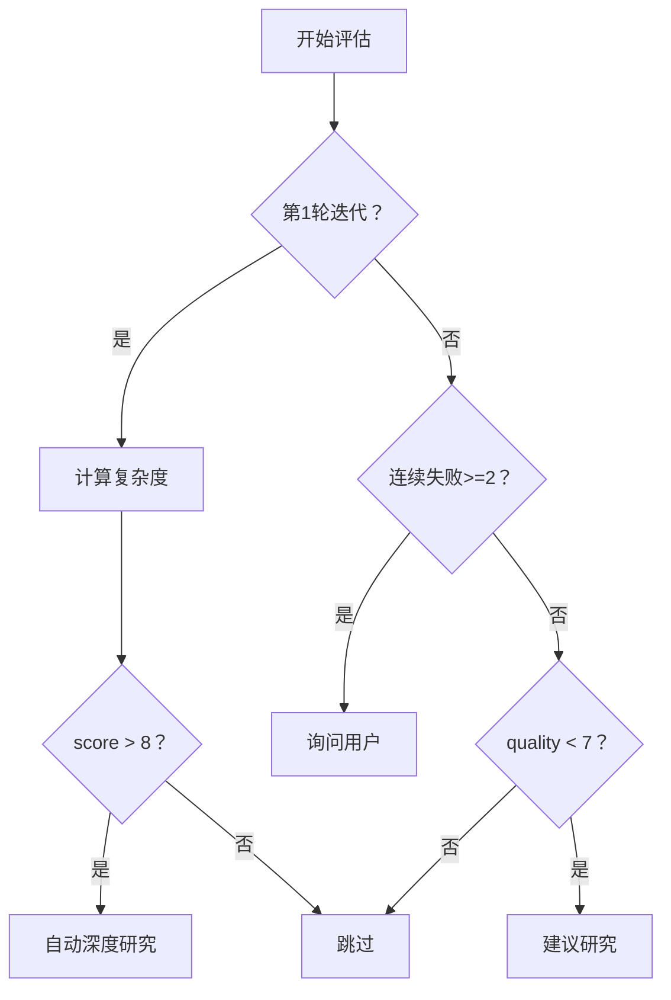

# 深度研究触发决策

## 触发矩阵

| 触发条件 | 自动调用 | 用户确认 |
|---------|---------|---------|
| Iteration = 1 AND complexity_score > 8 | 是 | 否 |
| 连续失败 >= 2 次 | 否 | 是（询问后调用） |
| Verifier quality_score < 7 | 否 | 是（建议，不强制） |
| 用户显式请求 | 是 | 否 |
| Planner 置信度 < 0.6 | 否 | 是（建议替代方案） |

## 复杂度评分算法（0-10）

| 维度 | 权重 | 评分标准 |
|------|------|---------|
| 涉及文件数 | 30% | 1-2=2, 3-5=5, 6-10=7, 10+=9 |
| 依赖深度 | 25% | 无依赖=1, 1层=3, 2层=5, 3层+=8 |
| 预估 Token | 25% | <1K=2, 1-5K=4, 5-20K=7, 20K+=9 |
| 跨模块影响 | 20% | 单模块=2, 2模块=5, 3+模块=8 |

最终评分 = sum(维度评分 * 权重)

## 决策树



## 用户确认模板

```
[MindFlow] 检测到复杂任务（复杂度：{score}/10），建议深度研究。
  预估耗时：5-10 分钟 | 研究重点：{focus}
  继续？[Y/n]
```
