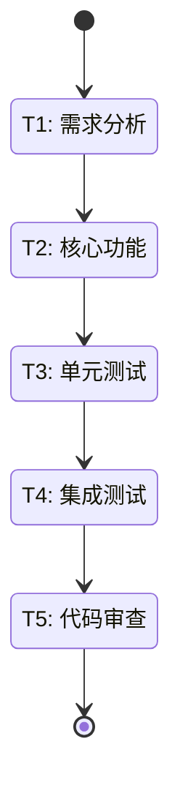

<!-- 用户反馈标注指南：
  1. HTML 注释：<!-- 反馈：你的意见 -- >
  2. 标记符号：[反馈] 你的意见
  3. 删除线：~~原方案~~ 新方案
  标注后拒绝计划，反馈会自动传递给下一轮规划 -->

[MindFlow·${任务内容}·${步骤索引}/${迭代轮数}·${任务状态-总任务的状态}] 请确认以下执行计划

### 任务编排

### 任务清单

| 状态 | 任务ID | 任务名称 | 负责Agent | 使用Skills | 相关文件 | 依赖任务 | 验收标准 |
|------|--------|---------|-----------|-----------|---------|---------|---------|
| 📋 | T1 | 需求分析 | analyst@project | requirements@project | docs/requirements.md | - | - [ ] 需求文档完整 - [ ] 用例清晰 |
| 📋 | T2 | 核心功能 | developer@task | python:core@python | src/core.py | T1 | - [ ] 功能完整 - [ ] 通过 lint |
| 📋 | T3 | 单元测试 | tester@task | python:testing@python | tests/ | T2 | - [ ] 覆盖率 ≥ 90% - [ ] 测试通过 |
| 📋 | T4 | 集成测试 | tester@task | python:testing@python | tests/integration/ | T3 | - [ ] 集成通过 - [ ] E2E覆盖 |
| 📋 | T5 | 代码审查 | reviewer@task | code-review@code-review | 所有变更文件 | T4 | - [ ] 质量达标 - [ ] 无阻塞问题 |

### 迭代验收标准

- [ ] 测试覆盖率 ≥ 90%
- [ ] CI 检查通过
- [ ] 无新增技术债

### 任务说明
