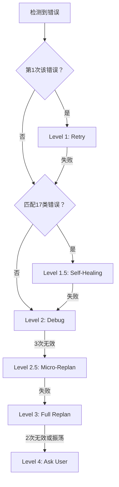

# Adjuster 升级流程图

## 分级升级决策树

```mermaid
flowchart TD
    Error[检测到错误] --> First{第1次该错误？}
    First -->|是| L1[Level 1: Retry]
    First -->|否| Match{匹配17类错误？}
    L1 -->|失败| Match
    Match -->|是| L15[Level 1.5: Self-Healing]
    Match -->|否| L2[Level 2: Debug]
    L15 -->|失败| L2
    L2 -->|3次无效| L25[Level 2.5: Micro-Replan]
    L25 -->|失败| L3[Level 3: Full Replan]
    L3 -->|2次无效或振荡| L4[Level 4: Ask User]
```

## 振荡检测

策略 A -> B -> A -> B 重复出现 -> 立即升级到 Ask User

## 紧急逃逸

总失败 >= 15 -> 无论当前级别，立即 Ask User
