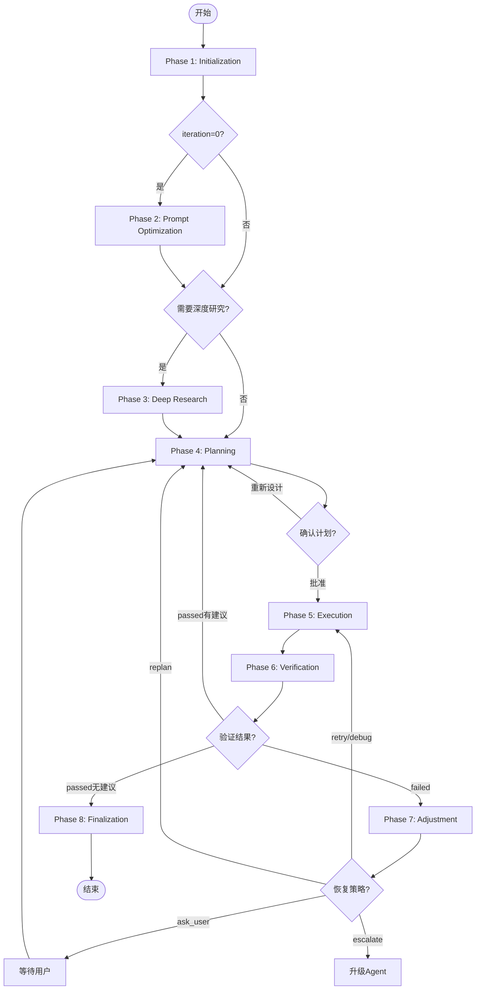

# Loop详细执行流程 - 导航索引

<!-- STATIC_CONTENT: 导航文档，可缓存 -->

## 概览

MindFlow Loop基于PDCA循环，通过8个执行阶段完成复杂任务的规划、执行、验证和调整。

**强制输出格式**：所有输出必须以 `[MindFlow]` 开头，无例外。

## 执行阶段索引

### [Phase 1: Initialization](phases/phase-1-initialization.md)

**目的**：初始化任务状态和执行环境

**关键操作**：
- 状态变量重置（iteration=0, context={}）
- 检查点恢复（如果存在）
- Memory加载（短期记忆、情节记忆）
- 资源可用性检查

**输出**：
- 干净的任务上下文
- 恢复的中间状态（如有）
- 可用的agents和skills列表

**状态转换**：成功 → Phase 4 | 检查点恢复 → 对应阶段

---

### [Phase 2: Prompt Optimization](phases/phase-2-prompt-optimization.md)

**目的**：优化用户输入，确保需求清晰完整

**关键操作**：
- 质量评估（清晰度、完整性、可执行性）
- 5W1H结构化提问
- WebSearch最新最佳实践（质量<6分）
- 生成优化后的提示词

**触发条件**：仅在 iteration=0 执行

**输出**：
- 优化后的任务描述（质量≥8分/维度）
- 澄清的上下文和约束

**状态转换**：优化完成 → Phase 3 或 Phase 4

---

### [Phase 3: Deep Research](phases/phase-3-deep-research.md)

**目的**：深入研究复杂问题，收集必要上下文

**关键操作**：
- 评估任务复杂度（4维度：技术栈陌生度、文件数量、依赖关系、业务复杂度）
- 触发深度研究（自动/手动）
- Explore subagent并行探索
- 整合研究结果

**触发条件**：
- 复杂度>8分（自动）
- 复杂度6-8分（询问用户）
- 连续失败2次（询问用户）
- 用户可拒绝

**输出**：
- 深度研究报告
- 关键发现和技术建议

**状态转换**：研究完成/跳过 → Phase 4

---

### [Phase 4: Planning & Confirmation](phases/phase-4-planning.md)

**目的**：设计执行计划并获得用户批准

**关键操作**：
- MECE任务分解
- 依赖关系建模（DAG）
- Agents/Skills分配
- Plan Mode确认（首次+用户重新设计）
- 自动批准（adjuster/verifier触发）

**智能路径选择**：

| 场景 | iteration | replan_trigger | 流程 |
|------|-----------|----------------|------|
| 首次规划 | 1 | None | ✓ Plan 模式 |
| 用户主动重新设计 | >1 | "user" | ✓ Plan 模式 |
| Adjuster 自动重新规划 | >1 | "adjuster" | ✗ 直接生成并自动批准 |
| Verifier 建议优化 | >1 | "verifier" | ✗ 直接生成并自动批准 |

**输出**：
- 结构化计划文档（JSON + Markdown）
- 执行流程图（Mermaid）
- 验收标准清单

**状态转换**：
- 路径A（自动）：生成 → 自动批准 → Phase 5
- 路径B（Plan模式）：
  - 用户批准 → Phase 5
  - 用户拒绝 → 提取反馈 → Phase 4
- 无需执行 → Phase 8

---

### [Phase 5: Execution](phases/phase-5-execution.md)

**目的**：按计划执行任务

**关键操作**：
- 智能并行调度（动态2-5个槽位）
- 复杂度评估（4维度）
- 文件冲突检测
- 使用 execute agent 编排执行
- HITL风险审批
- Agent自动管理生命周期

**并行度计算**：

| 场景 | 并行度 | 条件 |
|------|--------|------|
| 全部低复杂度 | 最大（默认2，配置最大5） | 无文件冲突 |
| 混合复杂度 | 2 | 高复杂度任务独占1槽位 |
| 存在文件冲突 | 1（串行） | 冲突任务必须串行 |
| 用户配置覆盖 | 用户指定值 | **绝不超过用户约束** |

**输出**：
- 任务执行结果
- 进度日志
- 成功/失败状态

**状态转换**：成功 → Phase 6

---

### [Phase 6: Verification](phases/phase-6-verification.md)

**目的**：验证执行结果是否满足验收标准

**关键操作**：
- 验收标准检查（acceptance_criteria）
- 质量评分（0-100分）
- 回归测试
- 终止条件判断

**输出决策**：
- `passed`：所有标准通过，无建议 → Phase 8（完成）
- `suggestions`：标准通过，有优化建议 → Phase 4（自动继续迭代）
- `failed`：标准失败 → Phase 7（失败调整）

**状态转换**：
- passed（无建议） → Phase 8
- suggestions（有建议） → Phase 4
- failed → Phase 7

---

### [Phase 7: Adjustment](phases/phase-7-adjustment.md)

**目的**：分析失败原因并决定恢复策略

**关键操作**：
- 失败原因分析（使用结构化错误）
- 记忆检索（历史失败模式）
- 停滞模式检测（连续3次相同错误）
- 5级渐进式升级（retry → debug → replan → ask_user → escalate）
- 指数退避（0秒 → 2秒 → 4秒）
- HITL审批（危险恢复操作）

**升级策略**：

| 级别 | 策略 | 触发条件 | 下一步 |
|------|------|---------|--------|
| 1 | retry | 首次失败，临时性错误 | Phase 5 |
| 2 | debug | 重试失败，逻辑错误 | Phase 5 |
| 3 | replan | 调试失败，计划缺陷 | Phase 4（自动批准） |
| 4 | ask_user | 重规划失败，停滞模式 | 用户决定 |
| 5 | escalate | 用户请求，超出能力 | 升级agent决定 |

**停滞检测**：
- 连续3次相同错误 → 保存失败记忆 → 请求用户决定

**输出**：
- 调整策略
- 调整报告（≤100字）
- 恢复操作（如有）

**状态转换**：
- retry/debug → Phase 5
- replan → Phase 4
- ask_user → 用户决定
- escalate → 升级agent决定

---

### [Phase 8: Finalization](phases/phase-8-finalization.md)

**目的**：清理资源，生成最终报告

**关键操作**：
- 删除计划文件（.md + .html）
- 清理检查点
- 保存任务执行记忆（情节记忆）
- 清理短期记忆
- 生成最终报告（耗时、迭代次数、质量分数）

**输出**：
- 清理报告
- 任务完成摘要
- 记忆URI（workflow://tasks/{task_id}）

**状态转换**：完成 → 结束

---

## 执行流程图

## 快速查找

### 按问题查找

| 问题 | 查看章节 |
|------|---------|
| 任务状态如何初始化？ | [Phase 1](phases/phase-1-initialization.md) |
| 如何优化模糊的用户输入？ | [Phase 2](phases/phase-2-prompt-optimization.md) |
| 什么时候触发深度研究？ | [Phase 3](phases/phase-3-deep-research.md) |
| 计划确认机制如何工作？ | [Phase 4](phases/phase-4-planning.md) |
| 如何控制并行任务数量？ | [Phase 5](phases/phase-5-execution.md) |
| 验收标准如何定义和检查？ | [Phase 6](phases/phase-6-verification.md) |
| 失败后如何决定恢复策略？ | [Phase 7](phases/phase-7-adjustment.md) |
| 任务完成后如何清理资源？ | [Phase 8](phases/phase-8-finalization.md) |

### 按关键字查找

- **状态重置**：Phase 1
- **检查点恢复**：Phase 1
- **5W1H提问**：Phase 2
- **质量评估**：Phase 2
- **复杂度评估**：Phase 3, Phase 5
- **深度研究**：Phase 3
- **MECE分解**：Phase 4
- **Plan Mode**：Phase 4
- **智能并行调度**：Phase 5
- **文件冲突检测**：Phase 5
- **HITL审批**：Phase 5, Phase 7
- **验收标准**：Phase 6
- **质量评分**：Phase 6
- **失败升级**：Phase 7
- **停滞检测**：Phase 7
- **指数退避**：Phase 7
- **资源清理**：Phase 8
- **记忆保存**：Phase 8

## 相关文档

- [SKILL.md](SKILL.md) - Loop技能概览
- [flows/plan.md](flows/plan.md) - 计划流程详细说明
- [flows/verify.md](flows/verify.md) - 验证流程详细说明
- [prompt-caching.md](prompt-caching.md) - 提示词缓存优化
- [deep-research-triggers.md](deep-research-triggers.md) - 深度研究触发决策

<!-- /STATIC_CONTENT -->
