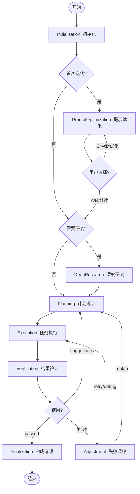

# Loop详细执行流程 - 导航索引

<!-- STATIC_CONTENT: 导航文档，可缓存 -->

MindFlow Loop基于PDCA循环，8个阶段完成任务规划、执行、验证和调整。**所有输出必须以 `[MindFlow·${task_id}]` 开头（task_id在 Initialization 阶段生成）。**

## 阶段索引

| 阶段 | 目的 | 关键操作 | 状态转换 |
|------|------|---------|---------|
| [Initialization](phases/phase-1-initialization.md) | 初始化环境 | 状态重置+检查点恢复+Memory加载 | →Planning / 恢复→对应阶段 |
| [PromptOptimization](phases/phase-2-prompt-optimization.md) | 优化用户输入（可选） | 质量评估+5W1H+WebSearch+用户选择 | A/B→DeepResearch或Planning / C→循环 |
| [DeepResearch](phases/phase-3-deep-research.md) | 深入研究（可选） | 复杂度评估+Explore探索 | →Planning |
| [Planning](phases/phase-4-planning.md) | 设计+确认计划 | MECE分解+DAG+Agent分配+用户确认 | 自动批准→Execution / 用户批准→Execution/拒绝→Planning |
| [Execution](phases/phase-5-execution.md) | 执行任务 | 智能并行(≤2)+冲突检测+HITL | →Verification |
| [Verification](phases/phase-6-verification.md) | 验证结果 | 验收检查+质量评分 | passed→Finalization / suggestions→Planning / failed→Adjustment |
| [Adjustment](phases/phase-7-adjustment.md) | 失败调整（条件触发） | 5级升级(retry→debug→replan→ask_user→escalate) | retry/debug→Execution / replan→Planning / ask_user→用户 |
| [Finalization](phases/phase-8-finalization.md) | 清理完成 | 删除计划+清理检查点+保存记忆 | →结束 |

## 流程图

## 相关文档

- [SKILL.md](SKILL.md) - Loop概览
- [flows/plan.md](flows/plan.md) / [flows/verify.md](flows/verify.md)
- [prompt-caching.md](prompt-caching.md) | [deep-research-triggers.md](deep-research-triggers.md)

<!-- /STATIC_CONTENT -->
