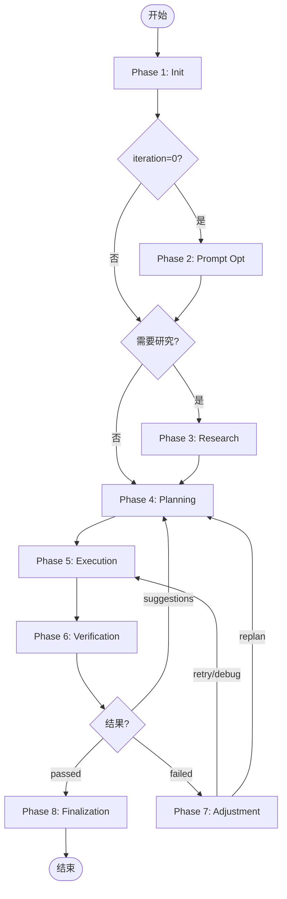

# Loop详细执行流程 - 导航索引

<!-- STATIC_CONTENT: 导航文档，可缓存 -->

MindFlow Loop基于PDCA循环，8个阶段完成任务规划、执行、验证和调整。**所有输出必须以 `[MindFlow]` 开头。**

## 阶段索引

| Phase | 目的 | 关键操作 | 状态转换 |
|-------|------|---------|---------|
| [1: Init](phases/phase-1-initialization.md) | 初始化环境 | 状态重置+检查点恢复+Memory加载 | →P4 / 恢复→对应阶段 |
| [2: Prompt Opt](phases/phase-2-prompt-optimization.md) | 优化用户输入 | 质量评估+5W1H+WebSearch | →P3或P4 |
| [3: Deep Research](phases/phase-3-deep-research.md) | 深入研究 | 复杂度评估+Explore探索 | →P4 |
| [4: Planning](phases/phase-4-planning.md) | 设计+确认计划 | MECE分解+DAG+Agent分配+用户确认 | A:自动批准→P5 / B:用户批准→P5/拒绝→P4 |
| [5: Execution](phases/phase-5-execution.md) | 执行任务 | 智能并行(≤2)+冲突检测+HITL | →P6 |
| [6: Verification](phases/phase-6-verification.md) | 验证结果 | 验收检查+质量评分 | passed→P8 / suggestions→P4 / failed→P7 |
| [7: Adjustment](phases/phase-7-adjustment.md) | 失败调整 | 5级升级(retry→debug→replan→ask_user→escalate) | retry/debug→P5 / replan→P4 / ask_user→用户 |
| [8: Finalization](phases/phase-8-finalization.md) | 清理完成 | 删除计划+清理检查点+保存记忆 | →结束 |

## 流程图

## 相关文档

- [SKILL.md](SKILL.md) - Loop概览
- [flows/plan.md](flows/plan.md) / [flows/verify.md](flows/verify.md)
- [prompt-caching.md](prompt-caching.md) | [deep-research-triggers.md](deep-research-triggers.md)

<!-- /STATIC_CONTENT -->
