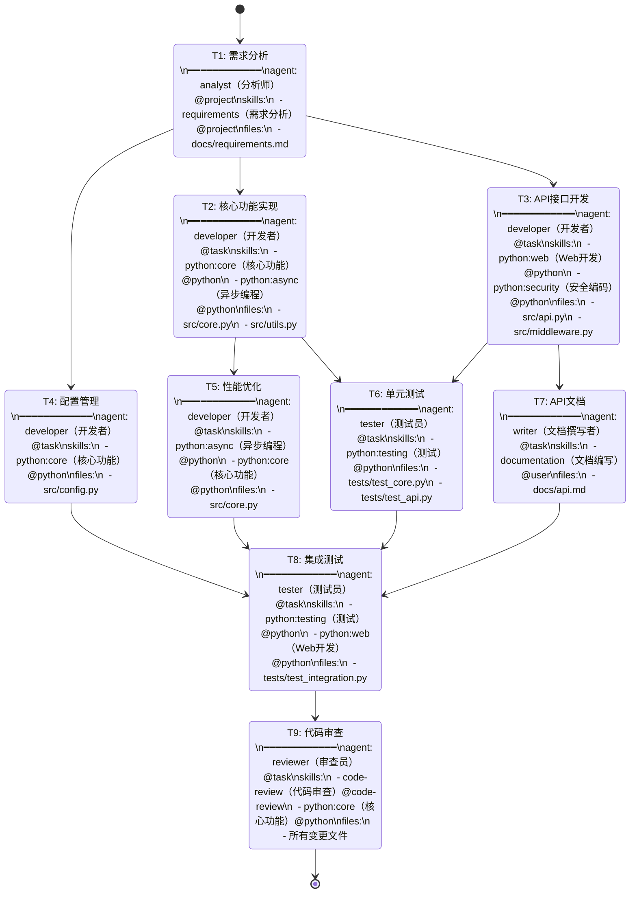
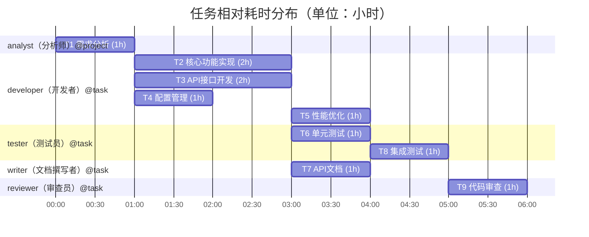

[MindFlow·${任务内容}·${步骤索引}/${迭代轮数}·${任务状态-总任务的状态}] 请确认以下执行计划

### 任务编排

### Agent/成员 视角

### 任务清单

| 任务ID | 任务名称 | 负责Agent | 使用Skills | 相关文件 | 依赖任务 |
|--------|---------|-----------|-----------|---------|---------|
| T1 | 需求分析 | analyst（分析师）@project | requirements（需求分析）@project | docs/requirements.md | - |
| T2 | 核心功能实现 | developer（开发者）@task | python:core（核心功能）@python python:async（异步编程）@python | src/core.py src/utils.py | T1 |
| T3 | API接口开发 | developer（开发者）@task | python:web（Web开发）@python python:security（安全编码）@python | src/api.py src/middleware.py | T1 |
| T4 | 配置管理 | developer（开发者）@task | python:core（核心功能）@python | src/config.py | T1 |
| T5 | 性能优化 | developer（开发者）@task | python:async（异步编程）@python python:core（核心功能）@python | src/core.py | T2 |
| T6 | 单元测试 | tester（测试员）@task | python:testing（测试）@python | tests/test_core.py tests/test_api.py | T2, T3 |
| T7 | API文档 | writer（文档撰写者）@task | documentation（文档编写）@user | docs/api.md | T3 |
| T8 | 集成测试 | tester（测试员）@task | python:testing（测试）@python python:web（Web开发）@python | tests/test_integration.py | T4, T5, T6, T7 |
| T9 | 代码审查 | reviewer（审查员）@task | code-review（代码审查）@code-review python:core（核心功能）@python | 所有变更文件 | T8 |

### 验收标准

- [ ] 单元测试覆盖率 ≥ 90%
- [ ] 所有 CI 检查通过（lint/test/build）
- [ ] 验收标准与需求 1:1 映射
- [ ] 无新增技术债（代码复杂度 ≤ X）
- [ ] 无影响已有功能（回归测试通过）

### 任务说明（≤100字）