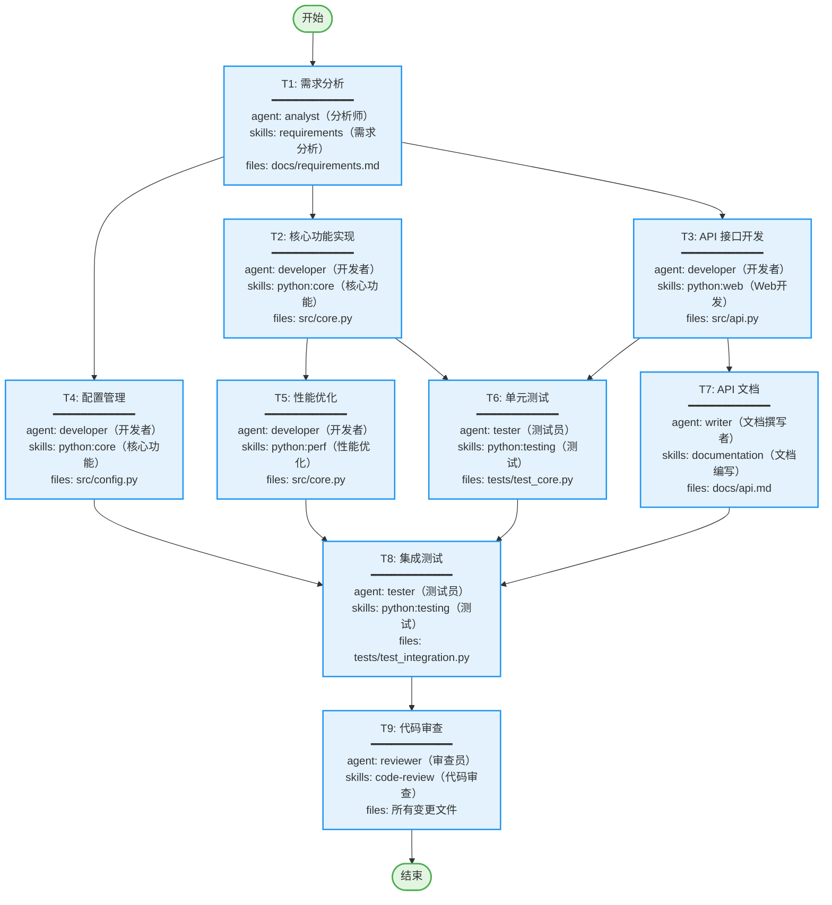
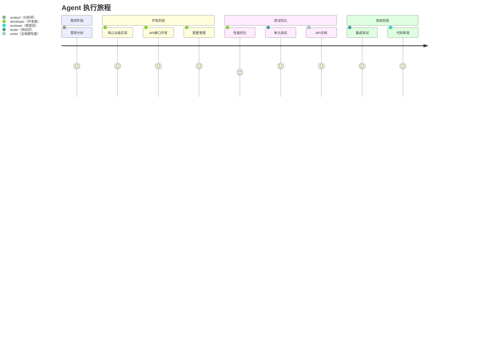

[MindFlow·${任务内容}·${步骤索引}/${迭代轮数}·${任务状态-总任务的状态}] 请确认以下执行计划

### 执行流程图（任务队列 + 并行执行模型）

### 执行者视角（User Journey）

### 任务清单

| 任务ID | 任务名称 | 负责Agent | 使用Skills | 相关文件 | 依赖任务 |
|--------|---------|-----------|-----------|---------|---------|
| T1 | 需求分析 | analyst（分析师） | requirements（需求分析） | docs/requirements.md | - |
| T2 | 核心功能实现 | developer（开发者） | python:core（核心功能） | src/core.py | T1 |
| T3 | API接口开发 | developer（开发者） | python:web（Web开发） | src/api.py | T1 |
| T4 | 配置管理 | developer（开发者） | python:core（核心功能） | src/config.py | T1 |
| T5 | 性能优化 | developer（开发者） | python:perf（性能优化） | src/core.py | T2 |
| T6 | 单元测试 | tester（测试员） | python:testing（测试） | tests/test_core.py | T2, T3 |
| T7 | API文档 | writer（文档撰写者） | documentation（文档编写） | docs/api.md | T3 |
| T8 | 集成测试 | tester（测试员） | python:testing（测试） | tests/test_integration.py | T4, T5, T6, T7 |
| T9 | 代码审查 | reviewer（审查员） | code-review（代码审查） | 所有变更文件 | T8 |

**多依赖说明：**
- **T6（单元测试）** 依赖 2 个前置任务：T2（核心功能）、T3（API接口）
- **T8（集成测试）** 依赖 4 个前置任务：T4（配置）、T5（优化）、T6（单测）、T7（文档）
- **T9（代码审查）** 依赖 T8，确保所有测试通过后才进行审查
- 多依赖任务必须等待**所有**前置任务完成后才能开始执行

### 验收标准（必须量化）

- [ ] 单元测试覆盖率 ≥ 90%
- [ ] 所有 CI 检查通过（lint/test/build）
- [ ] 验收标准与需求 1:1 映射
- [ ] 无新增技术债（代码复杂度 ≤ X）
- [ ] 无影响已有功能（回归测试通过）

### 简要说明（≤100字）

[任务概述]